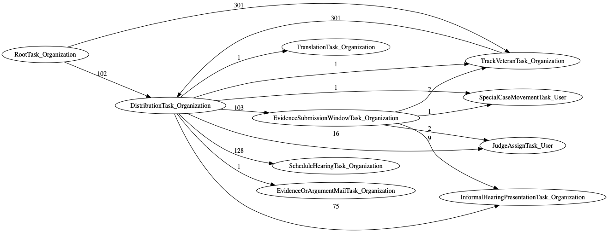

## Data-Driven Documentation of Task Trees

Actual task trees were processed and used to generate this documentation, which is organized by docket type:
* [Direct Review docket tasks](docs-DR/tasklist.md)
* [Evidence Submission docket tasks](docs-ES/tasklist.md)
* [Hearing docket tasks](docs-H/tasklist.md)

Each docket above presents a list of relevant tasks.
Each task has its own page (i.e., `md` file).
Each task page has the following sections:
* Tasks Created Before and After
  * Diagram of inlinks and outlinks to the task page. The number labeled on the link represents the number of occurrences where the creation of source task was followed by the creation of the destination task.
  * **Before**: links to tasks that were created _before_ the page's task
  * **After**: links to tasks that were created _after_ the page's task
* Task Creation Sequences (TCS): Examples grouped according to the sequence of tasks created up to the page's task.
  * Section names are formed using acronyms for each task. For example, `RootTask_Organization` is `RTO`. So a section named `RTO.TVTO.DTO.SHTO` means `RootTask_Organization` was created and followed by `TrackVeteranTask_Organization` followed by `DistributionTask_Organization` followed by `ScheduleHearingTask_Organization`. The naming represents the **task creation sequence**. The last task in the sequence will always refer to the page's task.
  * Each section presents the number of occurrences of that TCS (along with a few appeal IDs that have that TCS) and a task tree diagram of that appeal.

Notes:
* When tasks have the exact same creation timestamp, their ordering is nondeterministic. For example, the `ScheduleHearingTask` and `HearingTask` are created at the same time. This results in documentation that states both that `ScheduleHearingTask` is created before `HearingTask` and that `HearingTask` is created before `ScheduleHearingTask`.
* The Graphviz code used to generate the graph on each task page can be combined to show multi-hop/indirect relationships. For example, the following graph shows the task creation order pulled from the `RootTask_Organization`, `DistributionTask_Organization`, `EvidenceSubmissionWindowTask_Organization` task pages. From this, we can surmise that `JudgeAssignTask_User` is always created after `DistributionTask_Organization`.

  <details><summary>Task creation order combined from 3 task pages</summary>

  ```
  digraph G {
  rankdir="LR";
  "DistributionTask_Organization" -> "TrackVeteranTask_Organization" [label=1]
  "EvidenceSubmissionWindowTask_Organization" -> "TrackVeteranTask_Organization" [label=2]
  "EvidenceSubmissionWindowTask_Organization" -> "SpecialCaseMovementTask_User" [label=1]
  "DistributionTask_Organization" -> "JudgeAssignTask_User" [label=16]
  "EvidenceSubmissionWindowTask_Organization" -> "JudgeAssignTask_User" [label=2]
  "DistributionTask_Organization" -> "ScheduleHearingTask_Organization" [label=128]
  "RootTask_Organization" -> "DistributionTask_Organization" [label=102]
  "DistributionTask_Organization" -> "EvidenceOrArgumentMailTask_Organization" [label=1]
  "EvidenceSubmissionWindowTask_Organization" -> "InformalHearingPresentationTask_Organization" [label=9]
  "DistributionTask_Organization" -> "SpecialCaseMovementTask_User" [label=1]
  "DistributionTask_Organization" -> "EvidenceSubmissionWindowTask_Organization" [label=103]
  "RootTask_Organization" -> "TrackVeteranTask_Organization" [label=301]
  "DistributionTask_Organization" -> "InformalHearingPresentationTask_Organization" [label=75]
  "TrackVeteranTask_Organization" -> "DistributionTask_Organization" [label=301]
  "DistributionTask_Organization" -> "TranslationTask_Organization" [label=1]
  }
  ```
  </details>

  
