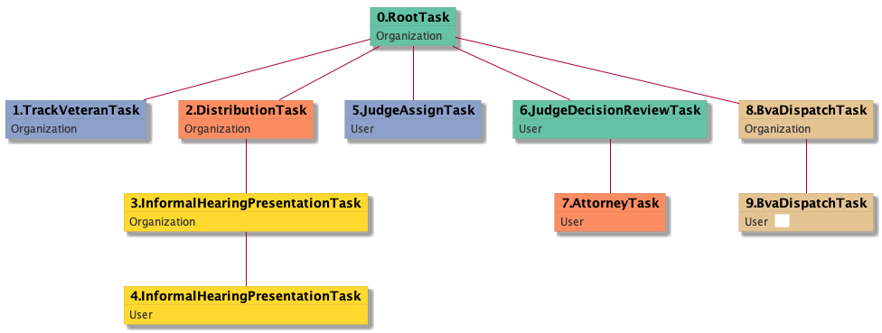
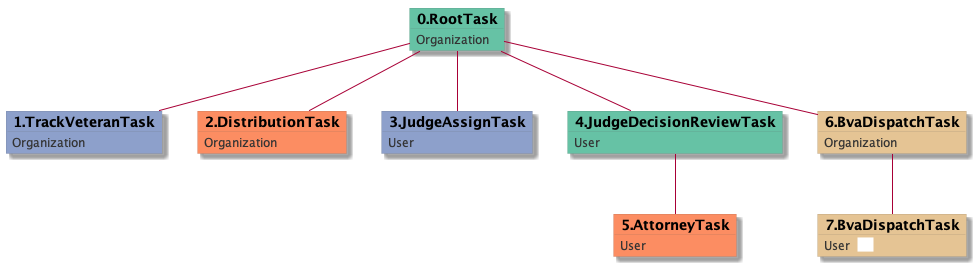

| [README.md](/README.md) | [Task Listing](tasklist.md) |

# BvaDispatchTask_User

[BvaDispatchTask_User description](../descr/BvaDispatchTask_User.md)

## Tasks Created Before and After

<details><summary>Tasks created before and after BvaDispatchTask_User</summary>

```
digraph G {
rankdir="LR";
"BvaDispatchTask_User" -> "ReturnedUndeliverableCorrespondenceMailTask_Organization" [label=1]
"BvaDispatchTask_Organization" -> "BvaDispatchTask_User" [label=16]
}
```
</details>


**Before:**

   * [BvaDispatchTask_Organization](BvaDispatchTask_Organization.md): 16 times

**After:**

   * [ReturnedUndeliverableCorrespondenceMailTask_Organization](ReturnedUndeliverableCorrespondenceMailTask_Organization.md): 1 times

## Task Creation Sequences

### RTO.TVTO.DTO.IHPTO.IHPTU.JATU.JDRTU.ATU.BDTO.BDTU

[RTO.TVTO.DTO.IHPTO.IHPTU.JATU.JDRTU.ATU.BDTO.BDTU description](../descr/RTO.TVTO.DTO.IHPTO.IHPTU.JATU.JDRTU.ATU.BDTO.BDTU.md)

4 occurrences (example appeal IDs: [30234, 35142, 5529, 34472])

<details><summary>Task Tree for appeal with ID 30234</summary>

```
@startuml
skinparam {
  ObjectBorderColor #555
  ObjectBorderThickness 0
  ObjectFontStyle bold
  ObjectFontSize 14
  ObjectAttributeFontColor #333
  ObjectAttributeFontSize 12
}
  object 0.RootTask #66c2a5 {
Organization
}
  object 1.TrackVeteranTask #8da0cb {
Organization
}
  object 2.DistributionTask #fc8d62 {
Organization
}
  object 3.InformalHearingPresentationTask #ffd92f {
Organization
}
  object 4.InformalHearingPresentationTask #ffd92f {
User
}
  object 5.JudgeAssignTask #8da0cb {
User
}
  object 6.JudgeDecisionReviewTask #66c2a5 {
User
}
  object 7.AttorneyTask #fc8d62 {
User
}
  object 8.BvaDispatchTask #e5c494 {
Organization
}
  object 9.BvaDispatchTask #e5c494 {
User  <back:white>    </back>
}
0.RootTask -- 1.TrackVeteranTask
0.RootTask -- 2.DistributionTask
2.DistributionTask -- 3.InformalHearingPresentationTask
3.InformalHearingPresentationTask -- 4.InformalHearingPresentationTask
0.RootTask -- 5.JudgeAssignTask
0.RootTask -- 6.JudgeDecisionReviewTask
6.JudgeDecisionReviewTask -- 7.AttorneyTask
0.RootTask -- 8.BvaDispatchTask
8.BvaDispatchTask -- 9.BvaDispatchTask
@enduml
```
</details>



### RTO.DTO.JATU.JDRTU.ATU.BDTO.BDTU

[RTO.DTO.JATU.JDRTU.ATU.BDTO.BDTU description](../descr/RTO.DTO.JATU.JDRTU.ATU.BDTO.BDTU.md)

3 occurrences (example appeal IDs: [32724, 38039, 40617])

<details><summary>Task Tree for appeal with ID 32724</summary>

```
@startuml
skinparam {
  ObjectBorderColor #555
  ObjectBorderThickness 0
  ObjectFontStyle bold
  ObjectFontSize 14
  ObjectAttributeFontColor #333
  ObjectAttributeFontSize 12
}
  object 0.RootTask #66c2a5 {
Organization
}
  object 1.DistributionTask #fc8d62 {
Organization
}
  object 2.JudgeAssignTask #8da0cb {
User
}
  object 3.JudgeDecisionReviewTask #66c2a5 {
User
}
  object 4.AttorneyTask #fc8d62 {
User
}
  object 5.BvaDispatchTask #e5c494 {
Organization
}
  object 6.BvaDispatchTask #e5c494 {
User  <back:white>    </back>
}
0.RootTask -- 1.DistributionTask
0.RootTask -- 2.JudgeAssignTask
0.RootTask -- 3.JudgeDecisionReviewTask
3.JudgeDecisionReviewTask -- 4.AttorneyTask
0.RootTask -- 5.BvaDispatchTask
5.BvaDispatchTask -- 6.BvaDispatchTask
@enduml
```
</details>


### RTO.TVTO.DTO.JATU.JDRTU.ATU.BDTO.BDTU

[RTO.TVTO.DTO.JATU.JDRTU.ATU.BDTO.BDTU description](../descr/RTO.TVTO.DTO.JATU.JDRTU.ATU.BDTO.BDTU.md)

3 occurrences (example appeal IDs: [33346, 41369, 37901])

<details><summary>Task Tree for appeal with ID 33346</summary>

```
@startuml
skinparam {
  ObjectBorderColor #555
  ObjectBorderThickness 0
  ObjectFontStyle bold
  ObjectFontSize 14
  ObjectAttributeFontColor #333
  ObjectAttributeFontSize 12
}
  object 0.RootTask #66c2a5 {
Organization
}
  object 1.TrackVeteranTask #8da0cb {
Organization
}
  object 2.DistributionTask #fc8d62 {
Organization
}
  object 3.JudgeAssignTask #8da0cb {
User
}
  object 4.JudgeDecisionReviewTask #66c2a5 {
User
}
  object 5.AttorneyTask #fc8d62 {
User
}
  object 6.BvaDispatchTask #e5c494 {
Organization
}
  object 7.BvaDispatchTask #e5c494 {
User  <back:white>    </back>
}
0.RootTask -- 1.TrackVeteranTask
0.RootTask -- 2.DistributionTask
0.RootTask -- 3.JudgeAssignTask
0.RootTask -- 4.JudgeDecisionReviewTask
4.JudgeDecisionReviewTask -- 5.AttorneyTask
0.RootTask -- 6.BvaDispatchTask
6.BvaDispatchTask -- 7.BvaDispatchTask
@enduml
```
</details>



### RTO.TVTO.DTO.IHPTO.JATU.JDRTU.ATU.BDTO.BDTU

[RTO.TVTO.DTO.IHPTO.JATU.JDRTU.ATU.BDTO.BDTU description](../descr/RTO.TVTO.DTO.IHPTO.JATU.JDRTU.ATU.BDTO.BDTU.md)

3 occurrences (example appeal IDs: [34538, 10197, 29665])

<details><summary>Task Tree for appeal with ID 34538</summary>

```
@startuml
skinparam {
  ObjectBorderColor #555
  ObjectBorderThickness 0
  ObjectFontStyle bold
  ObjectFontSize 14
  ObjectAttributeFontColor #333
  ObjectAttributeFontSize 12
}
  object 0.RootTask #66c2a5 {
Organization
}
  object 1.TrackVeteranTask #8da0cb {
Organization
}
  object 2.DistributionTask #fc8d62 {
Organization
}
  object 3.InformalHearingPresentationTask #ffd92f {
Organization
}
  object 4.JudgeAssignTask #8da0cb {
User
}
  object 5.JudgeDecisionReviewTask #66c2a5 {
User
}
  object 6.AttorneyTask #fc8d62 {
User
}
  object 7.BvaDispatchTask #e5c494 {
Organization
}
  object 8.BvaDispatchTask #e5c494 {
User  <back:white>    </back>
}
  object 9.BvaDispatchTask #e5c494 {
User  <back:white>    </back>
}
  object 10.BvaDispatchTask #e5c494 {
User  <back:white>    </back>
}
0.RootTask -- 1.TrackVeteranTask
0.RootTask -- 2.DistributionTask
2.DistributionTask -- 3.InformalHearingPresentationTask
0.RootTask -- 4.JudgeAssignTask
0.RootTask -- 5.JudgeDecisionReviewTask
5.JudgeDecisionReviewTask -- 6.AttorneyTask
0.RootTask -- 7.BvaDispatchTask
7.BvaDispatchTask -- 8.BvaDispatchTask
7.BvaDispatchTask -- 9.BvaDispatchTask
7.BvaDispatchTask -- 10.BvaDispatchTask
@enduml
```
</details>


### RTO.TVTO.DTO.IHPTO.JATU.ICTO.ICTU.THTU.JDRTU.ATU.QRTO.QRTU.BDTO.BDTU

[RTO.TVTO.DTO.IHPTO.JATU.ICTO.ICTU.THTU.JDRTU.ATU.QRTO.QRTU.BDTO.BDTU description](../descr/RTO.TVTO.DTO.IHPTO.JATU.ICTO.ICTU.THTU.JDRTU.ATU.QRTO.QRTU.BDTO.BDTU.md)

1 occurrences (example appeal IDs: [7729])

<details><summary>Task Tree for appeal with ID 7729</summary>

```
@startuml
skinparam {
  ObjectBorderColor #555
  ObjectBorderThickness 0
  ObjectFontStyle bold
  ObjectFontSize 14
  ObjectAttributeFontColor #333
  ObjectAttributeFontSize 12
}
  object 0.RootTask #66c2a5 {
Organization
}
  object 1.TrackVeteranTask #8da0cb {
Organization
}
  object 2.DistributionTask #fc8d62 {
Organization
}
  object 3.InformalHearingPresentationTask #ffd92f {
Organization
}
  object 4.InformalHearingPresentationTask #ffd92f {
User
}
  object 5.JudgeAssignTask #8da0cb {
User
}
  object 6.IhpColocatedTask #ffd92f {
Organization
}
  object 7.IhpColocatedTask #ffd92f {
User
}
  object 8.TimedHoldTask #e78ac3 {
User
}
  object 9.JudgeDecisionReviewTask #66c2a5 {
User
}
  object 10.AttorneyTask #fc8d62 {
User
}
  object 11.QualityReviewTask #fc8d62 {
Organization
}
  object 12.QualityReviewTask #fc8d62 {
User
}
  object 13.BvaDispatchTask #e5c494 {
Organization
}
  object 14.BvaDispatchTask #e5c494 {
User  <back:white>    </back>
}
0.RootTask -- 1.TrackVeteranTask
0.RootTask -- 2.DistributionTask
2.DistributionTask -- 3.InformalHearingPresentationTask
3.InformalHearingPresentationTask -- 4.InformalHearingPresentationTask
0.RootTask -- 5.JudgeAssignTask
5.JudgeAssignTask -- 6.IhpColocatedTask
6.IhpColocatedTask -- 7.IhpColocatedTask
7.IhpColocatedTask -- 8.TimedHoldTask
0.RootTask -- 9.JudgeDecisionReviewTask
9.JudgeDecisionReviewTask -- 10.AttorneyTask
0.RootTask -- 11.QualityReviewTask
11.QualityReviewTask -- 12.QualityReviewTask
0.RootTask -- 13.BvaDispatchTask
13.BvaDispatchTask -- 14.BvaDispatchTask
@enduml
```
</details>


### RTO.DTO.JATU.JDRTU.ATU.TVTO.IHPTO.BDTO.BDTU

[RTO.DTO.JATU.JDRTU.ATU.TVTO.IHPTO.BDTO.BDTU description](../descr/RTO.DTO.JATU.JDRTU.ATU.TVTO.IHPTO.BDTO.BDTU.md)

1 occurrences (example appeal IDs: [3875])

<details><summary>Task Tree for appeal with ID 3875</summary>

```
@startuml
skinparam {
  ObjectBorderColor #555
  ObjectBorderThickness 0
  ObjectFontStyle bold
  ObjectFontSize 14
  ObjectAttributeFontColor #333
  ObjectAttributeFontSize 12
}
  object 0.RootTask #66c2a5 {
Organization
}
  object 1.DistributionTask #fc8d62 {
Organization
}
  object 2.JudgeAssignTask #8da0cb {
User
}
  object 3.JudgeAssignTask #8da0cb {
User
}
  object 4.JudgeDecisionReviewTask #66c2a5 {
User
}
  object 5.AttorneyTask #fc8d62 {
User
}
  object 6.TrackVeteranTask #8da0cb {
Organization
}
  object 7.InformalHearingPresentationTask #ffd92f {
Organization
}
  object 8.BvaDispatchTask #e5c494 {
Organization
}
  object 9.BvaDispatchTask #e5c494 {
User  <back:white>    </back>
}
  object 10.BvaDispatchTask #e5c494 {
User  <back:white>    </back>
}
0.RootTask -- 1.DistributionTask
0.RootTask -- 2.JudgeAssignTask
0.RootTask -- 3.JudgeAssignTask
0.RootTask -- 4.JudgeDecisionReviewTask
4.JudgeDecisionReviewTask -- 5.AttorneyTask
0.RootTask -- 6.TrackVeteranTask
0.RootTask -- 7.InformalHearingPresentationTask
0.RootTask -- 8.BvaDispatchTask
8.BvaDispatchTask -- 9.BvaDispatchTask
8.BvaDispatchTask -- 10.BvaDispatchTask
@enduml
```
</details>


### RTO.DTO.EOAMTO.EOAMTO.EOAMTU.JATU.JDRTU.ATU.BDTO.BDTU

[RTO.DTO.EOAMTO.EOAMTO.EOAMTU.JATU.JDRTU.ATU.BDTO.BDTU description](../descr/RTO.DTO.EOAMTO.EOAMTO.EOAMTU.JATU.JDRTU.ATU.BDTO.BDTU.md)

1 occurrences (example appeal IDs: [10213])

<details><summary>Task Tree for appeal with ID 10213</summary>

```
@startuml
skinparam {
  ObjectBorderColor #555
  ObjectBorderThickness 0
  ObjectFontStyle bold
  ObjectFontSize 14
  ObjectAttributeFontColor #333
  ObjectAttributeFontSize 12
}
  object 0.RootTask #66c2a5 {
Organization
}
  object 1.DistributionTask #fc8d62 {
Organization
}
  object 2.EvidenceOrArgumentMailTask #ffd92f {
Organization
}
  object 3.EvidenceOrArgumentMailTask #ffd92f {
Organization
}
  object 4.EvidenceOrArgumentMailTask #ffd92f {
User
}
  object 5.JudgeAssignTask #8da0cb {
User
}
  object 6.JudgeDecisionReviewTask #66c2a5 {
User
}
  object 7.AttorneyTask #fc8d62 {
User
}
  object 8.BvaDispatchTask #e5c494 {
Organization
}
  object 9.BvaDispatchTask #e5c494 {
User  <back:white>    </back>
}
0.RootTask -- 1.DistributionTask
0.RootTask -- 2.EvidenceOrArgumentMailTask
2.EvidenceOrArgumentMailTask -- 3.EvidenceOrArgumentMailTask
3.EvidenceOrArgumentMailTask -- 4.EvidenceOrArgumentMailTask
0.RootTask -- 5.JudgeAssignTask
0.RootTask -- 6.JudgeDecisionReviewTask
6.JudgeDecisionReviewTask -- 7.AttorneyTask
0.RootTask -- 8.BvaDispatchTask
8.BvaDispatchTask -- 9.BvaDispatchTask
@enduml
```
</details>


