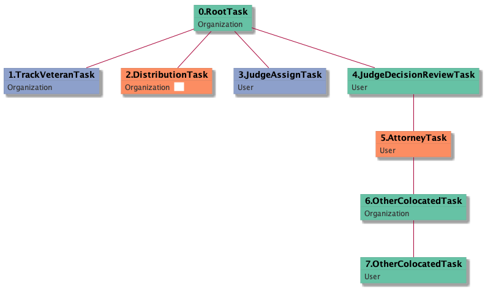

| [README.md](/README.md) | [Task Listing](tasklist.md) |

# DistributionTask_Organization

[DistributionTask_Organization description](../descr/DistributionTask_Organization.md)

## Tasks Created Before and After

<details><summary>Tasks created before and after DistributionTask_Organization</summary>

```
digraph G {
rankdir="LR";
"DistributionTask_Organization" -> "TrackVeteranTask_Organization" [label=1]
"DistributionTask_Organization" -> "JudgeAssignTask_User" [label=16]
"DistributionTask_Organization" -> "EvidenceOrArgumentMailTask_Organization" [label=1]
"TrackVeteranTask_Organization" -> "DistributionTask_Organization" [label=116]
"DistributionTask_Organization" -> "SpecialCaseMovementTask_User" [label=1]
"DistributionTask_Organization" -> "InformalHearingPresentationTask_Organization" [label=75]
"RootTask_Organization" -> "DistributionTask_Organization" [label=56]
"DistributionTask_Organization" -> "TranslationTask_Organization" [label=1]
}
```
</details>


**Before:**

   * [TrackVeteranTask_Organization](TrackVeteranTask_Organization.md): 116 times
   * [RootTask_Organization](RootTask_Organization.md): 56 times

**After:**

   * [InformalHearingPresentationTask_Organization](InformalHearingPresentationTask_Organization.md): 75 times
   * [JudgeAssignTask_User](JudgeAssignTask_User.md): 16 times
   * [EvidenceOrArgumentMailTask_Organization](EvidenceOrArgumentMailTask_Organization.md): 1 times
   * [TranslationTask_Organization](TranslationTask_Organization.md): 1 times
   * [SpecialCaseMovementTask_User](SpecialCaseMovementTask_User.md): 1 times
   * [TrackVeteranTask_Organization](TrackVeteranTask_Organization.md): 1 times

## Task Creation Sequences

### RTO.TVTO.DTO

[RTO.TVTO.DTO description](../descr/RTO.TVTO.DTO.md)

116 occurrences (example appeal IDs: [34538, 39812, 41319, 40595, 42034])

<details><summary>Task Tree for appeal with ID 34538</summary>

```
@startuml
skinparam {
  ObjectBorderColor #555
  ObjectBorderThickness 0
  ObjectFontStyle bold
  ObjectFontSize 14
  ObjectAttributeFontColor #333
  ObjectAttributeFontSize 12
}
  object 0.RootTask #66c2a5 {
Organization
}
  object 1.TrackVeteranTask #8da0cb {
Organization
}
  object 2.DistributionTask #fc8d62 {
Organization  <back:white>    </back>
}
  object 3.InformalHearingPresentationTask #ffd92f {
Organization
}
  object 4.JudgeAssignTask #8da0cb {
User
}
  object 5.JudgeDecisionReviewTask #66c2a5 {
User
}
  object 6.AttorneyTask #fc8d62 {
User
}
  object 7.BvaDispatchTask #e5c494 {
Organization
}
  object 8.BvaDispatchTask #e5c494 {
User
}
  object 9.BvaDispatchTask #e5c494 {
User
}
  object 10.BvaDispatchTask #e5c494 {
User
}
0.RootTask -- 1.TrackVeteranTask
0.RootTask -- 2.DistributionTask
2.DistributionTask -- 3.InformalHearingPresentationTask
0.RootTask -- 4.JudgeAssignTask
0.RootTask -- 5.JudgeDecisionReviewTask
5.JudgeDecisionReviewTask -- 6.AttorneyTask
0.RootTask -- 7.BvaDispatchTask
7.BvaDispatchTask -- 8.BvaDispatchTask
7.BvaDispatchTask -- 9.BvaDispatchTask
7.BvaDispatchTask -- 10.BvaDispatchTask
@enduml
```
</details>


### RTO.DTO

[RTO.DTO description](../descr/RTO.DTO.md)

56 occurrences (example appeal IDs: [32724, 10213, 39837, 41094, 41199])

<details><summary>Task Tree for appeal with ID 32724</summary>

```
@startuml
skinparam {
  ObjectBorderColor #555
  ObjectBorderThickness 0
  ObjectFontStyle bold
  ObjectFontSize 14
  ObjectAttributeFontColor #333
  ObjectAttributeFontSize 12
}
  object 0.RootTask #66c2a5 {
Organization
}
  object 1.DistributionTask #fc8d62 {
Organization  <back:white>    </back>
}
  object 2.JudgeAssignTask #8da0cb {
User
}
  object 3.JudgeDecisionReviewTask #66c2a5 {
User
}
  object 4.AttorneyTask #fc8d62 {
User
}
  object 5.BvaDispatchTask #e5c494 {
Organization
}
  object 6.BvaDispatchTask #e5c494 {
User
}
0.RootTask -- 1.DistributionTask
0.RootTask -- 2.JudgeAssignTask
0.RootTask -- 3.JudgeDecisionReviewTask
3.JudgeDecisionReviewTask -- 4.AttorneyTask
0.RootTask -- 5.BvaDispatchTask
5.BvaDispatchTask -- 6.BvaDispatchTask
@enduml
```
</details>


### DTO

[DTO description](../descr/DTO.md)

3 occurrences (example appeal IDs: [6702, 41852, 10958])

<details><summary>Task Tree for appeal with ID 6702</summary>

```
@startuml
skinparam {
  ObjectBorderColor #555
  ObjectBorderThickness 0
  ObjectFontStyle bold
  ObjectFontSize 14
  ObjectAttributeFontColor #333
  ObjectAttributeFontSize 12
}
  object 0.RootTask #66c2a5 {
Organization
}
  object 1.TrackVeteranTask #8da0cb {
Organization
}
  object 2.DistributionTask #fc8d62 {
Organization  <back:white>    </back>
}
  object 3.JudgeAssignTask #8da0cb {
User
}
  object 4.JudgeDecisionReviewTask #66c2a5 {
User
}
  object 5.AttorneyTask #fc8d62 {
User
}
  object 6.OtherColocatedTask #66c2a5 {
Organization
}
  object 7.OtherColocatedTask #66c2a5 {
User
}
0.RootTask -- 1.TrackVeteranTask
0.RootTask -- 2.DistributionTask
0.RootTask -- 3.JudgeAssignTask
0.RootTask -- 4.JudgeDecisionReviewTask
4.JudgeDecisionReviewTask -- 5.AttorneyTask
5.AttorneyTask -- 6.OtherColocatedTask
6.OtherColocatedTask -- 7.OtherColocatedTask
@enduml
```
</details>



