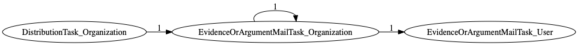
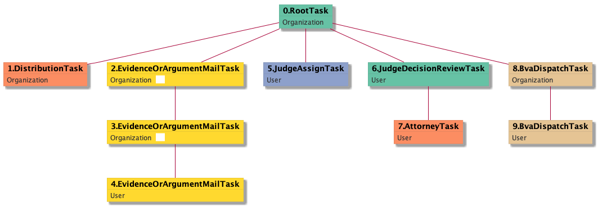

| [README.md](/README.md) | [Task Listing](tasklist.md) |

# EvidenceOrArgumentMailTask_Organization

## Tasks Created Before and After

<details><summary>Tasks created before and after EvidenceOrArgumentMailTask_Organization</summary>

```
digraph G {
rankdir="LR";
"EvidenceOrArgumentMailTask_Organization" -> "EvidenceOrArgumentMailTask_User" [label=1]
"EvidenceOrArgumentMailTask_Organization" -> "EvidenceOrArgumentMailTask_Organization" [label=1]
"DistributionTask_Organization" -> "EvidenceOrArgumentMailTask_Organization" [label=1]
}
```
</details>



**Before:**

   * [DistributionTask_Organization](DistributionTask_Organization.md): 1 times
   * [EvidenceOrArgumentMailTask_Organization](EvidenceOrArgumentMailTask_Organization.md): 1 times

**After:**

   * [EvidenceOrArgumentMailTask_Organization](EvidenceOrArgumentMailTask_Organization.md): 1 times
   * [EvidenceOrArgumentMailTask_User](EvidenceOrArgumentMailTask_User.md): 1 times

## Task Creation Sequences

### RTO.DTO.EOAMTO.EOAMTO

1 occurrences (example appeal IDs: [10213])

<details><summary>Task Tree for appeal with ID 10213</summary>

```
@startuml
skinparam {
  ObjectBorderColor #555
  ObjectBorderThickness 0
  ObjectFontStyle bold
  ObjectFontSize 14
  ObjectAttributeFontColor #333
  ObjectAttributeFontSize 12
}
  object 0.RootTask #66c2a5 {
Organization
}
  object 1.DistributionTask #fc8d62 {
Organization
}
  object 2.EvidenceOrArgumentMailTask #ffd92f {
Organization  <back:white>    </back>
}
  object 3.EvidenceOrArgumentMailTask #ffd92f {
Organization  <back:white>    </back>
}
  object 4.EvidenceOrArgumentMailTask #ffd92f {
User
}
  object 5.JudgeAssignTask #8da0cb {
User
}
  object 6.JudgeDecisionReviewTask #66c2a5 {
User
}
  object 7.AttorneyTask #fc8d62 {
User
}
  object 8.BvaDispatchTask #e5c494 {
Organization
}
  object 9.BvaDispatchTask #e5c494 {
User
}
0.RootTask -- 1.DistributionTask
0.RootTask -- 2.EvidenceOrArgumentMailTask
2.EvidenceOrArgumentMailTask -- 3.EvidenceOrArgumentMailTask
3.EvidenceOrArgumentMailTask -- 4.EvidenceOrArgumentMailTask
0.RootTask -- 5.JudgeAssignTask
0.RootTask -- 6.JudgeDecisionReviewTask
6.JudgeDecisionReviewTask -- 7.AttorneyTask
0.RootTask -- 8.BvaDispatchTask
8.BvaDispatchTask -- 9.BvaDispatchTask
@enduml
```
</details>



### RTO.DTO.EOAMTO

1 occurrences (example appeal IDs: [10213])

<details><summary>Task Tree for appeal with ID 10213</summary>

```
@startuml
skinparam {
  ObjectBorderColor #555
  ObjectBorderThickness 0
  ObjectFontStyle bold
  ObjectFontSize 14
  ObjectAttributeFontColor #333
  ObjectAttributeFontSize 12
}
  object 0.RootTask #66c2a5 {
Organization
}
  object 1.DistributionTask #fc8d62 {
Organization
}
  object 2.EvidenceOrArgumentMailTask #ffd92f {
Organization  <back:white>    </back>
}
  object 3.EvidenceOrArgumentMailTask #ffd92f {
Organization  <back:white>    </back>
}
  object 4.EvidenceOrArgumentMailTask #ffd92f {
User
}
  object 5.JudgeAssignTask #8da0cb {
User
}
  object 6.JudgeDecisionReviewTask #66c2a5 {
User
}
  object 7.AttorneyTask #fc8d62 {
User
}
  object 8.BvaDispatchTask #e5c494 {
Organization
}
  object 9.BvaDispatchTask #e5c494 {
User
}
0.RootTask -- 1.DistributionTask
0.RootTask -- 2.EvidenceOrArgumentMailTask
2.EvidenceOrArgumentMailTask -- 3.EvidenceOrArgumentMailTask
3.EvidenceOrArgumentMailTask -- 4.EvidenceOrArgumentMailTask
0.RootTask -- 5.JudgeAssignTask
0.RootTask -- 6.JudgeDecisionReviewTask
6.JudgeDecisionReviewTask -- 7.AttorneyTask
0.RootTask -- 8.BvaDispatchTask
8.BvaDispatchTask -- 9.BvaDispatchTask
@enduml
```
</details>


