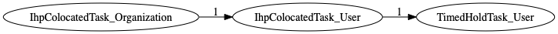
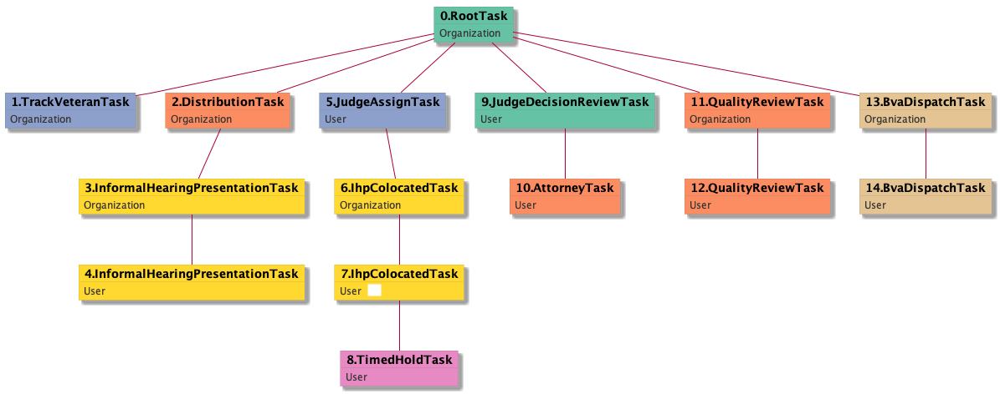

| [README.md](/README.md) | [Task Listing](tasklist.md) |

# IhpColocatedTask_User

[IhpColocatedTask_User description](../descr/IhpColocatedTask_User.md)

## Tasks Created Before and After

<details><summary>Tasks created before and after IhpColocatedTask_User</summary>

```
digraph G {
rankdir="LR";
"IhpColocatedTask_Organization" -> "IhpColocatedTask_User" [label=1]
"IhpColocatedTask_User" -> "TimedHoldTask_User" [label=1]
}
```
</details>



**Before:**

   * [IhpColocatedTask_Organization](IhpColocatedTask_Organization.md): 1 times

**After:**

   * [TimedHoldTask_User](TimedHoldTask_User.md): 1 times

## Task Creation Sequences

### RTO.TVTO.DTO.IHPTO.JATU.ICTO.ICTU

[RTO.TVTO.DTO.IHPTO.JATU.ICTO.ICTU description](../descr/RTO.TVTO.DTO.IHPTO.JATU.ICTO.ICTU.md)

1 occurrences (example appeal IDs: [7729])

<details><summary>Task Tree for appeal with ID 7729</summary>

```
@startuml
skinparam {
  ObjectBorderColor #555
  ObjectBorderThickness 0
  ObjectFontStyle bold
  ObjectFontSize 14
  ObjectAttributeFontColor #333
  ObjectAttributeFontSize 12
}
  object 0.RootTask #66c2a5 {
Organization
}
  object 1.TrackVeteranTask #8da0cb {
Organization
}
  object 2.DistributionTask #fc8d62 {
Organization
}
  object 3.InformalHearingPresentationTask #ffd92f {
Organization
}
  object 4.InformalHearingPresentationTask #ffd92f {
User
}
  object 5.JudgeAssignTask #8da0cb {
User
}
  object 6.IhpColocatedTask #ffd92f {
Organization
}
  object 7.IhpColocatedTask #ffd92f {
User  <back:white>    </back>
}
  object 8.TimedHoldTask #e78ac3 {
User
}
  object 9.JudgeDecisionReviewTask #66c2a5 {
User
}
  object 10.AttorneyTask #fc8d62 {
User
}
  object 11.QualityReviewTask #fc8d62 {
Organization
}
  object 12.QualityReviewTask #fc8d62 {
User
}
  object 13.BvaDispatchTask #e5c494 {
Organization
}
  object 14.BvaDispatchTask #e5c494 {
User
}
0.RootTask -- 1.TrackVeteranTask
0.RootTask -- 2.DistributionTask
2.DistributionTask -- 3.InformalHearingPresentationTask
3.InformalHearingPresentationTask -- 4.InformalHearingPresentationTask
0.RootTask -- 5.JudgeAssignTask
5.JudgeAssignTask -- 6.IhpColocatedTask
6.IhpColocatedTask -- 7.IhpColocatedTask
7.IhpColocatedTask -- 8.TimedHoldTask
0.RootTask -- 9.JudgeDecisionReviewTask
9.JudgeDecisionReviewTask -- 10.AttorneyTask
0.RootTask -- 11.QualityReviewTask
11.QualityReviewTask -- 12.QualityReviewTask
0.RootTask -- 13.BvaDispatchTask
13.BvaDispatchTask -- 14.BvaDispatchTask
@enduml
```
</details>



