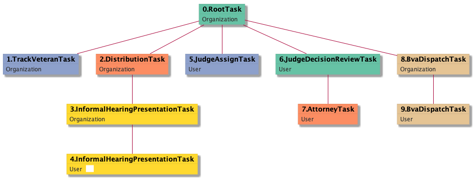

| [README.md](/README.md) | [Task Listing](tasklist.md) |

# InformalHearingPresentationTask_User

## Tasks Created Before and After

<details><summary>Tasks created before and after InformalHearingPresentationTask_User</summary>

```
digraph G {
rankdir="LR";
"InformalHearingPresentationTask_User" -> "JudgeAssignTask_User" [label=4]
"InformalHearingPresentationTask_Organization" -> "InformalHearingPresentationTask_User" [label=5]
}
```
</details>


**Before:**

   * [InformalHearingPresentationTask_Organization](InformalHearingPresentationTask_Organization.md): 5 times

**After:**

   * [JudgeAssignTask_User](JudgeAssignTask_User.md): 4 times

## Task Creation Sequences

### RTO.TVTO.DTO.IHPTO.IHPTU

5 occurrences (example appeal IDs: [30234, 35142, 41843, 5529, 34472])

<details><summary>Task Tree for appeal with ID 30234</summary>

```
@startuml
skinparam {
  ObjectBorderColor #555
  ObjectBorderThickness 0
  ObjectFontStyle bold
  ObjectFontSize 14
  ObjectAttributeFontColor #333
  ObjectAttributeFontSize 12
}
  object 0.RootTask #66c2a5 {
Organization
}
  object 1.TrackVeteranTask #8da0cb {
Organization
}
  object 2.DistributionTask #fc8d62 {
Organization
}
  object 3.InformalHearingPresentationTask #ffd92f {
Organization
}
  object 4.InformalHearingPresentationTask #ffd92f {
User  <back:white>    </back>
}
  object 5.JudgeAssignTask #8da0cb {
User
}
  object 6.JudgeDecisionReviewTask #66c2a5 {
User
}
  object 7.AttorneyTask #fc8d62 {
User
}
  object 8.BvaDispatchTask #e5c494 {
Organization
}
  object 9.BvaDispatchTask #e5c494 {
User
}
0.RootTask -- 1.TrackVeteranTask
0.RootTask -- 2.DistributionTask
2.DistributionTask -- 3.InformalHearingPresentationTask
3.InformalHearingPresentationTask -- 4.InformalHearingPresentationTask
0.RootTask -- 5.JudgeAssignTask
0.RootTask -- 6.JudgeDecisionReviewTask
6.JudgeDecisionReviewTask -- 7.AttorneyTask
0.RootTask -- 8.BvaDispatchTask
8.BvaDispatchTask -- 9.BvaDispatchTask
@enduml
```
</details>



