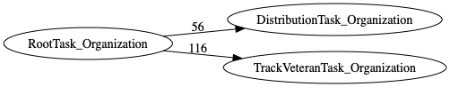
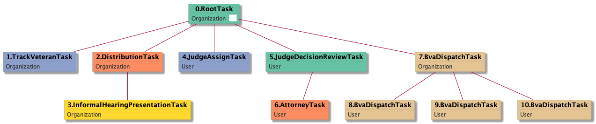

| [README.md](/README.md) | [Task Listing](tasklist.md) |

# RootTask_Organization

[RootTask_Organization description](../descr/RootTask_Organization.md)

## Tasks Created Before and After

<details><summary>Tasks created before and after RootTask_Organization</summary>

```
digraph G {
rankdir="LR";
"RootTask_Organization" -> "DistributionTask_Organization" [label=56]
"RootTask_Organization" -> "TrackVeteranTask_Organization" [label=116]
}
```
</details>



**Before:**


**After:**

   * [TrackVeteranTask_Organization](TrackVeteranTask_Organization.md): 116 times
   * [DistributionTask_Organization](DistributionTask_Organization.md): 56 times

## Task Creation Sequences

### RTO

[RTO description](../descr/RTO.md)

172 occurrences (example appeal IDs: [34538, 39812, 41319, 32724, 40595])

<details><summary>Task Tree for appeal with ID 34538</summary>

```
@startuml
skinparam {
  ObjectBorderColor #555
  ObjectBorderThickness 0
  ObjectFontStyle bold
  ObjectFontSize 14
  ObjectAttributeFontColor #333
  ObjectAttributeFontSize 12
}
  object 0.RootTask #66c2a5 {
Organization  <back:white>    </back>
}
  object 1.TrackVeteranTask #8da0cb {
Organization
}
  object 2.DistributionTask #fc8d62 {
Organization
}
  object 3.InformalHearingPresentationTask #ffd92f {
Organization
}
  object 4.JudgeAssignTask #8da0cb {
User
}
  object 5.JudgeDecisionReviewTask #66c2a5 {
User
}
  object 6.AttorneyTask #fc8d62 {
User
}
  object 7.BvaDispatchTask #e5c494 {
Organization
}
  object 8.BvaDispatchTask #e5c494 {
User
}
  object 9.BvaDispatchTask #e5c494 {
User
}
  object 10.BvaDispatchTask #e5c494 {
User
}
0.RootTask -- 1.TrackVeteranTask
0.RootTask -- 2.DistributionTask
2.DistributionTask -- 3.InformalHearingPresentationTask
0.RootTask -- 4.JudgeAssignTask
0.RootTask -- 5.JudgeDecisionReviewTask
5.JudgeDecisionReviewTask -- 6.AttorneyTask
0.RootTask -- 7.BvaDispatchTask
7.BvaDispatchTask -- 8.BvaDispatchTask
7.BvaDispatchTask -- 9.BvaDispatchTask
7.BvaDispatchTask -- 10.BvaDispatchTask
@enduml
```
</details>



