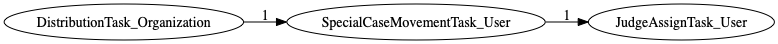
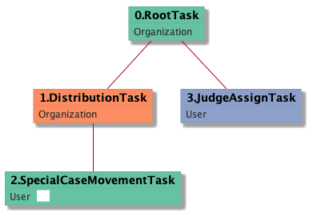

| [README.md](/README.md) | [Task Listing](tasklist.md) |

# SpecialCaseMovementTask_User

[SpecialCaseMovementTask_User description](../descr/SpecialCaseMovementTask_User.md)

## Tasks Created Before and After

<details><summary>Tasks created before and after SpecialCaseMovementTask_User</summary>

```
digraph G {
rankdir="LR";
"SpecialCaseMovementTask_User" -> "JudgeAssignTask_User" [label=1]
"DistributionTask_Organization" -> "SpecialCaseMovementTask_User" [label=1]
}
```
</details>



**Before:**

   * [DistributionTask_Organization](DistributionTask_Organization.md): 1 times

**After:**

   * [JudgeAssignTask_User](JudgeAssignTask_User.md): 1 times

## Task Creation Sequences

### RTO.DTO.SCMTU

[RTO.DTO.SCMTU description](../descr/RTO.DTO.SCMTU.md)

1 occurrences (example appeal IDs: [41963])

<details><summary>Task Tree for appeal with ID 41963</summary>

```
@startuml
skinparam {
  ObjectBorderColor #555
  ObjectBorderThickness 0
  ObjectFontStyle bold
  ObjectFontSize 14
  ObjectAttributeFontColor #333
  ObjectAttributeFontSize 12
}
  object 0.RootTask #66c2a5 {
Organization
}
  object 1.DistributionTask #fc8d62 {
Organization
}
  object 2.SpecialCaseMovementTask #66c2a5 {
User  <back:white>    </back>
}
  object 3.JudgeAssignTask #8da0cb {
User
}
0.RootTask -- 1.DistributionTask
1.DistributionTask -- 2.SpecialCaseMovementTask
0.RootTask -- 3.JudgeAssignTask
@enduml
```
</details>



