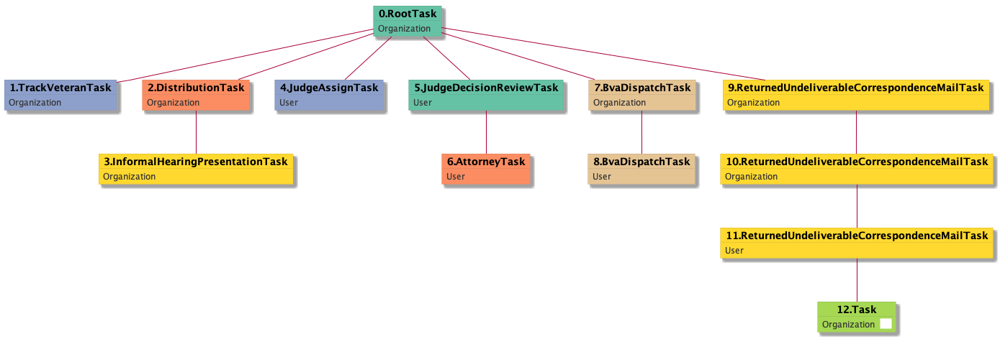

| [README.md](/README.md) | [Task Listing](tasklist.md) |

# Task_Organization

[Task_Organization description](../descr/Task_Organization.md)

## Tasks Created Before and After

<details><summary>Tasks created before and after Task_Organization</summary>

```
digraph G {
rankdir="LR";
"ReturnedUndeliverableCorrespondenceMailTask_User" -> "Task_Organization" [label=1]
}
```
</details>


**Before:**

   * [ReturnedUndeliverableCorrespondenceMailTask_User](ReturnedUndeliverableCorrespondenceMailTask_User.md): 1 times

**After:**


## Task Creation Sequences

### RTO.TVTO.DTO.IHPTO.JATU.JDRTU.ATU.BDTO.BDTU.RUCMTO.RUCMTO.RUCMTU.TO

[RTO.TVTO.DTO.IHPTO.JATU.JDRTU.ATU.BDTO.BDTU.RUCMTO.RUCMTO.RUCMTU.TO description](../descr/RTO.TVTO.DTO.IHPTO.JATU.JDRTU.ATU.BDTO.BDTU.RUCMTO.RUCMTO.RUCMTU.TO.md)

1 occurrences (example appeal IDs: [29665])

<details><summary>Task Tree for appeal with ID 29665</summary>

```
@startuml
skinparam {
  ObjectBorderColor #555
  ObjectBorderThickness 0
  ObjectFontStyle bold
  ObjectFontSize 14
  ObjectAttributeFontColor #333
  ObjectAttributeFontSize 12
}
  object 0.RootTask #66c2a5 {
Organization
}
  object 1.TrackVeteranTask #8da0cb {
Organization
}
  object 2.DistributionTask #fc8d62 {
Organization
}
  object 3.InformalHearingPresentationTask #ffd92f {
Organization
}
  object 4.JudgeAssignTask #8da0cb {
User
}
  object 5.JudgeDecisionReviewTask #66c2a5 {
User
}
  object 6.AttorneyTask #fc8d62 {
User
}
  object 7.BvaDispatchTask #e5c494 {
Organization
}
  object 8.BvaDispatchTask #e5c494 {
User
}
  object 9.ReturnedUndeliverableCorrespondenceMailTask #ffd92f {
Organization
}
  object 10.ReturnedUndeliverableCorrespondenceMailTask #ffd92f {
Organization
}
  object 11.ReturnedUndeliverableCorrespondenceMailTask #ffd92f {
User
}
  object 12.Task #a6d854 {
Organization  <back:white>    </back>
}
0.RootTask -- 1.TrackVeteranTask
0.RootTask -- 2.DistributionTask
2.DistributionTask -- 3.InformalHearingPresentationTask
0.RootTask -- 4.JudgeAssignTask
0.RootTask -- 5.JudgeDecisionReviewTask
5.JudgeDecisionReviewTask -- 6.AttorneyTask
0.RootTask -- 7.BvaDispatchTask
7.BvaDispatchTask -- 8.BvaDispatchTask
0.RootTask -- 9.ReturnedUndeliverableCorrespondenceMailTask
9.ReturnedUndeliverableCorrespondenceMailTask -- 10.ReturnedUndeliverableCorrespondenceMailTask
10.ReturnedUndeliverableCorrespondenceMailTask -- 11.ReturnedUndeliverableCorrespondenceMailTask
11.ReturnedUndeliverableCorrespondenceMailTask -- 12.Task
@enduml
```
</details>



