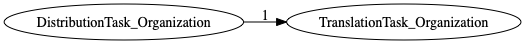
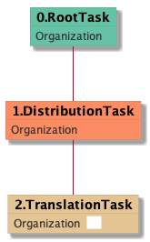

| [README.md](/README.md) | [Task Listing](tasklist.md) |

# TranslationTask_Organization

## Tasks Created Before and After

<details><summary>Tasks created before and after TranslationTask_Organization</summary>

```
digraph G {
rankdir="LR";
"DistributionTask_Organization" -> "TranslationTask_Organization" [label=1]
}
```
</details>



**Before:**

   * [DistributionTask_Organization](DistributionTask_Organization.md): 1 times

**After:**


## Task Creation Sequences

### RTO.DTO.TTO

1 occurrences (example appeal IDs: [41094])

<details><summary>Task Tree for appeal with ID 41094</summary>

```
@startuml
object 0.RootTask_Organization #66c2a5
object 1.DistributionTask_Organization #fc8d62
object 2.TranslationTask_Organization #e5c494
0.RootTask_Organization -- 1.DistributionTask_Organization
1.DistributionTask_Organization -- 2.TranslationTask_Organization
@enduml
```
</details>



