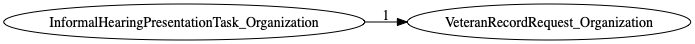
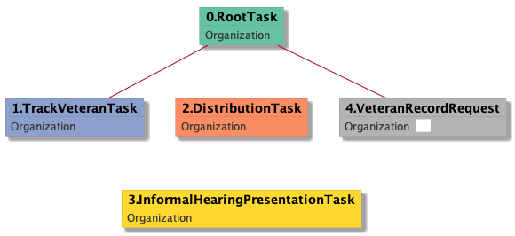

| [README.md](/README.md) | [Task Listing](tasklist.md) |

# VeteranRecordRequest_Organization

[VeteranRecordRequest_Organization description](../descr/VeteranRecordRequest_Organization.md)

## Tasks Created Before and After

<details><summary>Tasks created before and after VeteranRecordRequest_Organization</summary>

```
digraph G {
rankdir="LR";
"InformalHearingPresentationTask_Organization" -> "VeteranRecordRequest_Organization" [label=1]
}
```
</details>



**Before:**

   * [InformalHearingPresentationTask_Organization](InformalHearingPresentationTask_Organization.md): 1 times

**After:**


## Task Creation Sequences

### RTO.TVTO.DTO.IHPTO.VRRO

[RTO.TVTO.DTO.IHPTO.VRRO description](../descr/RTO.TVTO.DTO.IHPTO.VRRO.md)

1 occurrences (example appeal IDs: [42651])

<details><summary>Task Tree for appeal with ID 42651</summary>

```
@startuml
skinparam {
  ObjectBorderColor #555
  ObjectBorderThickness 0
  ObjectFontStyle bold
  ObjectFontSize 14
  ObjectAttributeFontColor #333
  ObjectAttributeFontSize 12
}
  object 0.RootTask #66c2a5 {
Organization
}
  object 1.TrackVeteranTask #8da0cb {
Organization
}
  object 2.DistributionTask #fc8d62 {
Organization
}
  object 3.InformalHearingPresentationTask #ffd92f {
Organization
}
  object 4.VeteranRecordRequest #b3b3b3 {
Organization  <back:white>    </back>
}
0.RootTask -- 1.TrackVeteranTask
0.RootTask -- 2.DistributionTask
2.DistributionTask -- 3.InformalHearingPresentationTask
0.RootTask -- 4.VeteranRecordRequest
@enduml
```
</details>



