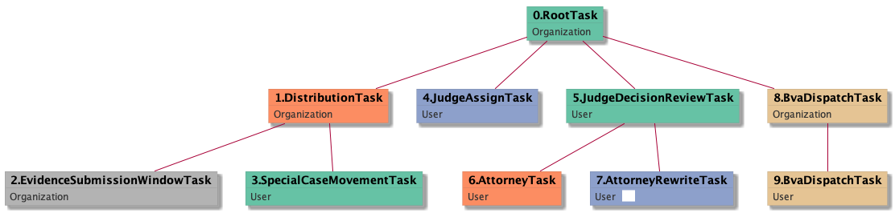

| [README.md](/README.md) | [Task Listing](tasklist.md) |

# AttorneyRewriteTask_User

[AttorneyRewriteTask_User description](../descr/AttorneyRewriteTask_User.md)

## Tasks Created Before and After

<details><summary>Tasks created before and after AttorneyRewriteTask_User</summary>

```
digraph G {
rankdir="LR";
"AttorneyRewriteTask_User" -> "BvaDispatchTask_Organization" [label=2]
"AttorneyTask_User" -> "AttorneyRewriteTask_User" [label=2]
}
```
</details>


**Before:**

   * [AttorneyTask_User](AttorneyTask_User.md): 2 times

**After:**

   * [BvaDispatchTask_Organization](BvaDispatchTask_Organization.md): 2 times

## Task Creation Sequences

### RTO.TVTO.DTO.ESWTO.IHPTO.JATU.JDRTU.ATU.ARTU

[RTO.TVTO.DTO.ESWTO.IHPTO.JATU.JDRTU.ATU.ARTU description](../descr/RTO.TVTO.DTO.ESWTO.IHPTO.JATU.JDRTU.ATU.ARTU.md)

1 occurrences (example appeal IDs: [11522])

<details><summary>Task Tree for appeal with ID 11522</summary>

```
@startuml
skinparam {
  ObjectBorderColor #555
  ObjectBorderThickness 0
  ObjectFontStyle bold
  ObjectFontSize 14
  ObjectAttributeFontColor #333
  ObjectAttributeFontSize 12
}
  object 0.RootTask #66c2a5 {
Organization
}
  object 1.TrackVeteranTask #8da0cb {
Organization
}
  object 2.DistributionTask #fc8d62 {
Organization
}
  object 3.EvidenceSubmissionWindowTask #b3b3b3 {
Organization
}
  object 4.InformalHearingPresentationTask #ffd92f {
Organization
}
  object 5.JudgeAssignTask #8da0cb {
User
}
  object 6.JudgeDecisionReviewTask #66c2a5 {
User
}
  object 7.AttorneyTask #fc8d62 {
User
}
  object 8.AttorneyRewriteTask #8da0cb {
User  <back:white>    </back>
}
  object 9.BvaDispatchTask #e5c494 {
Organization
}
  object 10.BvaDispatchTask #e5c494 {
User
}
0.RootTask -- 1.TrackVeteranTask
0.RootTask -- 2.DistributionTask
2.DistributionTask -- 3.EvidenceSubmissionWindowTask
2.DistributionTask -- 4.InformalHearingPresentationTask
0.RootTask -- 5.JudgeAssignTask
0.RootTask -- 6.JudgeDecisionReviewTask
6.JudgeDecisionReviewTask -- 7.AttorneyTask
6.JudgeDecisionReviewTask -- 8.AttorneyRewriteTask
0.RootTask -- 9.BvaDispatchTask
9.BvaDispatchTask -- 10.BvaDispatchTask
@enduml
```
</details>


### RTO.DTO.ESWTO.SCMTU.JATU.JDRTU.ATU.ARTU

[RTO.DTO.ESWTO.SCMTU.JATU.JDRTU.ATU.ARTU description](../descr/RTO.DTO.ESWTO.SCMTU.JATU.JDRTU.ATU.ARTU.md)

1 occurrences (example appeal IDs: [40605])

<details><summary>Task Tree for appeal with ID 40605</summary>

```
@startuml
skinparam {
  ObjectBorderColor #555
  ObjectBorderThickness 0
  ObjectFontStyle bold
  ObjectFontSize 14
  ObjectAttributeFontColor #333
  ObjectAttributeFontSize 12
}
  object 0.RootTask #66c2a5 {
Organization
}
  object 1.DistributionTask #fc8d62 {
Organization
}
  object 2.EvidenceSubmissionWindowTask #b3b3b3 {
Organization
}
  object 3.SpecialCaseMovementTask #66c2a5 {
User
}
  object 4.JudgeAssignTask #8da0cb {
User
}
  object 5.JudgeDecisionReviewTask #66c2a5 {
User
}
  object 6.AttorneyTask #fc8d62 {
User
}
  object 7.AttorneyRewriteTask #8da0cb {
User  <back:white>    </back>
}
  object 8.BvaDispatchTask #e5c494 {
Organization
}
  object 9.BvaDispatchTask #e5c494 {
User
}
0.RootTask -- 1.DistributionTask
1.DistributionTask -- 2.EvidenceSubmissionWindowTask
1.DistributionTask -- 3.SpecialCaseMovementTask
0.RootTask -- 4.JudgeAssignTask
0.RootTask -- 5.JudgeDecisionReviewTask
5.JudgeDecisionReviewTask -- 6.AttorneyTask
5.JudgeDecisionReviewTask -- 7.AttorneyRewriteTask
0.RootTask -- 8.BvaDispatchTask
8.BvaDispatchTask -- 9.BvaDispatchTask
@enduml
```
</details>



