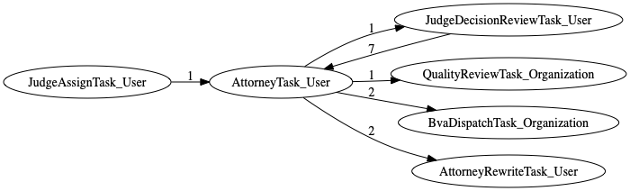
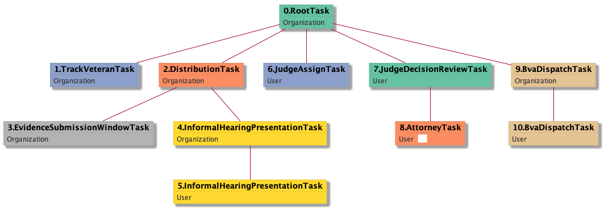
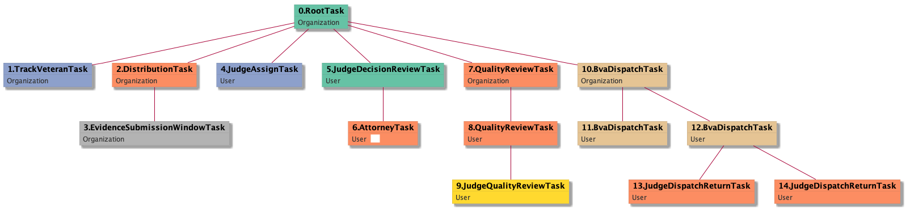
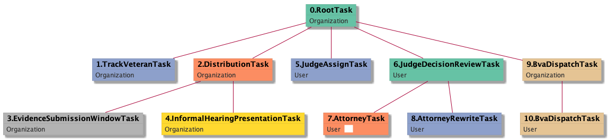
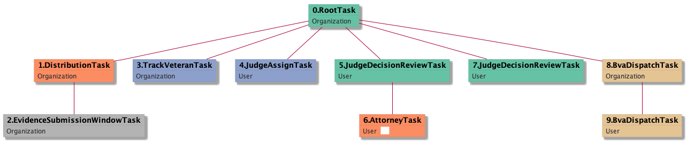
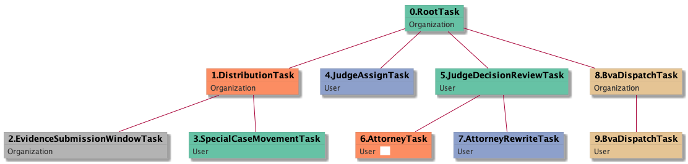
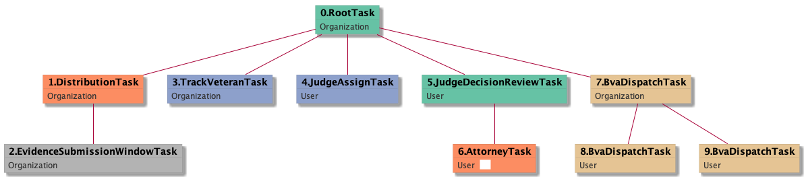

| [README.md](/README.md) | [Task Listing](tasklist.md) |

# AttorneyTask_User

## Tasks Created Before and After

<details><summary>Tasks created before and after AttorneyTask_User</summary>

```
digraph G {
rankdir="LR";
"AttorneyTask_User" -> "JudgeDecisionReviewTask_User" [label=1]
"AttorneyTask_User" -> "QualityReviewTask_Organization" [label=1]
"AttorneyTask_User" -> "BvaDispatchTask_Organization" [label=2]
"JudgeDecisionReviewTask_User" -> "AttorneyTask_User" [label=7]
"JudgeAssignTask_User" -> "AttorneyTask_User" [label=1]
"AttorneyTask_User" -> "AttorneyRewriteTask_User" [label=2]
}
```
</details>



**Before:**

   * [JudgeDecisionReviewTask_User](JudgeDecisionReviewTask_User.md): 7 times
   * [JudgeAssignTask_User](JudgeAssignTask_User.md): 1 times

**After:**

   * [BvaDispatchTask_Organization](BvaDispatchTask_Organization.md): 2 times
   * [AttorneyRewriteTask_User](AttorneyRewriteTask_User.md): 2 times
   * [JudgeDecisionReviewTask_User](JudgeDecisionReviewTask_User.md): 1 times
   * [QualityReviewTask_Organization](QualityReviewTask_Organization.md): 1 times

## Task Creation Sequences

### RTO.TVTO.DTO.ESWTO.IHPTO.IHPTU.JATU.JDRTU.ATU

2 occurrences (example appeal IDs: [15370, 41412])

<details><summary>Task Tree for appeal with ID 15370</summary>

```
@startuml
object 0.RootTask_Organization #66c2a5
object 1.TrackVeteranTask_Organization #8da0cb
object 2.DistributionTask_Organization #fc8d62
object 3.EvidenceSubmissionWindowTask_Organization #b3b3b3
object 4.InformalHearingPresentationTask_Organization #ffd92f
object 5.InformalHearingPresentationTask_User #ffd92f
object 6.JudgeAssignTask_User #8da0cb
object 7.JudgeDecisionReviewTask_User #66c2a5
object 8.AttorneyTask_User #fc8d62
object 9.BvaDispatchTask_Organization #e5c494
object 10.BvaDispatchTask_User #e5c494
0.RootTask_Organization -- 1.TrackVeteranTask_Organization
0.RootTask_Organization -- 2.DistributionTask_Organization
2.DistributionTask_Organization -- 3.EvidenceSubmissionWindowTask_Organization
2.DistributionTask_Organization -- 4.InformalHearingPresentationTask_Organization
4.InformalHearingPresentationTask_Organization -- 5.InformalHearingPresentationTask_User
0.RootTask_Organization -- 6.JudgeAssignTask_User
0.RootTask_Organization -- 7.JudgeDecisionReviewTask_User
7.JudgeDecisionReviewTask_User -- 8.AttorneyTask_User
0.RootTask_Organization -- 9.BvaDispatchTask_Organization
9.BvaDispatchTask_Organization -- 10.BvaDispatchTask_User
@enduml
```
</details>



### RTO.TVTO.DTO.ESWTO.JATU.JDRTU.ATU

2 occurrences (example appeal IDs: [15411, 40893])

<details><summary>Task Tree for appeal with ID 15411</summary>

```
@startuml
object 0.RootTask_Organization #66c2a5
object 1.TrackVeteranTask_Organization #8da0cb
object 2.DistributionTask_Organization #fc8d62
object 3.EvidenceSubmissionWindowTask_Organization #b3b3b3
object 4.JudgeAssignTask_User #8da0cb
object 5.JudgeDecisionReviewTask_User #66c2a5
object 6.AttorneyTask_User #fc8d62
object 7.QualityReviewTask_Organization #66c2a5
object 8.QualityReviewTask_User #66c2a5
object 9.JudgeQualityReviewTask_User #8da0cb
object 10.BvaDispatchTask_Organization #e5c494
object 11.BvaDispatchTask_User #e5c494
object 12.BvaDispatchTask_User #e5c494
object 13.JudgeDispatchReturnTask_User #fc8d62
object 14.JudgeDispatchReturnTask_User #fc8d62
0.RootTask_Organization -- 1.TrackVeteranTask_Organization
0.RootTask_Organization -- 2.DistributionTask_Organization
2.DistributionTask_Organization -- 3.EvidenceSubmissionWindowTask_Organization
0.RootTask_Organization -- 4.JudgeAssignTask_User
0.RootTask_Organization -- 5.JudgeDecisionReviewTask_User
5.JudgeDecisionReviewTask_User -- 6.AttorneyTask_User
0.RootTask_Organization -- 7.QualityReviewTask_Organization
7.QualityReviewTask_Organization -- 8.QualityReviewTask_User
8.QualityReviewTask_User -- 9.JudgeQualityReviewTask_User
0.RootTask_Organization -- 10.BvaDispatchTask_Organization
10.BvaDispatchTask_Organization -- 11.BvaDispatchTask_User
10.BvaDispatchTask_Organization -- 12.BvaDispatchTask_User
12.BvaDispatchTask_User -- 13.JudgeDispatchReturnTask_User
12.BvaDispatchTask_User -- 14.JudgeDispatchReturnTask_User
@enduml
```
</details>



### RTO.TVTO.DTO.ESWTO.IHPTO.JATU.JDRTU.ATU

1 occurrences (example appeal IDs: [11522])

<details><summary>Task Tree for appeal with ID 11522</summary>

```
@startuml
object 0.RootTask_Organization #66c2a5
object 1.TrackVeteranTask_Organization #8da0cb
object 2.DistributionTask_Organization #fc8d62
object 3.EvidenceSubmissionWindowTask_Organization #b3b3b3
object 4.InformalHearingPresentationTask_Organization #ffd92f
object 5.JudgeAssignTask_User #8da0cb
object 6.JudgeDecisionReviewTask_User #66c2a5
object 7.AttorneyTask_User #fc8d62
object 8.AttorneyRewriteTask_User #8da0cb
object 9.BvaDispatchTask_Organization #e5c494
object 10.BvaDispatchTask_User #e5c494
0.RootTask_Organization -- 1.TrackVeteranTask_Organization
0.RootTask_Organization -- 2.DistributionTask_Organization
2.DistributionTask_Organization -- 3.EvidenceSubmissionWindowTask_Organization
2.DistributionTask_Organization -- 4.InformalHearingPresentationTask_Organization
0.RootTask_Organization -- 5.JudgeAssignTask_User
0.RootTask_Organization -- 6.JudgeDecisionReviewTask_User
6.JudgeDecisionReviewTask_User -- 7.AttorneyTask_User
6.JudgeDecisionReviewTask_User -- 8.AttorneyRewriteTask_User
0.RootTask_Organization -- 9.BvaDispatchTask_Organization
9.BvaDispatchTask_Organization -- 10.BvaDispatchTask_User
@enduml
```
</details>



### RTO.DTO.ESWTO.TVTO.JATU.ATU

1 occurrences (example appeal IDs: [15152])

<details><summary>Task Tree for appeal with ID 15152</summary>

```
@startuml
object 0.RootTask_Organization #66c2a5
object 1.DistributionTask_Organization #fc8d62
object 2.EvidenceSubmissionWindowTask_Organization #b3b3b3
object 3.TrackVeteranTask_Organization #8da0cb
object 4.JudgeAssignTask_User #8da0cb
object 5.JudgeDecisionReviewTask_User #66c2a5
object 6.AttorneyTask_User #fc8d62
object 7.JudgeDecisionReviewTask_User #66c2a5
object 8.BvaDispatchTask_Organization #e5c494
object 9.BvaDispatchTask_User #e5c494
0.RootTask_Organization -- 1.DistributionTask_Organization
1.DistributionTask_Organization -- 2.EvidenceSubmissionWindowTask_Organization
0.RootTask_Organization -- 3.TrackVeteranTask_Organization
0.RootTask_Organization -- 4.JudgeAssignTask_User
0.RootTask_Organization -- 5.JudgeDecisionReviewTask_User
5.JudgeDecisionReviewTask_User -- 6.AttorneyTask_User
0.RootTask_Organization -- 7.JudgeDecisionReviewTask_User
0.RootTask_Organization -- 8.BvaDispatchTask_Organization
8.BvaDispatchTask_Organization -- 9.BvaDispatchTask_User
@enduml
```
</details>



### RTO.DTO.ESWTO.SCMTU.JATU.JDRTU.ATU

1 occurrences (example appeal IDs: [40605])

<details><summary>Task Tree for appeal with ID 40605</summary>

```
@startuml
object 0.RootTask_Organization #66c2a5
object 1.DistributionTask_Organization #fc8d62
object 2.EvidenceSubmissionWindowTask_Organization #b3b3b3
object 3.SpecialCaseMovementTask_User #a6d854
object 4.JudgeAssignTask_User #8da0cb
object 5.JudgeDecisionReviewTask_User #66c2a5
object 6.AttorneyTask_User #fc8d62
object 7.AttorneyRewriteTask_User #8da0cb
object 8.BvaDispatchTask_Organization #e5c494
object 9.BvaDispatchTask_User #e5c494
0.RootTask_Organization -- 1.DistributionTask_Organization
1.DistributionTask_Organization -- 2.EvidenceSubmissionWindowTask_Organization
1.DistributionTask_Organization -- 3.SpecialCaseMovementTask_User
0.RootTask_Organization -- 4.JudgeAssignTask_User
0.RootTask_Organization -- 5.JudgeDecisionReviewTask_User
5.JudgeDecisionReviewTask_User -- 6.AttorneyTask_User
5.JudgeDecisionReviewTask_User -- 7.AttorneyRewriteTask_User
0.RootTask_Organization -- 8.BvaDispatchTask_Organization
8.BvaDispatchTask_Organization -- 9.BvaDispatchTask_User
@enduml
```
</details>



### RTO.DTO.ESWTO.TVTO.JATU.JDRTU.ATU

1 occurrences (example appeal IDs: [17948])

<details><summary>Task Tree for appeal with ID 17948</summary>

```
@startuml
object 0.RootTask_Organization #66c2a5
object 1.DistributionTask_Organization #fc8d62
object 2.EvidenceSubmissionWindowTask_Organization #b3b3b3
object 3.TrackVeteranTask_Organization #8da0cb
object 4.JudgeAssignTask_User #8da0cb
object 5.JudgeDecisionReviewTask_User #66c2a5
object 6.AttorneyTask_User #fc8d62
object 7.BvaDispatchTask_Organization #e5c494
object 8.BvaDispatchTask_User #e5c494
object 9.BvaDispatchTask_User #e5c494
0.RootTask_Organization -- 1.DistributionTask_Organization
1.DistributionTask_Organization -- 2.EvidenceSubmissionWindowTask_Organization
0.RootTask_Organization -- 3.TrackVeteranTask_Organization
0.RootTask_Organization -- 4.JudgeAssignTask_User
0.RootTask_Organization -- 5.JudgeDecisionReviewTask_User
5.JudgeDecisionReviewTask_User -- 6.AttorneyTask_User
0.RootTask_Organization -- 7.BvaDispatchTask_Organization
7.BvaDispatchTask_Organization -- 8.BvaDispatchTask_User
7.BvaDispatchTask_Organization -- 9.BvaDispatchTask_User
@enduml
```
</details>



