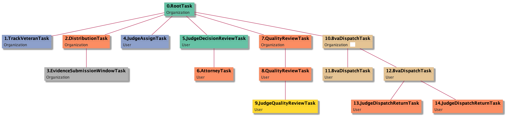
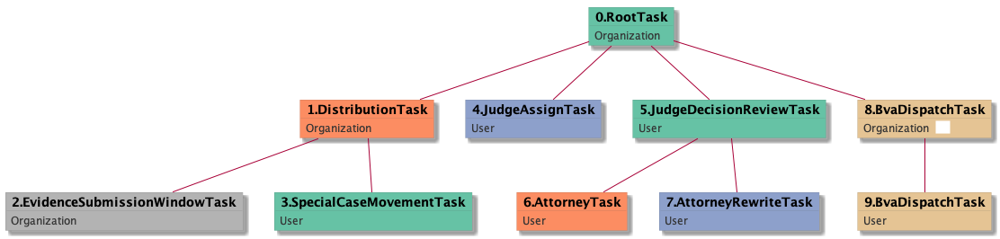
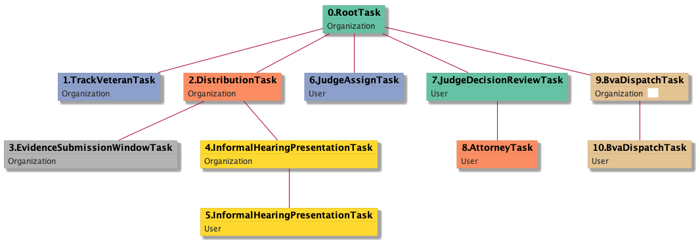

| [README.md](/README.md) | [Task Listing](tasklist.md) |

# BvaDispatchTask_Organization

## Tasks Created Before and After

<details><summary>Tasks created before and after BvaDispatchTask_Organization</summary>

```
digraph G {
rankdir="LR";
"AttorneyRewriteTask_User" -> "BvaDispatchTask_Organization" [label=2]
"AttorneyTask_User" -> "BvaDispatchTask_Organization" [label=2]
"BvaDispatchTask_Organization" -> "BvaDispatchTask_User" [label=6]
"JudgeDecisionReviewTask_User" -> "BvaDispatchTask_Organization" [label=1]
"JudgeQualityReviewTask_User" -> "BvaDispatchTask_Organization" [label=1]
}
```
</details>


**Before:**

   * [AttorneyTask_User](AttorneyTask_User.md): 2 times
   * [AttorneyRewriteTask_User](AttorneyRewriteTask_User.md): 2 times
   * [JudgeDecisionReviewTask_User](JudgeDecisionReviewTask_User.md): 1 times
   * [JudgeQualityReviewTask_User](JudgeQualityReviewTask_User.md): 1 times

**After:**

   * [BvaDispatchTask_User](BvaDispatchTask_User.md): 6 times

## Task Creation Sequences

### RTO.TVTO.DTO.ESWTO.JATU.JDRTU.ATU.QRTO.QRTU.JQRTU.BDTO

1 occurrences (example appeal IDs: [15411])

<details><summary>Task Tree for appeal with ID 15411</summary>

```
@startuml
skinparam {
  ObjectBorderColor #555
  ObjectBorderThickness 0
  ObjectFontStyle bold
  ObjectFontSize 14
  ObjectAttributeFontColor #333
  ObjectAttributeFontSize 12
}
  object 0.RootTask #66c2a5 {
Organization
}
  object 1.TrackVeteranTask #8da0cb {
Organization
}
  object 2.DistributionTask #fc8d62 {
Organization
}
  object 3.EvidenceSubmissionWindowTask #b3b3b3 {
Organization
}
  object 4.JudgeAssignTask #8da0cb {
User
}
  object 5.JudgeDecisionReviewTask #66c2a5 {
User
}
  object 6.AttorneyTask #fc8d62 {
User
}
  object 7.QualityReviewTask #66c2a5 {
Organization
}
  object 8.QualityReviewTask #66c2a5 {
User
}
  object 9.JudgeQualityReviewTask #8da0cb {
User
}
  object 10.BvaDispatchTask #e5c494 {
Organization  <back:white>    </back>
}
  object 11.BvaDispatchTask #e5c494 {
User
}
  object 12.BvaDispatchTask #e5c494 {
User
}
  object 13.JudgeDispatchReturnTask #fc8d62 {
User
}
  object 14.JudgeDispatchReturnTask #fc8d62 {
User
}
0.RootTask -- 1.TrackVeteranTask
0.RootTask -- 2.DistributionTask
2.DistributionTask -- 3.EvidenceSubmissionWindowTask
0.RootTask -- 4.JudgeAssignTask
0.RootTask -- 5.JudgeDecisionReviewTask
5.JudgeDecisionReviewTask -- 6.AttorneyTask
0.RootTask -- 7.QualityReviewTask
7.QualityReviewTask -- 8.QualityReviewTask
8.QualityReviewTask -- 9.JudgeQualityReviewTask
0.RootTask -- 10.BvaDispatchTask
10.BvaDispatchTask -- 11.BvaDispatchTask
10.BvaDispatchTask -- 12.BvaDispatchTask
12.BvaDispatchTask -- 13.JudgeDispatchReturnTask
12.BvaDispatchTask -- 14.JudgeDispatchReturnTask
@enduml
```
</details>



### RTO.DTO.ESWTO.TVTO.JATU.ATU.JDRTU.BDTO

1 occurrences (example appeal IDs: [15152])

<details><summary>Task Tree for appeal with ID 15152</summary>

```
@startuml
skinparam {
  ObjectBorderColor #555
  ObjectBorderThickness 0
  ObjectFontStyle bold
  ObjectFontSize 14
  ObjectAttributeFontColor #333
  ObjectAttributeFontSize 12
}
  object 0.RootTask #66c2a5 {
Organization
}
  object 1.DistributionTask #fc8d62 {
Organization
}
  object 2.EvidenceSubmissionWindowTask #b3b3b3 {
Organization
}
  object 3.TrackVeteranTask #8da0cb {
Organization
}
  object 4.JudgeAssignTask #8da0cb {
User
}
  object 5.JudgeDecisionReviewTask #66c2a5 {
User
}
  object 6.AttorneyTask #fc8d62 {
User
}
  object 7.JudgeDecisionReviewTask #66c2a5 {
User
}
  object 8.BvaDispatchTask #e5c494 {
Organization  <back:white>    </back>
}
  object 9.BvaDispatchTask #e5c494 {
User
}
0.RootTask -- 1.DistributionTask
1.DistributionTask -- 2.EvidenceSubmissionWindowTask
0.RootTask -- 3.TrackVeteranTask
0.RootTask -- 4.JudgeAssignTask
0.RootTask -- 5.JudgeDecisionReviewTask
5.JudgeDecisionReviewTask -- 6.AttorneyTask
0.RootTask -- 7.JudgeDecisionReviewTask
0.RootTask -- 8.BvaDispatchTask
8.BvaDispatchTask -- 9.BvaDispatchTask
@enduml
```
</details>


### RTO.DTO.ESWTO.TVTO.JATU.JDRTU.ATU.BDTO

1 occurrences (example appeal IDs: [17948])

<details><summary>Task Tree for appeal with ID 17948</summary>

```
@startuml
skinparam {
  ObjectBorderColor #555
  ObjectBorderThickness 0
  ObjectFontStyle bold
  ObjectFontSize 14
  ObjectAttributeFontColor #333
  ObjectAttributeFontSize 12
}
  object 0.RootTask #66c2a5 {
Organization
}
  object 1.DistributionTask #fc8d62 {
Organization
}
  object 2.EvidenceSubmissionWindowTask #b3b3b3 {
Organization
}
  object 3.TrackVeteranTask #8da0cb {
Organization
}
  object 4.JudgeAssignTask #8da0cb {
User
}
  object 5.JudgeDecisionReviewTask #66c2a5 {
User
}
  object 6.AttorneyTask #fc8d62 {
User
}
  object 7.BvaDispatchTask #e5c494 {
Organization  <back:white>    </back>
}
  object 8.BvaDispatchTask #e5c494 {
User
}
  object 9.BvaDispatchTask #e5c494 {
User
}
0.RootTask -- 1.DistributionTask
1.DistributionTask -- 2.EvidenceSubmissionWindowTask
0.RootTask -- 3.TrackVeteranTask
0.RootTask -- 4.JudgeAssignTask
0.RootTask -- 5.JudgeDecisionReviewTask
5.JudgeDecisionReviewTask -- 6.AttorneyTask
0.RootTask -- 7.BvaDispatchTask
7.BvaDispatchTask -- 8.BvaDispatchTask
7.BvaDispatchTask -- 9.BvaDispatchTask
@enduml
```
</details>


### RTO.DTO.ESWTO.SCMTU.JATU.JDRTU.ATU.ARTU.BDTO

1 occurrences (example appeal IDs: [40605])

<details><summary>Task Tree for appeal with ID 40605</summary>

```
@startuml
skinparam {
  ObjectBorderColor #555
  ObjectBorderThickness 0
  ObjectFontStyle bold
  ObjectFontSize 14
  ObjectAttributeFontColor #333
  ObjectAttributeFontSize 12
}
  object 0.RootTask #66c2a5 {
Organization
}
  object 1.DistributionTask #fc8d62 {
Organization
}
  object 2.EvidenceSubmissionWindowTask #b3b3b3 {
Organization
}
  object 3.SpecialCaseMovementTask #a6d854 {
User
}
  object 4.JudgeAssignTask #8da0cb {
User
}
  object 5.JudgeDecisionReviewTask #66c2a5 {
User
}
  object 6.AttorneyTask #fc8d62 {
User
}
  object 7.AttorneyRewriteTask #8da0cb {
User
}
  object 8.BvaDispatchTask #e5c494 {
Organization  <back:white>    </back>
}
  object 9.BvaDispatchTask #e5c494 {
User
}
0.RootTask -- 1.DistributionTask
1.DistributionTask -- 2.EvidenceSubmissionWindowTask
1.DistributionTask -- 3.SpecialCaseMovementTask
0.RootTask -- 4.JudgeAssignTask
0.RootTask -- 5.JudgeDecisionReviewTask
5.JudgeDecisionReviewTask -- 6.AttorneyTask
5.JudgeDecisionReviewTask -- 7.AttorneyRewriteTask
0.RootTask -- 8.BvaDispatchTask
8.BvaDispatchTask -- 9.BvaDispatchTask
@enduml
```
</details>



### RTO.TVTO.DTO.ESWTO.IHPTO.IHPTU.JATU.JDRTU.ATU.BDTO

1 occurrences (example appeal IDs: [15370])

<details><summary>Task Tree for appeal with ID 15370</summary>

```
@startuml
skinparam {
  ObjectBorderColor #555
  ObjectBorderThickness 0
  ObjectFontStyle bold
  ObjectFontSize 14
  ObjectAttributeFontColor #333
  ObjectAttributeFontSize 12
}
  object 0.RootTask #66c2a5 {
Organization
}
  object 1.TrackVeteranTask #8da0cb {
Organization
}
  object 2.DistributionTask #fc8d62 {
Organization
}
  object 3.EvidenceSubmissionWindowTask #b3b3b3 {
Organization
}
  object 4.InformalHearingPresentationTask #ffd92f {
Organization
}
  object 5.InformalHearingPresentationTask #ffd92f {
User
}
  object 6.JudgeAssignTask #8da0cb {
User
}
  object 7.JudgeDecisionReviewTask #66c2a5 {
User
}
  object 8.AttorneyTask #fc8d62 {
User
}
  object 9.BvaDispatchTask #e5c494 {
Organization  <back:white>    </back>
}
  object 10.BvaDispatchTask #e5c494 {
User
}
0.RootTask -- 1.TrackVeteranTask
0.RootTask -- 2.DistributionTask
2.DistributionTask -- 3.EvidenceSubmissionWindowTask
2.DistributionTask -- 4.InformalHearingPresentationTask
4.InformalHearingPresentationTask -- 5.InformalHearingPresentationTask
0.RootTask -- 6.JudgeAssignTask
0.RootTask -- 7.JudgeDecisionReviewTask
7.JudgeDecisionReviewTask -- 8.AttorneyTask
0.RootTask -- 9.BvaDispatchTask
9.BvaDispatchTask -- 10.BvaDispatchTask
@enduml
```
</details>



### RTO.TVTO.DTO.ESWTO.IHPTO.JATU.JDRTU.ATU.ARTU.BDTO

1 occurrences (example appeal IDs: [11522])

<details><summary>Task Tree for appeal with ID 11522</summary>

```
@startuml
skinparam {
  ObjectBorderColor #555
  ObjectBorderThickness 0
  ObjectFontStyle bold
  ObjectFontSize 14
  ObjectAttributeFontColor #333
  ObjectAttributeFontSize 12
}
  object 0.RootTask #66c2a5 {
Organization
}
  object 1.TrackVeteranTask #8da0cb {
Organization
}
  object 2.DistributionTask #fc8d62 {
Organization
}
  object 3.EvidenceSubmissionWindowTask #b3b3b3 {
Organization
}
  object 4.InformalHearingPresentationTask #ffd92f {
Organization
}
  object 5.JudgeAssignTask #8da0cb {
User
}
  object 6.JudgeDecisionReviewTask #66c2a5 {
User
}
  object 7.AttorneyTask #fc8d62 {
User
}
  object 8.AttorneyRewriteTask #8da0cb {
User
}
  object 9.BvaDispatchTask #e5c494 {
Organization  <back:white>    </back>
}
  object 10.BvaDispatchTask #e5c494 {
User
}
0.RootTask -- 1.TrackVeteranTask
0.RootTask -- 2.DistributionTask
2.DistributionTask -- 3.EvidenceSubmissionWindowTask
2.DistributionTask -- 4.InformalHearingPresentationTask
0.RootTask -- 5.JudgeAssignTask
0.RootTask -- 6.JudgeDecisionReviewTask
6.JudgeDecisionReviewTask -- 7.AttorneyTask
6.JudgeDecisionReviewTask -- 8.AttorneyRewriteTask
0.RootTask -- 9.BvaDispatchTask
9.BvaDispatchTask -- 10.BvaDispatchTask
@enduml
```
</details>


