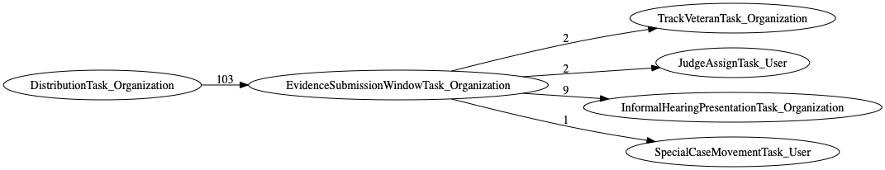
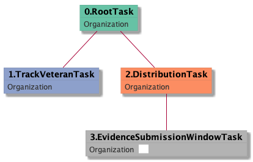
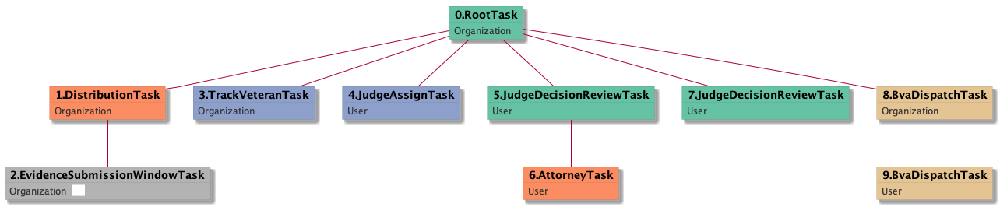
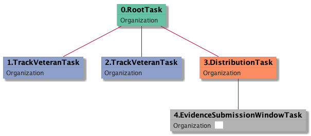

| [README.md](/README.md) | [Task Listing](tasklist.md) |

# EvidenceSubmissionWindowTask_Organization

[EvidenceSubmissionWindowTask_Organization description](../descr/EvidenceSubmissionWindowTask_Organization.md)

## Tasks Created Before and After

<details><summary>Tasks created before and after EvidenceSubmissionWindowTask_Organization</summary>

```
digraph G {
rankdir="LR";
"EvidenceSubmissionWindowTask_Organization" -> "TrackVeteranTask_Organization" [label=2]
"EvidenceSubmissionWindowTask_Organization" -> "JudgeAssignTask_User" [label=2]
"EvidenceSubmissionWindowTask_Organization" -> "InformalHearingPresentationTask_Organization" [label=9]
"DistributionTask_Organization" -> "EvidenceSubmissionWindowTask_Organization" [label=103]
"EvidenceSubmissionWindowTask_Organization" -> "SpecialCaseMovementTask_User" [label=1]
}
```
</details>



**Before:**

   * [DistributionTask_Organization](DistributionTask_Organization.md): 103 times

**After:**

   * [InformalHearingPresentationTask_Organization](InformalHearingPresentationTask_Organization.md): 9 times
   * [TrackVeteranTask_Organization](TrackVeteranTask_Organization.md): 2 times
   * [JudgeAssignTask_User](JudgeAssignTask_User.md): 2 times
   * [SpecialCaseMovementTask_User](SpecialCaseMovementTask_User.md): 1 times

## Task Creation Sequences

### RTO.TVTO.DTO.ESWTO

[RTO.TVTO.DTO.ESWTO description](../descr/RTO.TVTO.DTO.ESWTO.md)

63 occurrences (example appeal IDs: [40915, 42334, 41269, 42634, 40596])

<details><summary>Task Tree for appeal with ID 40915</summary>

```
@startuml
skinparam {
  ObjectBorderColor #555
  ObjectBorderThickness 0
  ObjectFontStyle bold
  ObjectFontSize 14
  ObjectAttributeFontColor #333
  ObjectAttributeFontSize 12
}
  object 0.RootTask #66c2a5 {
Organization
}
  object 1.TrackVeteranTask #8da0cb {
Organization
}
  object 2.DistributionTask #fc8d62 {
Organization
}
  object 3.EvidenceSubmissionWindowTask #b3b3b3 {
Organization  <back:white>    </back>
}
0.RootTask -- 1.TrackVeteranTask
0.RootTask -- 2.DistributionTask
2.DistributionTask -- 3.EvidenceSubmissionWindowTask
@enduml
```
</details>



### RTO.DTO.ESWTO

[RTO.DTO.ESWTO description](../descr/RTO.DTO.ESWTO.md)

37 occurrences (example appeal IDs: [15152, 42078, 39814, 42497, 40530])

<details><summary>Task Tree for appeal with ID 15152</summary>

```
@startuml
skinparam {
  ObjectBorderColor #555
  ObjectBorderThickness 0
  ObjectFontStyle bold
  ObjectFontSize 14
  ObjectAttributeFontColor #333
  ObjectAttributeFontSize 12
}
  object 0.RootTask #66c2a5 {
Organization
}
  object 1.DistributionTask #fc8d62 {
Organization
}
  object 2.EvidenceSubmissionWindowTask #b3b3b3 {
Organization  <back:white>    </back>
}
  object 3.TrackVeteranTask #8da0cb {
Organization
}
  object 4.JudgeAssignTask #8da0cb {
User
}
  object 5.JudgeDecisionReviewTask #66c2a5 {
User
}
  object 6.AttorneyTask #fc8d62 {
User
}
  object 7.JudgeDecisionReviewTask #66c2a5 {
User
}
  object 8.BvaDispatchTask #e5c494 {
Organization
}
  object 9.BvaDispatchTask #e5c494 {
User
}
0.RootTask -- 1.DistributionTask
1.DistributionTask -- 2.EvidenceSubmissionWindowTask
0.RootTask -- 3.TrackVeteranTask
0.RootTask -- 4.JudgeAssignTask
0.RootTask -- 5.JudgeDecisionReviewTask
5.JudgeDecisionReviewTask -- 6.AttorneyTask
0.RootTask -- 7.JudgeDecisionReviewTask
0.RootTask -- 8.BvaDispatchTask
8.BvaDispatchTask -- 9.BvaDispatchTask
@enduml
```
</details>



### RTO.TVTO.TVTO.DTO.ESWTO

[RTO.TVTO.TVTO.DTO.ESWTO description](../descr/RTO.TVTO.TVTO.DTO.ESWTO.md)

3 occurrences (example appeal IDs: [40894, 42805, 42609])

<details><summary>Task Tree for appeal with ID 40894</summary>

```
@startuml
skinparam {
  ObjectBorderColor #555
  ObjectBorderThickness 0
  ObjectFontStyle bold
  ObjectFontSize 14
  ObjectAttributeFontColor #333
  ObjectAttributeFontSize 12
}
  object 0.RootTask #66c2a5 {
Organization
}
  object 1.TrackVeteranTask #8da0cb {
Organization
}
  object 2.TrackVeteranTask #8da0cb {
Organization
}
  object 3.DistributionTask #fc8d62 {
Organization
}
  object 4.EvidenceSubmissionWindowTask #b3b3b3 {
Organization  <back:white>    </back>
}
0.RootTask -- 1.TrackVeteranTask
0.RootTask -- 2.TrackVeteranTask
0.RootTask -- 3.DistributionTask
3.DistributionTask -- 4.EvidenceSubmissionWindowTask
@enduml
```
</details>



