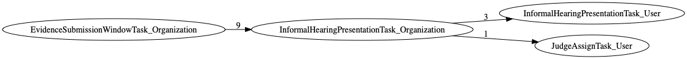
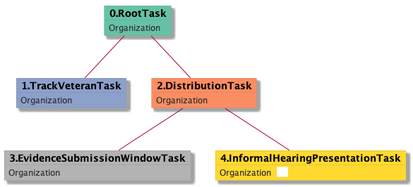

| [README.md](/README.md) | [Task Listing](tasklist.md) |

# InformalHearingPresentationTask_Organization

## Tasks Created Before and After

<details><summary>Tasks created before and after InformalHearingPresentationTask_Organization</summary>

```
digraph G {
rankdir="LR";
"InformalHearingPresentationTask_Organization" -> "InformalHearingPresentationTask_User" [label=3]
"InformalHearingPresentationTask_Organization" -> "JudgeAssignTask_User" [label=1]
"EvidenceSubmissionWindowTask_Organization" -> "InformalHearingPresentationTask_Organization" [label=9]
}
```
</details>



**Before:**

   * [EvidenceSubmissionWindowTask_Organization](EvidenceSubmissionWindowTask_Organization.md): 9 times

**After:**

   * [InformalHearingPresentationTask_User](InformalHearingPresentationTask_User.md): 3 times
   * [JudgeAssignTask_User](JudgeAssignTask_User.md): 1 times

## Task Creation Sequences

### RTO.TVTO.DTO.ESWTO.IHPTO

9 occurrences (example appeal IDs: [40596, 15370, 42548, 41133, 40540])

<details><summary>Task Tree for appeal with ID 40596</summary>

```
@startuml
skinparam {
  ObjectBorderColor #555
  ObjectBorderThickness 0
  ObjectFontStyle bold
  ObjectFontSize 14
  ObjectAttributeFontColor #333
  ObjectAttributeFontSize 12
}
  object 0.RootTask #66c2a5 {
Organization
}
  object 1.TrackVeteranTask #8da0cb {
Organization
}
  object 2.DistributionTask #fc8d62 {
Organization
}
  object 3.EvidenceSubmissionWindowTask #b3b3b3 {
Organization
}
  object 4.InformalHearingPresentationTask #ffd92f {
Organization  <back:white>    </back>
}
0.RootTask -- 1.TrackVeteranTask
0.RootTask -- 2.DistributionTask
2.DistributionTask -- 3.EvidenceSubmissionWindowTask
2.DistributionTask -- 4.InformalHearingPresentationTask
@enduml
```
</details>



