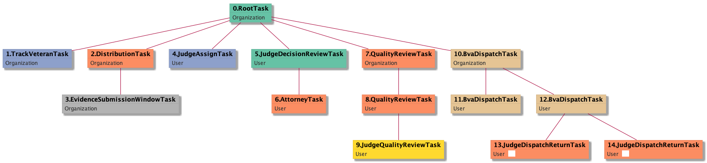

| [README.md](/README.md) | [Task Listing](tasklist.md) |

# JudgeDispatchReturnTask_User

[JudgeDispatchReturnTask_User description](../descr/JudgeDispatchReturnTask_User.md)

## Tasks Created Before and After

<details><summary>Tasks created before and after JudgeDispatchReturnTask_User</summary>

```
digraph G {
rankdir="LR";
"JudgeDispatchReturnTask_User" -> "JudgeDispatchReturnTask_User" [label=1]
"BvaDispatchTask_User" -> "JudgeDispatchReturnTask_User" [label=1]
}
```
</details>


**Before:**

   * [BvaDispatchTask_User](BvaDispatchTask_User.md): 1 times
   * [JudgeDispatchReturnTask_User](JudgeDispatchReturnTask_User.md): 1 times

**After:**

   * [JudgeDispatchReturnTask_User](JudgeDispatchReturnTask_User.md): 1 times

## Task Creation Sequences

### RTO.TVTO.DTO.ESWTO.JATU.JDRTU.ATU.QRTO.QRTU.JQRTU.BDTO.BDTU.JDRTU

[RTO.TVTO.DTO.ESWTO.JATU.JDRTU.ATU.QRTO.QRTU.JQRTU.BDTO.BDTU.JDRTU description](../descr/RTO.TVTO.DTO.ESWTO.JATU.JDRTU.ATU.QRTO.QRTU.JQRTU.BDTO.BDTU.JDRTU.md)

1 occurrences (example appeal IDs: [15411])

<details><summary>Task Tree for appeal with ID 15411</summary>

```
@startuml
skinparam {
  ObjectBorderColor #555
  ObjectBorderThickness 0
  ObjectFontStyle bold
  ObjectFontSize 14
  ObjectAttributeFontColor #333
  ObjectAttributeFontSize 12
}
  object 0.RootTask #66c2a5 {
Organization
}
  object 1.TrackVeteranTask #8da0cb {
Organization
}
  object 2.DistributionTask #fc8d62 {
Organization
}
  object 3.EvidenceSubmissionWindowTask #b3b3b3 {
Organization
}
  object 4.JudgeAssignTask #8da0cb {
User
}
  object 5.JudgeDecisionReviewTask #66c2a5 {
User
}
  object 6.AttorneyTask #fc8d62 {
User
}
  object 7.QualityReviewTask #fc8d62 {
Organization
}
  object 8.QualityReviewTask #fc8d62 {
User
}
  object 9.JudgeQualityReviewTask #ffd92f {
User
}
  object 10.BvaDispatchTask #e5c494 {
Organization
}
  object 11.BvaDispatchTask #e5c494 {
User
}
  object 12.BvaDispatchTask #e5c494 {
User
}
  object 13.JudgeDispatchReturnTask #fc8d62 {
User  <back:white>    </back>
}
  object 14.JudgeDispatchReturnTask #fc8d62 {
User  <back:white>    </back>
}
0.RootTask -- 1.TrackVeteranTask
0.RootTask -- 2.DistributionTask
2.DistributionTask -- 3.EvidenceSubmissionWindowTask
0.RootTask -- 4.JudgeAssignTask
0.RootTask -- 5.JudgeDecisionReviewTask
5.JudgeDecisionReviewTask -- 6.AttorneyTask
0.RootTask -- 7.QualityReviewTask
7.QualityReviewTask -- 8.QualityReviewTask
8.QualityReviewTask -- 9.JudgeQualityReviewTask
0.RootTask -- 10.BvaDispatchTask
10.BvaDispatchTask -- 11.BvaDispatchTask
10.BvaDispatchTask -- 12.BvaDispatchTask
12.BvaDispatchTask -- 13.JudgeDispatchReturnTask
12.BvaDispatchTask -- 14.JudgeDispatchReturnTask
@enduml
```
</details>


### RTO.TVTO.DTO.ESWTO.JATU.JDRTU.ATU.QRTO.QRTU.JQRTU.BDTO.BDTU.JDRTU.JDRTU

[RTO.TVTO.DTO.ESWTO.JATU.JDRTU.ATU.QRTO.QRTU.JQRTU.BDTO.BDTU.JDRTU.JDRTU description](../descr/RTO.TVTO.DTO.ESWTO.JATU.JDRTU.ATU.QRTO.QRTU.JQRTU.BDTO.BDTU.JDRTU.JDRTU.md)

1 occurrences (example appeal IDs: [15411])

<details><summary>Task Tree for appeal with ID 15411</summary>

```
@startuml
skinparam {
  ObjectBorderColor #555
  ObjectBorderThickness 0
  ObjectFontStyle bold
  ObjectFontSize 14
  ObjectAttributeFontColor #333
  ObjectAttributeFontSize 12
}
  object 0.RootTask #66c2a5 {
Organization
}
  object 1.TrackVeteranTask #8da0cb {
Organization
}
  object 2.DistributionTask #fc8d62 {
Organization
}
  object 3.EvidenceSubmissionWindowTask #b3b3b3 {
Organization
}
  object 4.JudgeAssignTask #8da0cb {
User
}
  object 5.JudgeDecisionReviewTask #66c2a5 {
User
}
  object 6.AttorneyTask #fc8d62 {
User
}
  object 7.QualityReviewTask #fc8d62 {
Organization
}
  object 8.QualityReviewTask #fc8d62 {
User
}
  object 9.JudgeQualityReviewTask #ffd92f {
User
}
  object 10.BvaDispatchTask #e5c494 {
Organization
}
  object 11.BvaDispatchTask #e5c494 {
User
}
  object 12.BvaDispatchTask #e5c494 {
User
}
  object 13.JudgeDispatchReturnTask #fc8d62 {
User  <back:white>    </back>
}
  object 14.JudgeDispatchReturnTask #fc8d62 {
User  <back:white>    </back>
}
0.RootTask -- 1.TrackVeteranTask
0.RootTask -- 2.DistributionTask
2.DistributionTask -- 3.EvidenceSubmissionWindowTask
0.RootTask -- 4.JudgeAssignTask
0.RootTask -- 5.JudgeDecisionReviewTask
5.JudgeDecisionReviewTask -- 6.AttorneyTask
0.RootTask -- 7.QualityReviewTask
7.QualityReviewTask -- 8.QualityReviewTask
8.QualityReviewTask -- 9.JudgeQualityReviewTask
0.RootTask -- 10.BvaDispatchTask
10.BvaDispatchTask -- 11.BvaDispatchTask
10.BvaDispatchTask -- 12.BvaDispatchTask
12.BvaDispatchTask -- 13.JudgeDispatchReturnTask
12.BvaDispatchTask -- 14.JudgeDispatchReturnTask
@enduml
```
</details>



