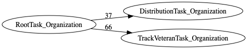
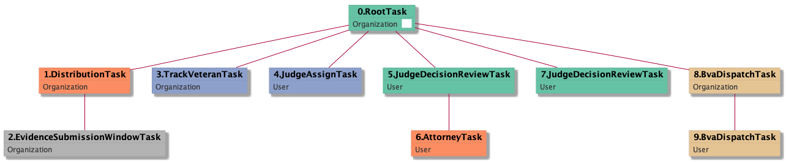

| [README.md](/README.md) | [Task Listing](tasklist.md) |

# RootTask_Organization

## Tasks Created Before and After

<details><summary>Tasks created before and after RootTask_Organization</summary>

```
digraph G {
rankdir="LR";
"RootTask_Organization" -> "DistributionTask_Organization" [label=37]
"RootTask_Organization" -> "TrackVeteranTask_Organization" [label=66]
}
```
</details>



**Before:**


**After:**

   * [TrackVeteranTask_Organization](TrackVeteranTask_Organization.md): 66 times
   * [DistributionTask_Organization](DistributionTask_Organization.md): 37 times

## Task Creation Sequences

### RTO

103 occurrences (example appeal IDs: [15152, 40915, 42334, 41269, 42078])

<details><summary>Task Tree for appeal with ID 15152</summary>

```
@startuml
object 0.RootTask_Organization #66c2a5
object 1.DistributionTask_Organization #fc8d62
object 2.EvidenceSubmissionWindowTask_Organization #b3b3b3
object 3.TrackVeteranTask_Organization #8da0cb
object 4.JudgeAssignTask_User #8da0cb
object 5.JudgeDecisionReviewTask_User #66c2a5
object 6.AttorneyTask_User #fc8d62
object 7.JudgeDecisionReviewTask_User #66c2a5
object 8.BvaDispatchTask_Organization #e5c494
object 9.BvaDispatchTask_User #e5c494
0.RootTask_Organization -- 1.DistributionTask_Organization
1.DistributionTask_Organization -- 2.EvidenceSubmissionWindowTask_Organization
0.RootTask_Organization -- 3.TrackVeteranTask_Organization
0.RootTask_Organization -- 4.JudgeAssignTask_User
0.RootTask_Organization -- 5.JudgeDecisionReviewTask_User
5.JudgeDecisionReviewTask_User -- 6.AttorneyTask_User
0.RootTask_Organization -- 7.JudgeDecisionReviewTask_User
0.RootTask_Organization -- 8.BvaDispatchTask_Organization
8.BvaDispatchTask_Organization -- 9.BvaDispatchTask_User
@enduml
```
</details>



