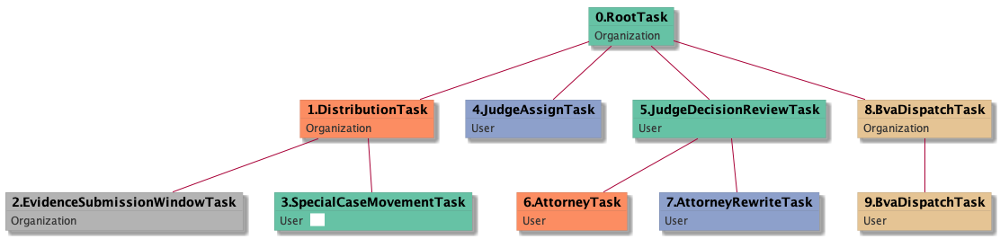

| [README.md](/README.md) | [Task Listing](tasklist.md) |

# SpecialCaseMovementTask_User

[SpecialCaseMovementTask_User description](../descr/SpecialCaseMovementTask_User.md)

## Tasks Created Before and After

<details><summary>Tasks created before and after SpecialCaseMovementTask_User</summary>

```
digraph G {
rankdir="LR";
"SpecialCaseMovementTask_User" -> "JudgeAssignTask_User" [label=1]
"EvidenceSubmissionWindowTask_Organization" -> "SpecialCaseMovementTask_User" [label=1]
}
```
</details>


**Before:**

   * [EvidenceSubmissionWindowTask_Organization](EvidenceSubmissionWindowTask_Organization.md): 1 times

**After:**

   * [JudgeAssignTask_User](JudgeAssignTask_User.md): 1 times

## Task Creation Sequences

### RTO.DTO.ESWTO.SCMTU

[RTO.DTO.ESWTO.SCMTU description](../descr/RTO.DTO.ESWTO.SCMTU.md)

1 occurrences (example appeal IDs: [40605])

<details><summary>Task Tree for appeal with ID 40605</summary>

```
@startuml
skinparam {
  ObjectBorderColor #555
  ObjectBorderThickness 0
  ObjectFontStyle bold
  ObjectFontSize 14
  ObjectAttributeFontColor #333
  ObjectAttributeFontSize 12
}
  object 0.RootTask #66c2a5 {
Organization
}
  object 1.DistributionTask #fc8d62 {
Organization
}
  object 2.EvidenceSubmissionWindowTask #b3b3b3 {
Organization
}
  object 3.SpecialCaseMovementTask #66c2a5 {
User  <back:white>    </back>
}
  object 4.JudgeAssignTask #8da0cb {
User
}
  object 5.JudgeDecisionReviewTask #66c2a5 {
User
}
  object 6.AttorneyTask #fc8d62 {
User
}
  object 7.AttorneyRewriteTask #8da0cb {
User
}
  object 8.BvaDispatchTask #e5c494 {
Organization
}
  object 9.BvaDispatchTask #e5c494 {
User
}
0.RootTask -- 1.DistributionTask
1.DistributionTask -- 2.EvidenceSubmissionWindowTask
1.DistributionTask -- 3.SpecialCaseMovementTask
0.RootTask -- 4.JudgeAssignTask
0.RootTask -- 5.JudgeDecisionReviewTask
5.JudgeDecisionReviewTask -- 6.AttorneyTask
5.JudgeDecisionReviewTask -- 7.AttorneyRewriteTask
0.RootTask -- 8.BvaDispatchTask
8.BvaDispatchTask -- 9.BvaDispatchTask
@enduml
```
</details>



