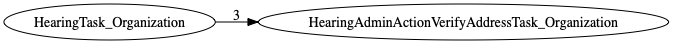
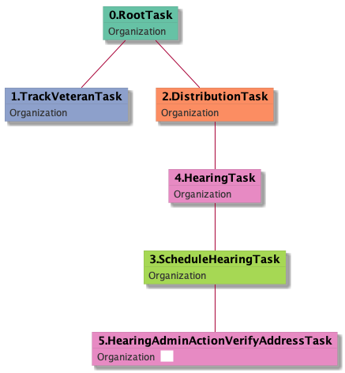

| [README.md](/README.md) | [Task Listing](tasklist.md) |

# HearingAdminActionVerifyAddressTask_Organization

[HearingAdminActionVerifyAddressTask_Organization description](../descr/HearingAdminActionVerifyAddressTask_Organization.md)

## Tasks Created Before and After

<details><summary>Tasks created before and after HearingAdminActionVerifyAddressTask_Organization</summary>

```
digraph G {
rankdir="LR";
"HearingTask_Organization" -> "HearingAdminActionVerifyAddressTask_Organization" [label=3]
}
```
</details>



**Before:**

   * [HearingTask_Organization](HearingTask_Organization.md): 3 times

**After:**


## Task Creation Sequences

### RTO.TVTO.DTO.SHTO.HTO.HAAVATO

[RTO.TVTO.DTO.SHTO.HTO.HAAVATO description](../descr/RTO.TVTO.DTO.SHTO.HTO.HAAVATO.md)

3 occurrences (example appeal IDs: [42837, 42103, 42843])

<details><summary>Task Tree for appeal with ID 42837</summary>

```
@startuml
skinparam {
  ObjectBorderColor #555
  ObjectBorderThickness 0
  ObjectFontStyle bold
  ObjectFontSize 14
  ObjectAttributeFontColor #333
  ObjectAttributeFontSize 12
}
  object 0.RootTask #66c2a5 {
Organization
}
  object 1.TrackVeteranTask #8da0cb {
Organization
}
  object 2.DistributionTask #fc8d62 {
Organization
}
  object 3.ScheduleHearingTask #a6d854 {
Organization
}
  object 4.HearingTask #e78ac3 {
Organization
}
  object 5.HearingAdminActionVerifyAddressTask #e78ac3 {
Organization  <back:white>    </back>
}
0.RootTask -- 1.TrackVeteranTask
0.RootTask -- 2.DistributionTask
4.HearingTask -- 3.ScheduleHearingTask
2.DistributionTask -- 4.HearingTask
3.ScheduleHearingTask -- 5.HearingAdminActionVerifyAddressTask
@enduml
```
</details>



