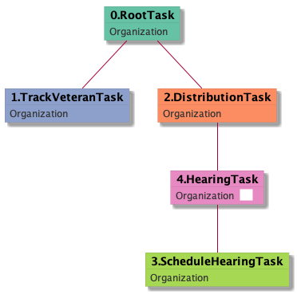
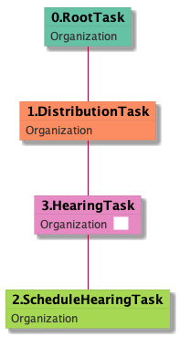

| [README.md](/README.md) | [Task Listing](tasklist.md) |

# HearingTask_Organization

[HearingTask_Organization description](../descr/HearingTask_Organization.md)

## Tasks Created Before and After

<details><summary>Tasks created before and after HearingTask_Organization</summary>

```
digraph G {
rankdir="LR";
"HearingTask_Organization" -> "HearingAdminActionVerifyAddressTask_Organization" [label=3]
"HearingTask_Organization" -> "AssignHearingDispositionTask_Organization" [label=3]
"ScheduleHearingTask_Organization" -> "HearingTask_Organization" [label=129]
"HearingTask_Organization" -> "TrackVeteranTask_Organization" [label=1]
"HearingTask_Organization" -> "TranslationTask_Organization" [label=1]
"HearingTask_Organization" -> "ReturnedUndeliverableCorrespondenceMailTask_Organization" [label=1]
}
```
</details>


**Before:**

   * [ScheduleHearingTask_Organization](ScheduleHearingTask_Organization.md): 129 times

**After:**

   * [AssignHearingDispositionTask_Organization](AssignHearingDispositionTask_Organization.md): 3 times
   * [HearingAdminActionVerifyAddressTask_Organization](HearingAdminActionVerifyAddressTask_Organization.md): 3 times
   * [TrackVeteranTask_Organization](TrackVeteranTask_Organization.md): 1 times
   * [TranslationTask_Organization](TranslationTask_Organization.md): 1 times
   * [ReturnedUndeliverableCorrespondenceMailTask_Organization](ReturnedUndeliverableCorrespondenceMailTask_Organization.md): 1 times

## Task Creation Sequences

### RTO.TVTO.DTO.SHTO.HTO

[RTO.TVTO.DTO.SHTO.HTO description](../descr/RTO.TVTO.DTO.SHTO.HTO.md)

120 occurrences (example appeal IDs: [16461, 42769, 42820, 42010, 42071])

<details><summary>Task Tree for appeal with ID 16461</summary>

```
@startuml
skinparam {
  ObjectBorderColor #555
  ObjectBorderThickness 0
  ObjectFontStyle bold
  ObjectFontSize 14
  ObjectAttributeFontColor #333
  ObjectAttributeFontSize 12
}
  object 0.RootTask #66c2a5 {
Organization
}
  object 1.TrackVeteranTask #8da0cb {
Organization
}
  object 2.DistributionTask #fc8d62 {
Organization
}
  object 3.ScheduleHearingTask #a6d854 {
Organization
}
  object 4.HearingTask #e78ac3 {
Organization  <back:white>    </back>
}
0.RootTask -- 1.TrackVeteranTask
0.RootTask -- 2.DistributionTask
4.HearingTask -- 3.ScheduleHearingTask
2.DistributionTask -- 4.HearingTask
@enduml
```
</details>



### RTO.DTO.SHTO.HTO

[RTO.DTO.SHTO.HTO description](../descr/RTO.DTO.SHTO.HTO.md)

9 occurrences (example appeal IDs: [41136, 42097, 4988, 42691, 40835])

<details><summary>Task Tree for appeal with ID 41136</summary>

```
@startuml
skinparam {
  ObjectBorderColor #555
  ObjectBorderThickness 0
  ObjectFontStyle bold
  ObjectFontSize 14
  ObjectAttributeFontColor #333
  ObjectAttributeFontSize 12
}
  object 0.RootTask #66c2a5 {
Organization
}
  object 1.DistributionTask #fc8d62 {
Organization
}
  object 2.ScheduleHearingTask #a6d854 {
Organization
}
  object 3.HearingTask #e78ac3 {
Organization  <back:white>    </back>
}
0.RootTask -- 1.DistributionTask
3.HearingTask -- 2.ScheduleHearingTask
1.DistributionTask -- 3.HearingTask
@enduml
```
</details>



