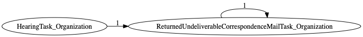
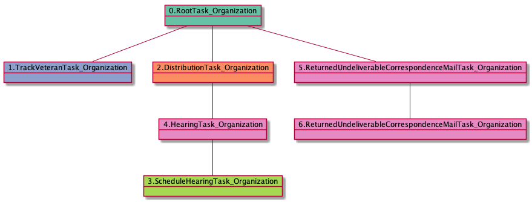

| [README.md](/README.md) | [Task Listing](tasklist.md) |

# ReturnedUndeliverableCorrespondenceMailTask_Organization

## Tasks Created Before and After

<details><summary>Tasks created before and after ReturnedUndeliverableCorrespondenceMailTask_Organization</summary>

```
digraph G {
rankdir="LR";
"ReturnedUndeliverableCorrespondenceMailTask_Organization" -> "ReturnedUndeliverableCorrespondenceMailTask_Organization" [label=1]
"HearingTask_Organization" -> "ReturnedUndeliverableCorrespondenceMailTask_Organization" [label=1]
}
```
</details>



**Before:**

   * [HearingTask_Organization](HearingTask_Organization.md): 1 times
   * [ReturnedUndeliverableCorrespondenceMailTask_Organization](ReturnedUndeliverableCorrespondenceMailTask_Organization.md): 1 times

**After:**

   * [ReturnedUndeliverableCorrespondenceMailTask_Organization](ReturnedUndeliverableCorrespondenceMailTask_Organization.md): 1 times

## Task Creation Sequences

### RTO.TVTO.DTO.SHTO.HTO.RUCMTO.RUCMTO

1 occurrences (example appeal IDs: [2056])

<details><summary>Task Tree for appeal with ID 2056</summary>

```
@startuml
object 0.RootTask_Organization #66c2a5
object 1.TrackVeteranTask_Organization #8da0cb
object 2.DistributionTask_Organization #fc8d62
object 3.ScheduleHearingTask_Organization #a6d854
object 4.HearingTask_Organization #e78ac3
object 5.ReturnedUndeliverableCorrespondenceMailTask_Organization #e78ac3
object 6.ReturnedUndeliverableCorrespondenceMailTask_Organization #e78ac3
0.RootTask_Organization -- 1.TrackVeteranTask_Organization
0.RootTask_Organization -- 2.DistributionTask_Organization
4.HearingTask_Organization -- 3.ScheduleHearingTask_Organization
2.DistributionTask_Organization -- 4.HearingTask_Organization
0.RootTask_Organization -- 5.ReturnedUndeliverableCorrespondenceMailTask_Organization
5.ReturnedUndeliverableCorrespondenceMailTask_Organization -- 6.ReturnedUndeliverableCorrespondenceMailTask_Organization
@enduml
```
</details>


### RTO.TVTO.DTO.SHTO.HTO.RUCMTO

1 occurrences (example appeal IDs: [2056])

<details><summary>Task Tree for appeal with ID 2056</summary>

```
@startuml
object 0.RootTask_Organization #66c2a5
object 1.TrackVeteranTask_Organization #8da0cb
object 2.DistributionTask_Organization #fc8d62
object 3.ScheduleHearingTask_Organization #a6d854
object 4.HearingTask_Organization #e78ac3
object 5.ReturnedUndeliverableCorrespondenceMailTask_Organization #e78ac3
object 6.ReturnedUndeliverableCorrespondenceMailTask_Organization #e78ac3
0.RootTask_Organization -- 1.TrackVeteranTask_Organization
0.RootTask_Organization -- 2.DistributionTask_Organization
4.HearingTask_Organization -- 3.ScheduleHearingTask_Organization
2.DistributionTask_Organization -- 4.HearingTask_Organization
0.RootTask_Organization -- 5.ReturnedUndeliverableCorrespondenceMailTask_Organization
5.ReturnedUndeliverableCorrespondenceMailTask_Organization -- 6.ReturnedUndeliverableCorrespondenceMailTask_Organization
@enduml
```
</details>



