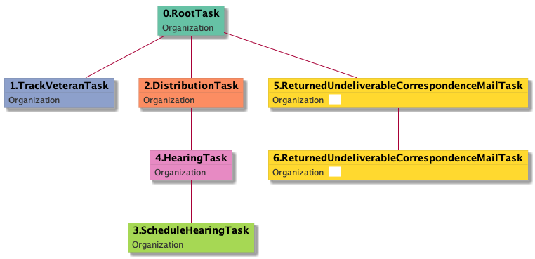

| [README.md](/README.md) | [Task Listing](tasklist.md) |

# ReturnedUndeliverableCorrespondenceMailTask_Organization

## Tasks Created Before and After

<details><summary>Tasks created before and after ReturnedUndeliverableCorrespondenceMailTask_Organization</summary>

```
digraph G {
rankdir="LR";
"ReturnedUndeliverableCorrespondenceMailTask_Organization" -> "ReturnedUndeliverableCorrespondenceMailTask_Organization" [label=1]
"HearingTask_Organization" -> "ReturnedUndeliverableCorrespondenceMailTask_Organization" [label=1]
}
```
</details>


**Before:**

   * [HearingTask_Organization](HearingTask_Organization.md): 1 times
   * [ReturnedUndeliverableCorrespondenceMailTask_Organization](ReturnedUndeliverableCorrespondenceMailTask_Organization.md): 1 times

**After:**

   * [ReturnedUndeliverableCorrespondenceMailTask_Organization](ReturnedUndeliverableCorrespondenceMailTask_Organization.md): 1 times

## Task Creation Sequences

### RTO.TVTO.DTO.SHTO.HTO.RUCMTO.RUCMTO

1 occurrences (example appeal IDs: [2056])

<details><summary>Task Tree for appeal with ID 2056</summary>

```
@startuml
skinparam {
  ObjectBorderColor #555
  ObjectBorderThickness 0
  ObjectFontStyle bold
  ObjectFontSize 14
  ObjectAttributeFontColor #333
  ObjectAttributeFontSize 12
}
  object 0.RootTask #66c2a5 {
Organization
}
  object 1.TrackVeteranTask #8da0cb {
Organization
}
  object 2.DistributionTask #fc8d62 {
Organization
}
  object 3.ScheduleHearingTask #a6d854 {
Organization
}
  object 4.HearingTask #e78ac3 {
Organization
}
  object 5.ReturnedUndeliverableCorrespondenceMailTask #e78ac3 {
Organization  <back:white>    </back>
}
  object 6.ReturnedUndeliverableCorrespondenceMailTask #e78ac3 {
Organization  <back:white>    </back>
}
0.RootTask -- 1.TrackVeteranTask
0.RootTask -- 2.DistributionTask
4.HearingTask -- 3.ScheduleHearingTask
2.DistributionTask -- 4.HearingTask
0.RootTask -- 5.ReturnedUndeliverableCorrespondenceMailTask
5.ReturnedUndeliverableCorrespondenceMailTask -- 6.ReturnedUndeliverableCorrespondenceMailTask
@enduml
```
</details>



### RTO.TVTO.DTO.SHTO.HTO.RUCMTO

1 occurrences (example appeal IDs: [2056])

<details><summary>Task Tree for appeal with ID 2056</summary>

```
@startuml
skinparam {
  ObjectBorderColor #555
  ObjectBorderThickness 0
  ObjectFontStyle bold
  ObjectFontSize 14
  ObjectAttributeFontColor #333
  ObjectAttributeFontSize 12
}
  object 0.RootTask #66c2a5 {
Organization
}
  object 1.TrackVeteranTask #8da0cb {
Organization
}
  object 2.DistributionTask #fc8d62 {
Organization
}
  object 3.ScheduleHearingTask #a6d854 {
Organization
}
  object 4.HearingTask #e78ac3 {
Organization
}
  object 5.ReturnedUndeliverableCorrespondenceMailTask #e78ac3 {
Organization  <back:white>    </back>
}
  object 6.ReturnedUndeliverableCorrespondenceMailTask #e78ac3 {
Organization  <back:white>    </back>
}
0.RootTask -- 1.TrackVeteranTask
0.RootTask -- 2.DistributionTask
4.HearingTask -- 3.ScheduleHearingTask
2.DistributionTask -- 4.HearingTask
0.RootTask -- 5.ReturnedUndeliverableCorrespondenceMailTask
5.ReturnedUndeliverableCorrespondenceMailTask -- 6.ReturnedUndeliverableCorrespondenceMailTask
@enduml
```
</details>


