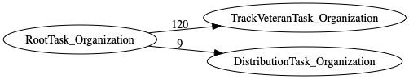
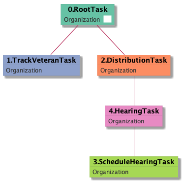

| [README.md](/README.md) | [Task Listing](tasklist.md) |

# RootTask_Organization

[RootTask_Organization description](../descr/RootTask_Organization.md)

## Tasks Created Before and After

<details><summary>Tasks created before and after RootTask_Organization</summary>

```
digraph G {
rankdir="LR";
"RootTask_Organization" -> "TrackVeteranTask_Organization" [label=120]
"RootTask_Organization" -> "DistributionTask_Organization" [label=9]
}
```
</details>



**Before:**


**After:**

   * [TrackVeteranTask_Organization](TrackVeteranTask_Organization.md): 120 times
   * [DistributionTask_Organization](DistributionTask_Organization.md): 9 times

## Task Creation Sequences

### RTO

[RTO description](../descr/RTO.md)

129 occurrences (example appeal IDs: [16461, 42769, 42820, 42010, 42071])

<details><summary>Task Tree for appeal with ID 16461</summary>

```
@startuml
skinparam {
  ObjectBorderColor #555
  ObjectBorderThickness 0
  ObjectFontStyle bold
  ObjectFontSize 14
  ObjectAttributeFontColor #333
  ObjectAttributeFontSize 12
}
  object 0.RootTask #66c2a5 {
Organization  <back:white>    </back>
}
  object 1.TrackVeteranTask #8da0cb {
Organization
}
  object 2.DistributionTask #fc8d62 {
Organization
}
  object 3.ScheduleHearingTask #a6d854 {
Organization
}
  object 4.HearingTask #e78ac3 {
Organization
}
0.RootTask -- 1.TrackVeteranTask
0.RootTask -- 2.DistributionTask
4.HearingTask -- 3.ScheduleHearingTask
2.DistributionTask -- 4.HearingTask
@enduml
```
</details>



