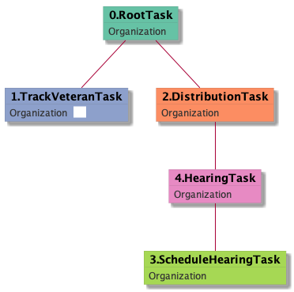

| [README.md](/README.md) | [Task Listing](tasklist.md) |

# TrackVeteranTask_Organization

## Tasks Created Before and After

<details><summary>Tasks created before and after TrackVeteranTask_Organization</summary>

```
digraph G {
rankdir="LR";
"RootTask_Organization" -> "TrackVeteranTask_Organization" [label=119]
"TrackVeteranTask_Organization" -> "DistributionTask_Organization" [label=119]
"HearingTask_Organization" -> "TrackVeteranTask_Organization" [label=1]
}
```
</details>


**Before:**

   * [RootTask_Organization](RootTask_Organization.md): 119 times
   * [HearingTask_Organization](HearingTask_Organization.md): 1 times

**After:**

   * [DistributionTask_Organization](DistributionTask_Organization.md): 119 times

## Task Creation Sequences

### RTO.TVTO

119 occurrences (example appeal IDs: [42769, 42820, 42010, 42071, 39818])

<details><summary>Task Tree for appeal with ID 42769</summary>

```
@startuml
object 0.RootTask_Organization #66c2a5
object 1.TrackVeteranTask_Organization #8da0cb
object 2.DistributionTask_Organization #fc8d62
object 3.ScheduleHearingTask_Organization #a6d854
object 4.HearingTask_Organization #e78ac3
0.RootTask_Organization -- 1.TrackVeteranTask_Organization
0.RootTask_Organization -- 2.DistributionTask_Organization
4.HearingTask_Organization -- 3.ScheduleHearingTask_Organization
2.DistributionTask_Organization -- 4.HearingTask_Organization
@enduml
```
</details>



### RTO.DTO.SHTO.HTO.TVTO

1 occurrences (example appeal IDs: [4988])

<details><summary>Task Tree for appeal with ID 4988</summary>

```
@startuml
object 0.RootTask_Organization #66c2a5
object 1.DistributionTask_Organization #fc8d62
object 2.ScheduleHearingTask_Organization #a6d854
object 3.HearingTask_Organization #e78ac3
object 4.TrackVeteranTask_Organization #8da0cb
0.RootTask_Organization -- 1.DistributionTask_Organization
3.HearingTask_Organization -- 2.ScheduleHearingTask_Organization
1.DistributionTask_Organization -- 3.HearingTask_Organization
0.RootTask_Organization -- 4.TrackVeteranTask_Organization
@enduml
```
</details>


