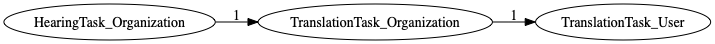
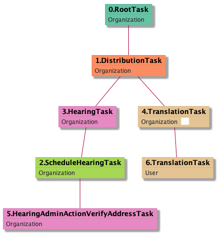

| [README.md](/README.md) | [Task Listing](tasklist.md) |

# TranslationTask_Organization

## Tasks Created Before and After

<details><summary>Tasks created before and after TranslationTask_Organization</summary>

```
digraph G {
rankdir="LR";
"HearingTask_Organization" -> "TranslationTask_Organization" [label=1]
"TranslationTask_Organization" -> "TranslationTask_User" [label=1]
}
```
</details>



**Before:**

   * [HearingTask_Organization](HearingTask_Organization.md): 1 times

**After:**

   * [TranslationTask_User](TranslationTask_User.md): 1 times

## Task Creation Sequences

### RTO.DTO.SHTO.HTO.TTO

1 occurrences (example appeal IDs: [24900])

<details><summary>Task Tree for appeal with ID 24900</summary>

```
@startuml
skinparam {
  ObjectBorderColor #555
  ObjectBorderThickness 0
  ObjectFontStyle bold
  ObjectFontSize 14
  ObjectAttributeFontColor #333
  ObjectAttributeFontSize 12
}
  object 0.RootTask #66c2a5 {
Organization
}
  object 1.DistributionTask #fc8d62 {
Organization
}
  object 2.ScheduleHearingTask #a6d854 {
Organization
}
  object 3.HearingTask #e78ac3 {
Organization
}
  object 4.TranslationTask #e5c494 {
Organization  <back:white>    </back>
}
  object 5.HearingAdminActionVerifyAddressTask #e78ac3 {
Organization
}
  object 6.TranslationTask #e5c494 {
User
}
0.RootTask -- 1.DistributionTask
3.HearingTask -- 2.ScheduleHearingTask
1.DistributionTask -- 3.HearingTask
1.DistributionTask -- 4.TranslationTask
2.ScheduleHearingTask -- 5.HearingAdminActionVerifyAddressTask
4.TranslationTask -- 6.TranslationTask
@enduml
```
</details>



