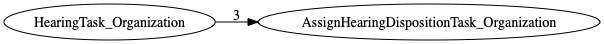

| [README.md](README.md) | [Task Listing](tasklist.md) |

# AssignHearingDispositionTask_Organization

## Tasks Created Before and After

<details><summary>Tasks created before and after AssignHearingDispositionTask_Organization</summary>

```
digraph G {
rankdir="LR";
"HearingTask_Organization" -> "AssignHearingDispositionTask_Organization" [label=3]
}
```
</details>



**Before:**

   * [HearingTask_Organization](HearingTask_Organization.md): 3 times

**After:**


## Task Creation Sequences

### RTO.TVTO.DTO.SHTO.HTO.AHDTO

3 occurrences (example appeal IDs: [42246, 41907, 40879])

<details><summary>Task Tree for appeal with ID 42246</summary>

```
@startuml
object 0.RootTask_Organization #66c2a5
object 1.TrackVeteranTask_Organization #8da0cb
object 2.DistributionTask_Organization #fc8d62
object 3.ScheduleHearingTask_Organization #a6d854
object 4.HearingTask_Organization #e78ac3
object 5.AssignHearingDispositionTask_Organization #a6d854
0.RootTask_Organization -- 1.TrackVeteranTask_Organization
0.RootTask_Organization -- 2.DistributionTask_Organization
4.HearingTask_Organization -- 3.ScheduleHearingTask_Organization
2.DistributionTask_Organization -- 4.HearingTask_Organization
4.HearingTask_Organization -- 5.AssignHearingDispositionTask_Organization
@enduml
```
</details>


