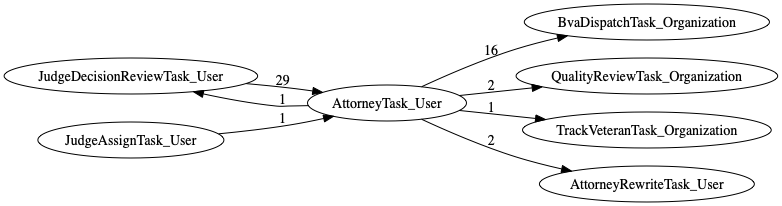
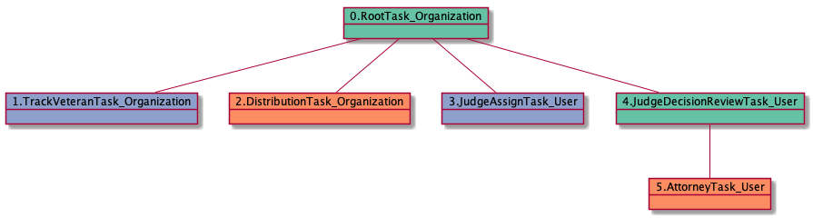
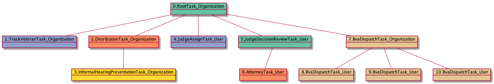
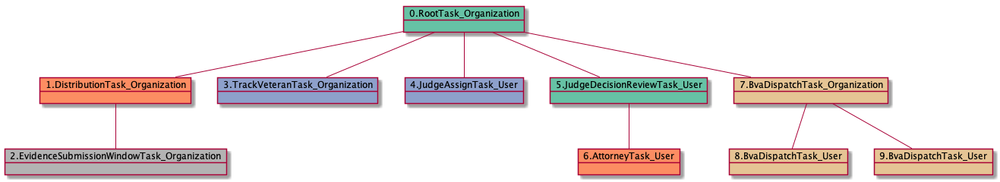
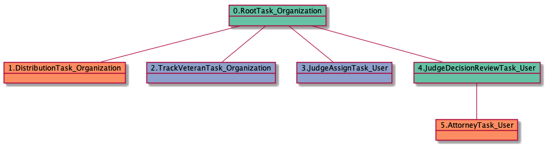
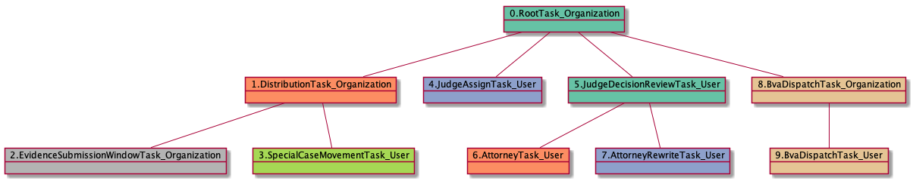

# AttorneyTask_User

<details><summary>Links for AttorneyTask_User</summary>

```
digraph G {
rankdir="LR";
"JudgeDecisionReviewTask_User" -> "AttorneyTask_User" [label=29]
"AttorneyTask_User" -> "JudgeDecisionReviewTask_User" [label=1]
"AttorneyTask_User" -> "BvaDispatchTask_Organization" [label=16]
"AttorneyTask_User" -> "QualityReviewTask_Organization" [label=2]
"JudgeAssignTask_User" -> "AttorneyTask_User" [label=1]
"AttorneyTask_User" -> "TrackVeteranTask_Organization" [label=1]
"AttorneyTask_User" -> "AttorneyRewriteTask_User" [label=2]
}
```
</details>



## Nextlinks

   * 16 [BvaDispatchTask_Organization](BvaDispatchTask_Organization.md)
   * 2 [QualityReviewTask_Organization](QualityReviewTask_Organization.md)
   * 2 [AttorneyRewriteTask_User](AttorneyRewriteTask_User.md)
   * 1 [JudgeDecisionReviewTask_User](JudgeDecisionReviewTask_User.md)
   * 1 [TrackVeteranTask_Organization](TrackVeteranTask_Organization.md)

## Backlinks

   * 29 [JudgeDecisionReviewTask_User](JudgeDecisionReviewTask_User.md)
   * 1 [JudgeAssignTask_User](JudgeAssignTask_User.md)

## RTO.TVTO.DTO.JATU.JDRTU.ATU

6 occurrences (example appeals: [40595, 33346, 41369, 37901, 40892])

<details><summary>PlantUML for 40595</summary>

```
@startuml
object 0.RootTask_Organization #66c2a5
object 1.TrackVeteranTask_Organization #8da0cb
object 2.DistributionTask_Organization #fc8d62
object 3.JudgeAssignTask_User #8da0cb
object 4.JudgeDecisionReviewTask_User #66c2a5
object 5.AttorneyTask_User #fc8d62
0.RootTask_Organization -- 1.TrackVeteranTask_Organization
0.RootTask_Organization -- 2.DistributionTask_Organization
0.RootTask_Organization -- 3.JudgeAssignTask_User
0.RootTask_Organization -- 4.JudgeDecisionReviewTask_User
4.JudgeDecisionReviewTask_User -- 5.AttorneyTask_User
@enduml
```
</details>



## RTO.DTO.JATU.JDRTU.ATU

6 occurrences (example appeals: [32724, 38039, 3875, 40608, 41376])

<details><summary>PlantUML for 32724</summary>

```
@startuml
object 0.RootTask_Organization #66c2a5
object 1.DistributionTask_Organization #fc8d62
object 2.JudgeAssignTask_User #8da0cb
object 3.JudgeDecisionReviewTask_User #66c2a5
object 4.AttorneyTask_User #fc8d62
object 5.BvaDispatchTask_Organization #e5c494
object 6.BvaDispatchTask_User #e5c494
0.RootTask_Organization -- 1.DistributionTask_Organization
0.RootTask_Organization -- 2.JudgeAssignTask_User
0.RootTask_Organization -- 3.JudgeDecisionReviewTask_User
3.JudgeDecisionReviewTask_User -- 4.AttorneyTask_User
0.RootTask_Organization -- 5.BvaDispatchTask_Organization
5.BvaDispatchTask_Organization -- 6.BvaDispatchTask_User
@enduml
```
</details>


## RTO.TVTO.DTO.IHPTO.IHPTU.JATU.JDRTU.ATU

4 occurrences (example appeals: [30234, 35142, 5529, 34472])

<details><summary>PlantUML for 30234</summary>

```
@startuml
object 0.RootTask_Organization #66c2a5
object 1.TrackVeteranTask_Organization #8da0cb
object 2.DistributionTask_Organization #fc8d62
object 3.InformalHearingPresentationTask_Organization #ffd92f
object 4.InformalHearingPresentationTask_User #ffd92f
object 5.JudgeAssignTask_User #8da0cb
object 6.JudgeDecisionReviewTask_User #66c2a5
object 7.AttorneyTask_User #fc8d62
object 8.BvaDispatchTask_Organization #e5c494
object 9.BvaDispatchTask_User #e5c494
0.RootTask_Organization -- 1.TrackVeteranTask_Organization
0.RootTask_Organization -- 2.DistributionTask_Organization
2.DistributionTask_Organization -- 3.InformalHearingPresentationTask_Organization
3.InformalHearingPresentationTask_Organization -- 4.InformalHearingPresentationTask_User
0.RootTask_Organization -- 5.JudgeAssignTask_User
0.RootTask_Organization -- 6.JudgeDecisionReviewTask_User
6.JudgeDecisionReviewTask_User -- 7.AttorneyTask_User
0.RootTask_Organization -- 8.BvaDispatchTask_Organization
8.BvaDispatchTask_Organization -- 9.BvaDispatchTask_User
@enduml
```
</details>


## RTO.TVTO.DTO.IHPTO.JATU.JDRTU.ATU

3 occurrences (example appeals: [34538, 10197, 29665])

<details><summary>PlantUML for 34538</summary>

```
@startuml
object 0.RootTask_Organization #66c2a5
object 1.TrackVeteranTask_Organization #8da0cb
object 2.DistributionTask_Organization #fc8d62
object 3.InformalHearingPresentationTask_Organization #ffd92f
object 4.JudgeAssignTask_User #8da0cb
object 5.JudgeDecisionReviewTask_User #66c2a5
object 6.AttorneyTask_User #fc8d62
object 7.BvaDispatchTask_Organization #e5c494
object 8.BvaDispatchTask_User #e5c494
object 9.BvaDispatchTask_User #e5c494
object 10.BvaDispatchTask_User #e5c494
0.RootTask_Organization -- 1.TrackVeteranTask_Organization
0.RootTask_Organization -- 2.DistributionTask_Organization
2.DistributionTask_Organization -- 3.InformalHearingPresentationTask_Organization
0.RootTask_Organization -- 4.JudgeAssignTask_User
0.RootTask_Organization -- 5.JudgeDecisionReviewTask_User
5.JudgeDecisionReviewTask_User -- 6.AttorneyTask_User
0.RootTask_Organization -- 7.BvaDispatchTask_Organization
7.BvaDispatchTask_Organization -- 8.BvaDispatchTask_User
7.BvaDispatchTask_Organization -- 9.BvaDispatchTask_User
7.BvaDispatchTask_Organization -- 10.BvaDispatchTask_User
@enduml
```
</details>



## RTO.TVTO.DTO.ESWTO.IHPTO.IHPTU.JATU.JDRTU.ATU

2 occurrences (example appeals: [15370, 41412])

<details><summary>PlantUML for 15370</summary>

```
@startuml
object 0.RootTask_Organization #66c2a5
object 1.TrackVeteranTask_Organization #8da0cb
object 2.DistributionTask_Organization #fc8d62
object 3.EvidenceSubmissionWindowTask_Organization #b3b3b3
object 4.InformalHearingPresentationTask_Organization #ffd92f
object 5.InformalHearingPresentationTask_User #ffd92f
object 6.JudgeAssignTask_User #8da0cb
object 7.JudgeDecisionReviewTask_User #66c2a5
object 8.AttorneyTask_User #fc8d62
object 9.BvaDispatchTask_Organization #e5c494
object 10.BvaDispatchTask_User #e5c494
0.RootTask_Organization -- 1.TrackVeteranTask_Organization
0.RootTask_Organization -- 2.DistributionTask_Organization
2.DistributionTask_Organization -- 3.EvidenceSubmissionWindowTask_Organization
2.DistributionTask_Organization -- 4.InformalHearingPresentationTask_Organization
4.InformalHearingPresentationTask_Organization -- 5.InformalHearingPresentationTask_User
0.RootTask_Organization -- 6.JudgeAssignTask_User
0.RootTask_Organization -- 7.JudgeDecisionReviewTask_User
7.JudgeDecisionReviewTask_User -- 8.AttorneyTask_User
0.RootTask_Organization -- 9.BvaDispatchTask_Organization
9.BvaDispatchTask_Organization -- 10.BvaDispatchTask_User
@enduml
```
</details>


## RTO.TVTO.DTO.ESWTO.JATU.JDRTU.ATU

2 occurrences (example appeals: [15411, 40893])

<details><summary>PlantUML for 15411</summary>

```
@startuml
object 0.RootTask_Organization #66c2a5
object 1.TrackVeteranTask_Organization #8da0cb
object 2.DistributionTask_Organization #fc8d62
object 3.EvidenceSubmissionWindowTask_Organization #b3b3b3
object 4.JudgeAssignTask_User #8da0cb
object 5.JudgeDecisionReviewTask_User #66c2a5
object 6.AttorneyTask_User #fc8d62
object 7.QualityReviewTask_Organization #66c2a5
object 8.QualityReviewTask_User #66c2a5
object 9.JudgeQualityReviewTask_User #8da0cb
object 10.BvaDispatchTask_Organization #e5c494
object 11.BvaDispatchTask_User #e5c494
object 12.BvaDispatchTask_User #e5c494
object 13.JudgeDispatchReturnTask_User #fc8d62
object 14.JudgeDispatchReturnTask_User #fc8d62
0.RootTask_Organization -- 1.TrackVeteranTask_Organization
0.RootTask_Organization -- 2.DistributionTask_Organization
2.DistributionTask_Organization -- 3.EvidenceSubmissionWindowTask_Organization
0.RootTask_Organization -- 4.JudgeAssignTask_User
0.RootTask_Organization -- 5.JudgeDecisionReviewTask_User
5.JudgeDecisionReviewTask_User -- 6.AttorneyTask_User
0.RootTask_Organization -- 7.QualityReviewTask_Organization
7.QualityReviewTask_Organization -- 8.QualityReviewTask_User
8.QualityReviewTask_User -- 9.JudgeQualityReviewTask_User
0.RootTask_Organization -- 10.BvaDispatchTask_Organization
10.BvaDispatchTask_Organization -- 11.BvaDispatchTask_User
10.BvaDispatchTask_Organization -- 12.BvaDispatchTask_User
12.BvaDispatchTask_User -- 13.JudgeDispatchReturnTask_User
12.BvaDispatchTask_User -- 14.JudgeDispatchReturnTask_User
@enduml
```
</details>


## RTO.DTO.EOAMTO.EOAMTO.EOAMTU.JATU.JDRTU.ATU

1 occurrences (example appeals: [10213])

<details><summary>PlantUML for 10213</summary>

```
@startuml
object 0.RootTask_Organization #66c2a5
object 1.DistributionTask_Organization #fc8d62
object 2.EvidenceOrArgumentMailTask_Organization #ffd92f
object 3.EvidenceOrArgumentMailTask_Organization #ffd92f
object 4.EvidenceOrArgumentMailTask_User #ffd92f
object 5.JudgeAssignTask_User #8da0cb
object 6.JudgeDecisionReviewTask_User #66c2a5
object 7.AttorneyTask_User #fc8d62
object 8.BvaDispatchTask_Organization #e5c494
object 9.BvaDispatchTask_User #e5c494
0.RootTask_Organization -- 1.DistributionTask_Organization
0.RootTask_Organization -- 2.EvidenceOrArgumentMailTask_Organization
2.EvidenceOrArgumentMailTask_Organization -- 3.EvidenceOrArgumentMailTask_Organization
3.EvidenceOrArgumentMailTask_Organization -- 4.EvidenceOrArgumentMailTask_User
0.RootTask_Organization -- 5.JudgeAssignTask_User
0.RootTask_Organization -- 6.JudgeDecisionReviewTask_User
6.JudgeDecisionReviewTask_User -- 7.AttorneyTask_User
0.RootTask_Organization -- 8.BvaDispatchTask_Organization
8.BvaDispatchTask_Organization -- 9.BvaDispatchTask_User
@enduml
```
</details>


## RTO.TVTO.DTO.ESWTO.IHPTO.JATU.JDRTU.ATU

1 occurrences (example appeals: [11522])

<details><summary>PlantUML for 11522</summary>

```
@startuml
object 0.RootTask_Organization #66c2a5
object 1.TrackVeteranTask_Organization #8da0cb
object 2.DistributionTask_Organization #fc8d62
object 3.EvidenceSubmissionWindowTask_Organization #b3b3b3
object 4.InformalHearingPresentationTask_Organization #ffd92f
object 5.JudgeAssignTask_User #8da0cb
object 6.JudgeDecisionReviewTask_User #66c2a5
object 7.AttorneyTask_User #fc8d62
object 8.AttorneyRewriteTask_User #8da0cb
object 9.BvaDispatchTask_Organization #e5c494
object 10.BvaDispatchTask_User #e5c494
0.RootTask_Organization -- 1.TrackVeteranTask_Organization
0.RootTask_Organization -- 2.DistributionTask_Organization
2.DistributionTask_Organization -- 3.EvidenceSubmissionWindowTask_Organization
2.DistributionTask_Organization -- 4.InformalHearingPresentationTask_Organization
0.RootTask_Organization -- 5.JudgeAssignTask_User
0.RootTask_Organization -- 6.JudgeDecisionReviewTask_User
6.JudgeDecisionReviewTask_User -- 7.AttorneyTask_User
6.JudgeDecisionReviewTask_User -- 8.AttorneyRewriteTask_User
0.RootTask_Organization -- 9.BvaDispatchTask_Organization
9.BvaDispatchTask_Organization -- 10.BvaDispatchTask_User
@enduml
```
</details>


## RTO.DTO.ESWTO.TVTO.JATU.JDRTU.ATU

1 occurrences (example appeals: [17948])

<details><summary>PlantUML for 17948</summary>

```
@startuml
object 0.RootTask_Organization #66c2a5
object 1.DistributionTask_Organization #fc8d62
object 2.EvidenceSubmissionWindowTask_Organization #b3b3b3
object 3.TrackVeteranTask_Organization #8da0cb
object 4.JudgeAssignTask_User #8da0cb
object 5.JudgeDecisionReviewTask_User #66c2a5
object 6.AttorneyTask_User #fc8d62
object 7.BvaDispatchTask_Organization #e5c494
object 8.BvaDispatchTask_User #e5c494
object 9.BvaDispatchTask_User #e5c494
0.RootTask_Organization -- 1.DistributionTask_Organization
1.DistributionTask_Organization -- 2.EvidenceSubmissionWindowTask_Organization
0.RootTask_Organization -- 3.TrackVeteranTask_Organization
0.RootTask_Organization -- 4.JudgeAssignTask_User
0.RootTask_Organization -- 5.JudgeDecisionReviewTask_User
5.JudgeDecisionReviewTask_User -- 6.AttorneyTask_User
0.RootTask_Organization -- 7.BvaDispatchTask_Organization
7.BvaDispatchTask_Organization -- 8.BvaDispatchTask_User
7.BvaDispatchTask_Organization -- 9.BvaDispatchTask_User
@enduml
```
</details>



## RTO.DTO.TVTO.JATU.JDRTU.ATU

1 occurrences (example appeals: [11092])

<details><summary>PlantUML for 11092</summary>

```
@startuml
object 0.RootTask_Organization #66c2a5
object 1.DistributionTask_Organization #fc8d62
object 2.TrackVeteranTask_Organization #8da0cb
object 3.JudgeAssignTask_User #8da0cb
object 4.JudgeDecisionReviewTask_User #66c2a5
object 5.AttorneyTask_User #fc8d62
0.RootTask_Organization -- 1.DistributionTask_Organization
0.RootTask_Organization -- 2.TrackVeteranTask_Organization
0.RootTask_Organization -- 3.JudgeAssignTask_User
0.RootTask_Organization -- 4.JudgeDecisionReviewTask_User
4.JudgeDecisionReviewTask_User -- 5.AttorneyTask_User
@enduml
```
</details>



## RTO.DTO.ESWTO.TVTO.JATU.ATU

1 occurrences (example appeals: [15152])

<details><summary>PlantUML for 15152</summary>

```
@startuml
object 0.RootTask_Organization #66c2a5
object 1.DistributionTask_Organization #fc8d62
object 2.EvidenceSubmissionWindowTask_Organization #b3b3b3
object 3.TrackVeteranTask_Organization #8da0cb
object 4.JudgeAssignTask_User #8da0cb
object 5.JudgeDecisionReviewTask_User #66c2a5
object 6.AttorneyTask_User #fc8d62
object 7.JudgeDecisionReviewTask_User #66c2a5
object 8.BvaDispatchTask_Organization #e5c494
object 9.BvaDispatchTask_User #e5c494
0.RootTask_Organization -- 1.DistributionTask_Organization
1.DistributionTask_Organization -- 2.EvidenceSubmissionWindowTask_Organization
0.RootTask_Organization -- 3.TrackVeteranTask_Organization
0.RootTask_Organization -- 4.JudgeAssignTask_User
0.RootTask_Organization -- 5.JudgeDecisionReviewTask_User
5.JudgeDecisionReviewTask_User -- 6.AttorneyTask_User
0.RootTask_Organization -- 7.JudgeDecisionReviewTask_User
0.RootTask_Organization -- 8.BvaDispatchTask_Organization
8.BvaDispatchTask_Organization -- 9.BvaDispatchTask_User
@enduml
```
</details>


## RTO.TVTO.DTO.IHPTO.JATU.ICTO.ICTU.THTU.JDRTU.ATU

1 occurrences (example appeals: [7729])

<details><summary>PlantUML for 7729</summary>

```
@startuml
object 0.RootTask_Organization #66c2a5
object 1.TrackVeteranTask_Organization #8da0cb
object 2.DistributionTask_Organization #fc8d62
object 3.InformalHearingPresentationTask_Organization #ffd92f
object 4.InformalHearingPresentationTask_User #ffd92f
object 5.JudgeAssignTask_User #8da0cb
object 6.IhpColocatedTask_Organization #a6d854
object 7.IhpColocatedTask_User #a6d854
object 8.TimedHoldTask_User #e78ac3
object 9.JudgeDecisionReviewTask_User #66c2a5
object 10.AttorneyTask_User #fc8d62
object 11.QualityReviewTask_Organization #66c2a5
object 12.QualityReviewTask_User #66c2a5
object 13.BvaDispatchTask_Organization #e5c494
object 14.BvaDispatchTask_User #e5c494
0.RootTask_Organization -- 1.TrackVeteranTask_Organization
0.RootTask_Organization -- 2.DistributionTask_Organization
2.DistributionTask_Organization -- 3.InformalHearingPresentationTask_Organization
3.InformalHearingPresentationTask_Organization -- 4.InformalHearingPresentationTask_User
0.RootTask_Organization -- 5.JudgeAssignTask_User
5.JudgeAssignTask_User -- 6.IhpColocatedTask_Organization
6.IhpColocatedTask_Organization -- 7.IhpColocatedTask_User
7.IhpColocatedTask_User -- 8.TimedHoldTask_User
0.RootTask_Organization -- 9.JudgeDecisionReviewTask_User
9.JudgeDecisionReviewTask_User -- 10.AttorneyTask_User
0.RootTask_Organization -- 11.QualityReviewTask_Organization
11.QualityReviewTask_Organization -- 12.QualityReviewTask_User
0.RootTask_Organization -- 13.BvaDispatchTask_Organization
13.BvaDispatchTask_Organization -- 14.BvaDispatchTask_User
@enduml
```
</details>


## RTO.DTO.ESWTO.SCMTU.JATU.JDRTU.ATU

1 occurrences (example appeals: [40605])

<details><summary>PlantUML for 40605</summary>

```
@startuml
object 0.RootTask_Organization #66c2a5
object 1.DistributionTask_Organization #fc8d62
object 2.EvidenceSubmissionWindowTask_Organization #b3b3b3
object 3.SpecialCaseMovementTask_User #a6d854
object 4.JudgeAssignTask_User #8da0cb
object 5.JudgeDecisionReviewTask_User #66c2a5
object 6.AttorneyTask_User #fc8d62
object 7.AttorneyRewriteTask_User #8da0cb
object 8.BvaDispatchTask_Organization #e5c494
object 9.BvaDispatchTask_User #e5c494
0.RootTask_Organization -- 1.DistributionTask_Organization
1.DistributionTask_Organization -- 2.EvidenceSubmissionWindowTask_Organization
1.DistributionTask_Organization -- 3.SpecialCaseMovementTask_User
0.RootTask_Organization -- 4.JudgeAssignTask_User
0.RootTask_Organization -- 5.JudgeDecisionReviewTask_User
5.JudgeDecisionReviewTask_User -- 6.AttorneyTask_User
5.JudgeDecisionReviewTask_User -- 7.AttorneyRewriteTask_User
0.RootTask_Organization -- 8.BvaDispatchTask_Organization
8.BvaDispatchTask_Organization -- 9.BvaDispatchTask_User
@enduml
```
</details>



