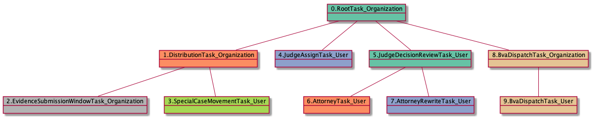

| [README.md](README.md) | [Task Listing](tasklist.md) |

# BvaDispatchTask_Organization

## Tasks Created Before and After

<details><summary>Tasks created before and after BvaDispatchTask_Organization</summary>

```
digraph G {
rankdir="LR";
"AttorneyRewriteTask_User" -> "BvaDispatchTask_Organization" [label=2]
"BvaDispatchTask_Organization" -> "BvaDispatchTask_User" [label=22]
"AttorneyTask_User" -> "BvaDispatchTask_Organization" [label=16]
"JudgeDecisionReviewTask_User" -> "BvaDispatchTask_Organization" [label=1]
"QualityReviewTask_User" -> "BvaDispatchTask_Organization" [label=1]
"InformalHearingPresentationTask_Organization" -> "BvaDispatchTask_Organization" [label=1]
"JudgeQualityReviewTask_User" -> "BvaDispatchTask_Organization" [label=1]
}
```
</details>


**Before:**

   * [AttorneyTask_User](AttorneyTask_User.md): 16 times
   * [AttorneyRewriteTask_User](AttorneyRewriteTask_User.md): 2 times
   * [JudgeDecisionReviewTask_User](JudgeDecisionReviewTask_User.md): 1 times
   * [InformalHearingPresentationTask_Organization](InformalHearingPresentationTask_Organization.md): 1 times
   * [JudgeQualityReviewTask_User](JudgeQualityReviewTask_User.md): 1 times
   * [QualityReviewTask_User](QualityReviewTask_User.md): 1 times

**After:**

   * [BvaDispatchTask_User](BvaDispatchTask_User.md): 22 times

## Task Creation Sequences

### RTO.TVTO.DTO.IHPTO.IHPTU.JATU.JDRTU.ATU.BDTO

4 occurrences (example appeal IDs: [30234, 35142, 5529, 34472])

<details><summary>Task Tree for appeal with ID 30234</summary>

```
@startuml
object 0.RootTask_Organization #66c2a5
object 1.TrackVeteranTask_Organization #8da0cb
object 2.DistributionTask_Organization #fc8d62
object 3.InformalHearingPresentationTask_Organization #ffd92f
object 4.InformalHearingPresentationTask_User #ffd92f
object 5.JudgeAssignTask_User #8da0cb
object 6.JudgeDecisionReviewTask_User #66c2a5
object 7.AttorneyTask_User #fc8d62
object 8.BvaDispatchTask_Organization #e5c494
object 9.BvaDispatchTask_User #e5c494
0.RootTask_Organization -- 1.TrackVeteranTask_Organization
0.RootTask_Organization -- 2.DistributionTask_Organization
2.DistributionTask_Organization -- 3.InformalHearingPresentationTask_Organization
3.InformalHearingPresentationTask_Organization -- 4.InformalHearingPresentationTask_User
0.RootTask_Organization -- 5.JudgeAssignTask_User
0.RootTask_Organization -- 6.JudgeDecisionReviewTask_User
6.JudgeDecisionReviewTask_User -- 7.AttorneyTask_User
0.RootTask_Organization -- 8.BvaDispatchTask_Organization
8.BvaDispatchTask_Organization -- 9.BvaDispatchTask_User
@enduml
```
</details>


### RTO.DTO.JATU.JDRTU.ATU.BDTO

3 occurrences (example appeal IDs: [32724, 38039, 40617])

<details><summary>Task Tree for appeal with ID 32724</summary>

```
@startuml
object 0.RootTask_Organization #66c2a5
object 1.DistributionTask_Organization #fc8d62
object 2.JudgeAssignTask_User #8da0cb
object 3.JudgeDecisionReviewTask_User #66c2a5
object 4.AttorneyTask_User #fc8d62
object 5.BvaDispatchTask_Organization #e5c494
object 6.BvaDispatchTask_User #e5c494
0.RootTask_Organization -- 1.DistributionTask_Organization
0.RootTask_Organization -- 2.JudgeAssignTask_User
0.RootTask_Organization -- 3.JudgeDecisionReviewTask_User
3.JudgeDecisionReviewTask_User -- 4.AttorneyTask_User
0.RootTask_Organization -- 5.BvaDispatchTask_Organization
5.BvaDispatchTask_Organization -- 6.BvaDispatchTask_User
@enduml
```
</details>


### RTO.TVTO.DTO.IHPTO.JATU.JDRTU.ATU.BDTO

3 occurrences (example appeal IDs: [34538, 10197, 29665])

<details><summary>Task Tree for appeal with ID 34538</summary>

```
@startuml
object 0.RootTask_Organization #66c2a5
object 1.TrackVeteranTask_Organization #8da0cb
object 2.DistributionTask_Organization #fc8d62
object 3.InformalHearingPresentationTask_Organization #ffd92f
object 4.JudgeAssignTask_User #8da0cb
object 5.JudgeDecisionReviewTask_User #66c2a5
object 6.AttorneyTask_User #fc8d62
object 7.BvaDispatchTask_Organization #e5c494
object 8.BvaDispatchTask_User #e5c494
object 9.BvaDispatchTask_User #e5c494
object 10.BvaDispatchTask_User #e5c494
0.RootTask_Organization -- 1.TrackVeteranTask_Organization
0.RootTask_Organization -- 2.DistributionTask_Organization
2.DistributionTask_Organization -- 3.InformalHearingPresentationTask_Organization
0.RootTask_Organization -- 4.JudgeAssignTask_User
0.RootTask_Organization -- 5.JudgeDecisionReviewTask_User
5.JudgeDecisionReviewTask_User -- 6.AttorneyTask_User
0.RootTask_Organization -- 7.BvaDispatchTask_Organization
7.BvaDispatchTask_Organization -- 8.BvaDispatchTask_User
7.BvaDispatchTask_Organization -- 9.BvaDispatchTask_User
7.BvaDispatchTask_Organization -- 10.BvaDispatchTask_User
@enduml
```
</details>


### RTO.TVTO.DTO.JATU.JDRTU.ATU.BDTO

3 occurrences (example appeal IDs: [33346, 41369, 37901])

<details><summary>Task Tree for appeal with ID 33346</summary>

```
@startuml
object 0.RootTask_Organization #66c2a5
object 1.TrackVeteranTask_Organization #8da0cb
object 2.DistributionTask_Organization #fc8d62
object 3.JudgeAssignTask_User #8da0cb
object 4.JudgeDecisionReviewTask_User #66c2a5
object 5.AttorneyTask_User #fc8d62
object 6.BvaDispatchTask_Organization #e5c494
object 7.BvaDispatchTask_User #e5c494
0.RootTask_Organization -- 1.TrackVeteranTask_Organization
0.RootTask_Organization -- 2.DistributionTask_Organization
0.RootTask_Organization -- 3.JudgeAssignTask_User
0.RootTask_Organization -- 4.JudgeDecisionReviewTask_User
4.JudgeDecisionReviewTask_User -- 5.AttorneyTask_User
0.RootTask_Organization -- 6.BvaDispatchTask_Organization
6.BvaDispatchTask_Organization -- 7.BvaDispatchTask_User
@enduml
```
</details>


### RTO.TVTO.DTO.ESWTO.JATU.JDRTU.ATU.QRTO.QRTU.JQRTU.BDTO

1 occurrences (example appeal IDs: [15411])

<details><summary>Task Tree for appeal with ID 15411</summary>

```
@startuml
object 0.RootTask_Organization #66c2a5
object 1.TrackVeteranTask_Organization #8da0cb
object 2.DistributionTask_Organization #fc8d62
object 3.EvidenceSubmissionWindowTask_Organization #b3b3b3
object 4.JudgeAssignTask_User #8da0cb
object 5.JudgeDecisionReviewTask_User #66c2a5
object 6.AttorneyTask_User #fc8d62
object 7.QualityReviewTask_Organization #66c2a5
object 8.QualityReviewTask_User #66c2a5
object 9.JudgeQualityReviewTask_User #8da0cb
object 10.BvaDispatchTask_Organization #e5c494
object 11.BvaDispatchTask_User #e5c494
object 12.BvaDispatchTask_User #e5c494
object 13.JudgeDispatchReturnTask_User #fc8d62
object 14.JudgeDispatchReturnTask_User #fc8d62
0.RootTask_Organization -- 1.TrackVeteranTask_Organization
0.RootTask_Organization -- 2.DistributionTask_Organization
2.DistributionTask_Organization -- 3.EvidenceSubmissionWindowTask_Organization
0.RootTask_Organization -- 4.JudgeAssignTask_User
0.RootTask_Organization -- 5.JudgeDecisionReviewTask_User
5.JudgeDecisionReviewTask_User -- 6.AttorneyTask_User
0.RootTask_Organization -- 7.QualityReviewTask_Organization
7.QualityReviewTask_Organization -- 8.QualityReviewTask_User
8.QualityReviewTask_User -- 9.JudgeQualityReviewTask_User
0.RootTask_Organization -- 10.BvaDispatchTask_Organization
10.BvaDispatchTask_Organization -- 11.BvaDispatchTask_User
10.BvaDispatchTask_Organization -- 12.BvaDispatchTask_User
12.BvaDispatchTask_User -- 13.JudgeDispatchReturnTask_User
12.BvaDispatchTask_User -- 14.JudgeDispatchReturnTask_User
@enduml
```
</details>


### RTO.DTO.ESWTO.TVTO.JATU.ATU.JDRTU.BDTO

1 occurrences (example appeal IDs: [15152])

<details><summary>Task Tree for appeal with ID 15152</summary>

```
@startuml
object 0.RootTask_Organization #66c2a5
object 1.DistributionTask_Organization #fc8d62
object 2.EvidenceSubmissionWindowTask_Organization #b3b3b3
object 3.TrackVeteranTask_Organization #8da0cb
object 4.JudgeAssignTask_User #8da0cb
object 5.JudgeDecisionReviewTask_User #66c2a5
object 6.AttorneyTask_User #fc8d62
object 7.JudgeDecisionReviewTask_User #66c2a5
object 8.BvaDispatchTask_Organization #e5c494
object 9.BvaDispatchTask_User #e5c494
0.RootTask_Organization -- 1.DistributionTask_Organization
1.DistributionTask_Organization -- 2.EvidenceSubmissionWindowTask_Organization
0.RootTask_Organization -- 3.TrackVeteranTask_Organization
0.RootTask_Organization -- 4.JudgeAssignTask_User
0.RootTask_Organization -- 5.JudgeDecisionReviewTask_User
5.JudgeDecisionReviewTask_User -- 6.AttorneyTask_User
0.RootTask_Organization -- 7.JudgeDecisionReviewTask_User
0.RootTask_Organization -- 8.BvaDispatchTask_Organization
8.BvaDispatchTask_Organization -- 9.BvaDispatchTask_User
@enduml
```
</details>


### RTO.DTO.ESWTO.TVTO.JATU.JDRTU.ATU.BDTO

1 occurrences (example appeal IDs: [17948])

<details><summary>Task Tree for appeal with ID 17948</summary>

```
@startuml
object 0.RootTask_Organization #66c2a5
object 1.DistributionTask_Organization #fc8d62
object 2.EvidenceSubmissionWindowTask_Organization #b3b3b3
object 3.TrackVeteranTask_Organization #8da0cb
object 4.JudgeAssignTask_User #8da0cb
object 5.JudgeDecisionReviewTask_User #66c2a5
object 6.AttorneyTask_User #fc8d62
object 7.BvaDispatchTask_Organization #e5c494
object 8.BvaDispatchTask_User #e5c494
object 9.BvaDispatchTask_User #e5c494
0.RootTask_Organization -- 1.DistributionTask_Organization
1.DistributionTask_Organization -- 2.EvidenceSubmissionWindowTask_Organization
0.RootTask_Organization -- 3.TrackVeteranTask_Organization
0.RootTask_Organization -- 4.JudgeAssignTask_User
0.RootTask_Organization -- 5.JudgeDecisionReviewTask_User
5.JudgeDecisionReviewTask_User -- 6.AttorneyTask_User
0.RootTask_Organization -- 7.BvaDispatchTask_Organization
7.BvaDispatchTask_Organization -- 8.BvaDispatchTask_User
7.BvaDispatchTask_Organization -- 9.BvaDispatchTask_User
@enduml
```
</details>


### RTO.TVTO.DTO.IHPTO.JATU.ICTO.ICTU.THTU.JDRTU.ATU.QRTO.QRTU.BDTO

1 occurrences (example appeal IDs: [7729])

<details><summary>Task Tree for appeal with ID 7729</summary>

```
@startuml
object 0.RootTask_Organization #66c2a5
object 1.TrackVeteranTask_Organization #8da0cb
object 2.DistributionTask_Organization #fc8d62
object 3.InformalHearingPresentationTask_Organization #ffd92f
object 4.InformalHearingPresentationTask_User #ffd92f
object 5.JudgeAssignTask_User #8da0cb
object 6.IhpColocatedTask_Organization #a6d854
object 7.IhpColocatedTask_User #a6d854
object 8.TimedHoldTask_User #e78ac3
object 9.JudgeDecisionReviewTask_User #66c2a5
object 10.AttorneyTask_User #fc8d62
object 11.QualityReviewTask_Organization #66c2a5
object 12.QualityReviewTask_User #66c2a5
object 13.BvaDispatchTask_Organization #e5c494
object 14.BvaDispatchTask_User #e5c494
0.RootTask_Organization -- 1.TrackVeteranTask_Organization
0.RootTask_Organization -- 2.DistributionTask_Organization
2.DistributionTask_Organization -- 3.InformalHearingPresentationTask_Organization
3.InformalHearingPresentationTask_Organization -- 4.InformalHearingPresentationTask_User
0.RootTask_Organization -- 5.JudgeAssignTask_User
5.JudgeAssignTask_User -- 6.IhpColocatedTask_Organization
6.IhpColocatedTask_Organization -- 7.IhpColocatedTask_User
7.IhpColocatedTask_User -- 8.TimedHoldTask_User
0.RootTask_Organization -- 9.JudgeDecisionReviewTask_User
9.JudgeDecisionReviewTask_User -- 10.AttorneyTask_User
0.RootTask_Organization -- 11.QualityReviewTask_Organization
11.QualityReviewTask_Organization -- 12.QualityReviewTask_User
0.RootTask_Organization -- 13.BvaDispatchTask_Organization
13.BvaDispatchTask_Organization -- 14.BvaDispatchTask_User
@enduml
```
</details>


### RTO.TVTO.DTO.ESWTO.IHPTO.IHPTU.JATU.JDRTU.ATU.BDTO

1 occurrences (example appeal IDs: [15370])

<details><summary>Task Tree for appeal with ID 15370</summary>

```
@startuml
object 0.RootTask_Organization #66c2a5
object 1.TrackVeteranTask_Organization #8da0cb
object 2.DistributionTask_Organization #fc8d62
object 3.EvidenceSubmissionWindowTask_Organization #b3b3b3
object 4.InformalHearingPresentationTask_Organization #ffd92f
object 5.InformalHearingPresentationTask_User #ffd92f
object 6.JudgeAssignTask_User #8da0cb
object 7.JudgeDecisionReviewTask_User #66c2a5
object 8.AttorneyTask_User #fc8d62
object 9.BvaDispatchTask_Organization #e5c494
object 10.BvaDispatchTask_User #e5c494
0.RootTask_Organization -- 1.TrackVeteranTask_Organization
0.RootTask_Organization -- 2.DistributionTask_Organization
2.DistributionTask_Organization -- 3.EvidenceSubmissionWindowTask_Organization
2.DistributionTask_Organization -- 4.InformalHearingPresentationTask_Organization
4.InformalHearingPresentationTask_Organization -- 5.InformalHearingPresentationTask_User
0.RootTask_Organization -- 6.JudgeAssignTask_User
0.RootTask_Organization -- 7.JudgeDecisionReviewTask_User
7.JudgeDecisionReviewTask_User -- 8.AttorneyTask_User
0.RootTask_Organization -- 9.BvaDispatchTask_Organization
9.BvaDispatchTask_Organization -- 10.BvaDispatchTask_User
@enduml
```
</details>


### RTO.DTO.ESWTO.SCMTU.JATU.JDRTU.ATU.ARTU.BDTO

1 occurrences (example appeal IDs: [40605])

<details><summary>Task Tree for appeal with ID 40605</summary>

```
@startuml
object 0.RootTask_Organization #66c2a5
object 1.DistributionTask_Organization #fc8d62
object 2.EvidenceSubmissionWindowTask_Organization #b3b3b3
object 3.SpecialCaseMovementTask_User #a6d854
object 4.JudgeAssignTask_User #8da0cb
object 5.JudgeDecisionReviewTask_User #66c2a5
object 6.AttorneyTask_User #fc8d62
object 7.AttorneyRewriteTask_User #8da0cb
object 8.BvaDispatchTask_Organization #e5c494
object 9.BvaDispatchTask_User #e5c494
0.RootTask_Organization -- 1.DistributionTask_Organization
1.DistributionTask_Organization -- 2.EvidenceSubmissionWindowTask_Organization
1.DistributionTask_Organization -- 3.SpecialCaseMovementTask_User
0.RootTask_Organization -- 4.JudgeAssignTask_User
0.RootTask_Organization -- 5.JudgeDecisionReviewTask_User
5.JudgeDecisionReviewTask_User -- 6.AttorneyTask_User
5.JudgeDecisionReviewTask_User -- 7.AttorneyRewriteTask_User
0.RootTask_Organization -- 8.BvaDispatchTask_Organization
8.BvaDispatchTask_Organization -- 9.BvaDispatchTask_User
@enduml
```
</details>



### RTO.TVTO.DTO.ESWTO.IHPTO.JATU.JDRTU.ATU.ARTU.BDTO

1 occurrences (example appeal IDs: [11522])

<details><summary>Task Tree for appeal with ID 11522</summary>

```
@startuml
object 0.RootTask_Organization #66c2a5
object 1.TrackVeteranTask_Organization #8da0cb
object 2.DistributionTask_Organization #fc8d62
object 3.EvidenceSubmissionWindowTask_Organization #b3b3b3
object 4.InformalHearingPresentationTask_Organization #ffd92f
object 5.JudgeAssignTask_User #8da0cb
object 6.JudgeDecisionReviewTask_User #66c2a5
object 7.AttorneyTask_User #fc8d62
object 8.AttorneyRewriteTask_User #8da0cb
object 9.BvaDispatchTask_Organization #e5c494
object 10.BvaDispatchTask_User #e5c494
0.RootTask_Organization -- 1.TrackVeteranTask_Organization
0.RootTask_Organization -- 2.DistributionTask_Organization
2.DistributionTask_Organization -- 3.EvidenceSubmissionWindowTask_Organization
2.DistributionTask_Organization -- 4.InformalHearingPresentationTask_Organization
0.RootTask_Organization -- 5.JudgeAssignTask_User
0.RootTask_Organization -- 6.JudgeDecisionReviewTask_User
6.JudgeDecisionReviewTask_User -- 7.AttorneyTask_User
6.JudgeDecisionReviewTask_User -- 8.AttorneyRewriteTask_User
0.RootTask_Organization -- 9.BvaDispatchTask_Organization
9.BvaDispatchTask_Organization -- 10.BvaDispatchTask_User
@enduml
```
</details>


### RTO.DTO.EOAMTO.EOAMTO.EOAMTU.JATU.JDRTU.ATU.BDTO

1 occurrences (example appeal IDs: [10213])

<details><summary>Task Tree for appeal with ID 10213</summary>

```
@startuml
object 0.RootTask_Organization #66c2a5
object 1.DistributionTask_Organization #fc8d62
object 2.EvidenceOrArgumentMailTask_Organization #ffd92f
object 3.EvidenceOrArgumentMailTask_Organization #ffd92f
object 4.EvidenceOrArgumentMailTask_User #ffd92f
object 5.JudgeAssignTask_User #8da0cb
object 6.JudgeDecisionReviewTask_User #66c2a5
object 7.AttorneyTask_User #fc8d62
object 8.BvaDispatchTask_Organization #e5c494
object 9.BvaDispatchTask_User #e5c494
0.RootTask_Organization -- 1.DistributionTask_Organization
0.RootTask_Organization -- 2.EvidenceOrArgumentMailTask_Organization
2.EvidenceOrArgumentMailTask_Organization -- 3.EvidenceOrArgumentMailTask_Organization
3.EvidenceOrArgumentMailTask_Organization -- 4.EvidenceOrArgumentMailTask_User
0.RootTask_Organization -- 5.JudgeAssignTask_User
0.RootTask_Organization -- 6.JudgeDecisionReviewTask_User
6.JudgeDecisionReviewTask_User -- 7.AttorneyTask_User
0.RootTask_Organization -- 8.BvaDispatchTask_Organization
8.BvaDispatchTask_Organization -- 9.BvaDispatchTask_User
@enduml
```
</details>


### RTO.DTO.JATU.JDRTU.ATU.TVTO.IHPTO.BDTO

1 occurrences (example appeal IDs: [3875])

<details><summary>Task Tree for appeal with ID 3875</summary>

```
@startuml
object 0.RootTask_Organization #66c2a5
object 1.DistributionTask_Organization #fc8d62
object 2.JudgeAssignTask_User #8da0cb
object 3.JudgeAssignTask_User #8da0cb
object 4.JudgeDecisionReviewTask_User #66c2a5
object 5.AttorneyTask_User #fc8d62
object 6.TrackVeteranTask_Organization #8da0cb
object 7.InformalHearingPresentationTask_Organization #ffd92f
object 8.BvaDispatchTask_Organization #e5c494
object 9.BvaDispatchTask_User #e5c494
object 10.BvaDispatchTask_User #e5c494
0.RootTask_Organization -- 1.DistributionTask_Organization
0.RootTask_Organization -- 2.JudgeAssignTask_User
0.RootTask_Organization -- 3.JudgeAssignTask_User
0.RootTask_Organization -- 4.JudgeDecisionReviewTask_User
4.JudgeDecisionReviewTask_User -- 5.AttorneyTask_User
0.RootTask_Organization -- 6.TrackVeteranTask_Organization
0.RootTask_Organization -- 7.InformalHearingPresentationTask_Organization
0.RootTask_Organization -- 8.BvaDispatchTask_Organization
8.BvaDispatchTask_Organization -- 9.BvaDispatchTask_User
8.BvaDispatchTask_Organization -- 10.BvaDispatchTask_User
@enduml
```
</details>


