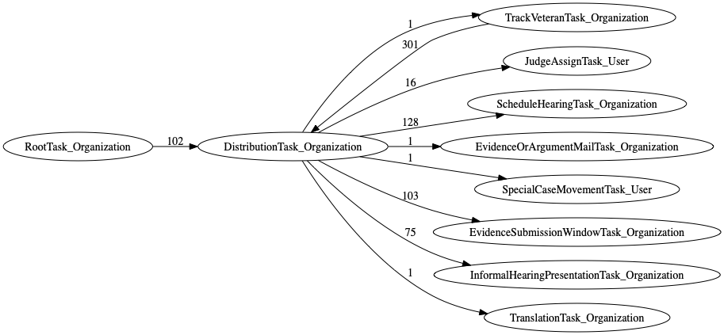
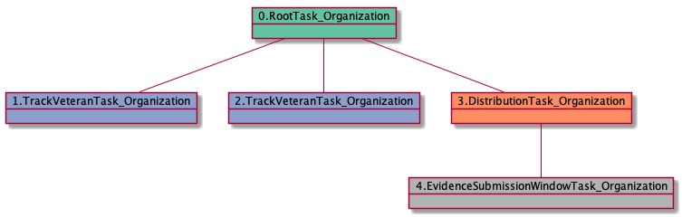
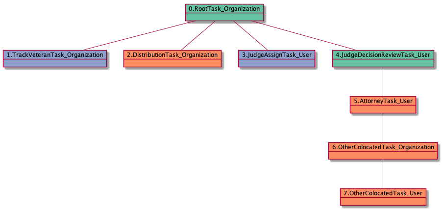

| [README.md](README.md) | [Task Listing](tasklist.md) |

# DistributionTask_Organization

## Tasks Created Before and After

<details><summary>Tasks created before and after DistributionTask_Organization</summary>

```
digraph G {
rankdir="LR";
"DistributionTask_Organization" -> "TrackVeteranTask_Organization" [label=1]
"DistributionTask_Organization" -> "JudgeAssignTask_User" [label=16]
"DistributionTask_Organization" -> "ScheduleHearingTask_Organization" [label=128]
"RootTask_Organization" -> "DistributionTask_Organization" [label=102]
"DistributionTask_Organization" -> "EvidenceOrArgumentMailTask_Organization" [label=1]
"DistributionTask_Organization" -> "SpecialCaseMovementTask_User" [label=1]
"DistributionTask_Organization" -> "EvidenceSubmissionWindowTask_Organization" [label=103]
"DistributionTask_Organization" -> "InformalHearingPresentationTask_Organization" [label=75]
"TrackVeteranTask_Organization" -> "DistributionTask_Organization" [label=301]
"DistributionTask_Organization" -> "TranslationTask_Organization" [label=1]
}
```
</details>



**Before:**

   * [TrackVeteranTask_Organization](TrackVeteranTask_Organization.md): 301 times
   * [RootTask_Organization](RootTask_Organization.md): 102 times

**After:**

   * [ScheduleHearingTask_Organization](ScheduleHearingTask_Organization.md): 128 times
   * [EvidenceSubmissionWindowTask_Organization](EvidenceSubmissionWindowTask_Organization.md): 103 times
   * [InformalHearingPresentationTask_Organization](InformalHearingPresentationTask_Organization.md): 75 times
   * [JudgeAssignTask_User](JudgeAssignTask_User.md): 16 times
   * [EvidenceOrArgumentMailTask_Organization](EvidenceOrArgumentMailTask_Organization.md): 1 times
   * [TranslationTask_Organization](TranslationTask_Organization.md): 1 times
   * [SpecialCaseMovementTask_User](SpecialCaseMovementTask_User.md): 1 times
   * [TrackVeteranTask_Organization](TrackVeteranTask_Organization.md): 1 times

## Task Creation Sequences

### RTO.TVTO.DTO

298 occurrences (example appeal IDs: [42769, 34538, 39812, 41319, 40595])

<details><summary>Task Tree for appeal with ID 42769</summary>

```
@startuml
object 0.RootTask_Organization #66c2a5
object 1.TrackVeteranTask_Organization #8da0cb
object 2.DistributionTask_Organization #fc8d62
object 3.ScheduleHearingTask_Organization #a6d854
object 4.HearingTask_Organization #e78ac3
0.RootTask_Organization -- 1.TrackVeteranTask_Organization
0.RootTask_Organization -- 2.DistributionTask_Organization
4.HearingTask_Organization -- 3.ScheduleHearingTask_Organization
2.DistributionTask_Organization -- 4.HearingTask_Organization
@enduml
```
</details>


### RTO.DTO

102 occurrences (example appeal IDs: [15152, 32724, 10213, 39837, 41094])

<details><summary>Task Tree for appeal with ID 15152</summary>

```
@startuml
object 0.RootTask_Organization #66c2a5
object 1.DistributionTask_Organization #fc8d62
object 2.EvidenceSubmissionWindowTask_Organization #b3b3b3
object 3.TrackVeteranTask_Organization #8da0cb
object 4.JudgeAssignTask_User #8da0cb
object 5.JudgeDecisionReviewTask_User #66c2a5
object 6.AttorneyTask_User #fc8d62
object 7.JudgeDecisionReviewTask_User #66c2a5
object 8.BvaDispatchTask_Organization #e5c494
object 9.BvaDispatchTask_User #e5c494
0.RootTask_Organization -- 1.DistributionTask_Organization
1.DistributionTask_Organization -- 2.EvidenceSubmissionWindowTask_Organization
0.RootTask_Organization -- 3.TrackVeteranTask_Organization
0.RootTask_Organization -- 4.JudgeAssignTask_User
0.RootTask_Organization -- 5.JudgeDecisionReviewTask_User
5.JudgeDecisionReviewTask_User -- 6.AttorneyTask_User
0.RootTask_Organization -- 7.JudgeDecisionReviewTask_User
0.RootTask_Organization -- 8.BvaDispatchTask_Organization
8.BvaDispatchTask_Organization -- 9.BvaDispatchTask_User
@enduml
```
</details>


### RTO.TVTO.TVTO.DTO

3 occurrences (example appeal IDs: [40894, 42805, 42609])

<details><summary>Task Tree for appeal with ID 40894</summary>

```
@startuml
object 0.RootTask_Organization #66c2a5
object 1.TrackVeteranTask_Organization #8da0cb
object 2.TrackVeteranTask_Organization #8da0cb
object 3.DistributionTask_Organization #fc8d62
object 4.EvidenceSubmissionWindowTask_Organization #b3b3b3
0.RootTask_Organization -- 1.TrackVeteranTask_Organization
0.RootTask_Organization -- 2.TrackVeteranTask_Organization
0.RootTask_Organization -- 3.DistributionTask_Organization
3.DistributionTask_Organization -- 4.EvidenceSubmissionWindowTask_Organization
@enduml
```
</details>



### DTO

3 occurrences (example appeal IDs: [6702, 41852, 10958])

<details><summary>Task Tree for appeal with ID 6702</summary>

```
@startuml
object 0.RootTask_Organization #66c2a5
object 1.TrackVeteranTask_Organization #8da0cb
object 2.DistributionTask_Organization #fc8d62
object 3.JudgeAssignTask_User #8da0cb
object 4.JudgeDecisionReviewTask_User #66c2a5
object 5.AttorneyTask_User #fc8d62
object 6.OtherColocatedTask_Organization #fc8d62
object 7.OtherColocatedTask_User #fc8d62
0.RootTask_Organization -- 1.TrackVeteranTask_Organization
0.RootTask_Organization -- 2.DistributionTask_Organization
0.RootTask_Organization -- 3.JudgeAssignTask_User
0.RootTask_Organization -- 4.JudgeDecisionReviewTask_User
4.JudgeDecisionReviewTask_User -- 5.AttorneyTask_User
5.AttorneyTask_User -- 6.OtherColocatedTask_Organization
6.OtherColocatedTask_Organization -- 7.OtherColocatedTask_User
@enduml
```
</details>



