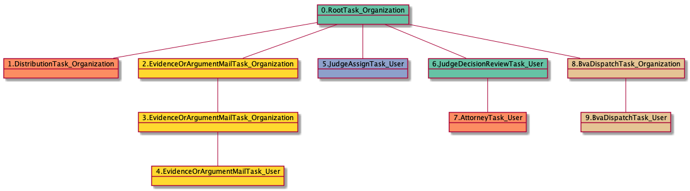

| [README.md](README.md) | [Task Listing](tasklist.md) |

# EvidenceOrArgumentMailTask_User

## Tasks Created Before and After

<details><summary>Tasks created before and after EvidenceOrArgumentMailTask_User</summary>

```
digraph G {
rankdir="LR";
"EvidenceOrArgumentMailTask_User" -> "JudgeAssignTask_User" [label=1]
"EvidenceOrArgumentMailTask_Organization" -> "EvidenceOrArgumentMailTask_User" [label=1]
}
```
</details>


**Before:**

   * [EvidenceOrArgumentMailTask_Organization](EvidenceOrArgumentMailTask_Organization.md): 1 times

**After:**

   * [JudgeAssignTask_User](JudgeAssignTask_User.md): 1 times

## Task Creation Sequences

### RTO.DTO.EOAMTO.EOAMTO.EOAMTU

1 occurrences (example appeal IDs: [10213])

<details><summary>Task Tree for appeal with ID 10213</summary>

```
@startuml
object 0.RootTask_Organization #66c2a5
object 1.DistributionTask_Organization #fc8d62
object 2.EvidenceOrArgumentMailTask_Organization #ffd92f
object 3.EvidenceOrArgumentMailTask_Organization #ffd92f
object 4.EvidenceOrArgumentMailTask_User #ffd92f
object 5.JudgeAssignTask_User #8da0cb
object 6.JudgeDecisionReviewTask_User #66c2a5
object 7.AttorneyTask_User #fc8d62
object 8.BvaDispatchTask_Organization #e5c494
object 9.BvaDispatchTask_User #e5c494
0.RootTask_Organization -- 1.DistributionTask_Organization
0.RootTask_Organization -- 2.EvidenceOrArgumentMailTask_Organization
2.EvidenceOrArgumentMailTask_Organization -- 3.EvidenceOrArgumentMailTask_Organization
3.EvidenceOrArgumentMailTask_Organization -- 4.EvidenceOrArgumentMailTask_User
0.RootTask_Organization -- 5.JudgeAssignTask_User
0.RootTask_Organization -- 6.JudgeDecisionReviewTask_User
6.JudgeDecisionReviewTask_User -- 7.AttorneyTask_User
0.RootTask_Organization -- 8.BvaDispatchTask_Organization
8.BvaDispatchTask_Organization -- 9.BvaDispatchTask_User
@enduml
```
</details>



