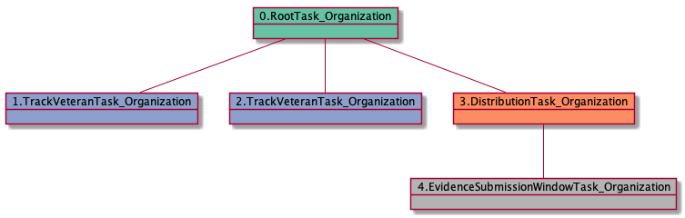

| [README.md](README.md) | [Task Listing](tasklist.md) |

# EvidenceSubmissionWindowTask_Organization

## Tasks Created Before and After

<details><summary>Tasks created before and after EvidenceSubmissionWindowTask_Organization</summary>

```
digraph G {
rankdir="LR";
"EvidenceSubmissionWindowTask_Organization" -> "TrackVeteranTask_Organization" [label=2]
"EvidenceSubmissionWindowTask_Organization" -> "JudgeAssignTask_User" [label=2]
"EvidenceSubmissionWindowTask_Organization" -> "InformalHearingPresentationTask_Organization" [label=9]
"DistributionTask_Organization" -> "EvidenceSubmissionWindowTask_Organization" [label=103]
"EvidenceSubmissionWindowTask_Organization" -> "SpecialCaseMovementTask_User" [label=1]
}
```
</details>


**Before:**

   * [DistributionTask_Organization](DistributionTask_Organization.md): 103 times

**After:**

   * [InformalHearingPresentationTask_Organization](InformalHearingPresentationTask_Organization.md): 9 times
   * [TrackVeteranTask_Organization](TrackVeteranTask_Organization.md): 2 times
   * [JudgeAssignTask_User](JudgeAssignTask_User.md): 2 times
   * [SpecialCaseMovementTask_User](SpecialCaseMovementTask_User.md): 1 times

## Task Creation Sequences

### RTO.TVTO.DTO.ESWTO

63 occurrences (example appeal IDs: [40915, 42334, 41269, 42634, 40596])

<details><summary>Task Tree for appeal with ID 40915</summary>

```
@startuml
object 0.RootTask_Organization #66c2a5
object 1.TrackVeteranTask_Organization #8da0cb
object 2.DistributionTask_Organization #fc8d62
object 3.EvidenceSubmissionWindowTask_Organization #b3b3b3
0.RootTask_Organization -- 1.TrackVeteranTask_Organization
0.RootTask_Organization -- 2.DistributionTask_Organization
2.DistributionTask_Organization -- 3.EvidenceSubmissionWindowTask_Organization
@enduml
```
</details>


### RTO.DTO.ESWTO

37 occurrences (example appeal IDs: [15152, 42078, 39814, 42497, 40530])

<details><summary>Task Tree for appeal with ID 15152</summary>

```
@startuml
object 0.RootTask_Organization #66c2a5
object 1.DistributionTask_Organization #fc8d62
object 2.EvidenceSubmissionWindowTask_Organization #b3b3b3
object 3.TrackVeteranTask_Organization #8da0cb
object 4.JudgeAssignTask_User #8da0cb
object 5.JudgeDecisionReviewTask_User #66c2a5
object 6.AttorneyTask_User #fc8d62
object 7.JudgeDecisionReviewTask_User #66c2a5
object 8.BvaDispatchTask_Organization #e5c494
object 9.BvaDispatchTask_User #e5c494
0.RootTask_Organization -- 1.DistributionTask_Organization
1.DistributionTask_Organization -- 2.EvidenceSubmissionWindowTask_Organization
0.RootTask_Organization -- 3.TrackVeteranTask_Organization
0.RootTask_Organization -- 4.JudgeAssignTask_User
0.RootTask_Organization -- 5.JudgeDecisionReviewTask_User
5.JudgeDecisionReviewTask_User -- 6.AttorneyTask_User
0.RootTask_Organization -- 7.JudgeDecisionReviewTask_User
0.RootTask_Organization -- 8.BvaDispatchTask_Organization
8.BvaDispatchTask_Organization -- 9.BvaDispatchTask_User
@enduml
```
</details>


### RTO.TVTO.TVTO.DTO.ESWTO

3 occurrences (example appeal IDs: [40894, 42805, 42609])

<details><summary>Task Tree for appeal with ID 40894</summary>

```
@startuml
object 0.RootTask_Organization #66c2a5
object 1.TrackVeteranTask_Organization #8da0cb
object 2.TrackVeteranTask_Organization #8da0cb
object 3.DistributionTask_Organization #fc8d62
object 4.EvidenceSubmissionWindowTask_Organization #b3b3b3
0.RootTask_Organization -- 1.TrackVeteranTask_Organization
0.RootTask_Organization -- 2.TrackVeteranTask_Organization
0.RootTask_Organization -- 3.DistributionTask_Organization
3.DistributionTask_Organization -- 4.EvidenceSubmissionWindowTask_Organization
@enduml
```
</details>



