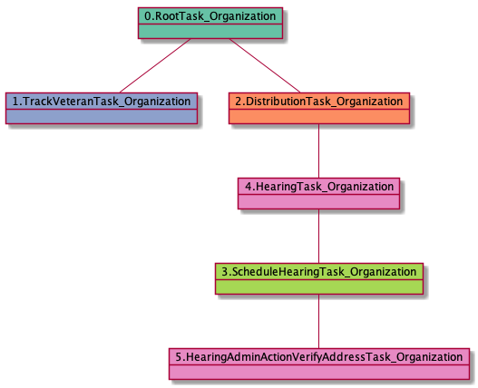

# HearingAdminActionVerifyAddressTask_Organization

<details><summary>Links for HearingAdminActionVerifyAddressTask_Organization</summary>

```
digraph G {
rankdir="LR";
"HearingTask_Organization" -> "HearingAdminActionVerifyAddressTask_Organization" [label=3]
}
```
</details>


## Nextlinks


## Backlinks

   * 3 [HearingTask_Organization](HearingTask_Organization.md)

## RTO.TVTO.DTO.SHTO.HTO.HAAVATO

3 occurrences (example appeals: [42837, 42103, 42843])

<details><summary>PlantUML for 42837</summary>

```
@startuml
object 0.RootTask_Organization #66c2a5
object 1.TrackVeteranTask_Organization #8da0cb
object 2.DistributionTask_Organization #fc8d62
object 3.ScheduleHearingTask_Organization #a6d854
object 4.HearingTask_Organization #e78ac3
object 5.HearingAdminActionVerifyAddressTask_Organization #e78ac3
0.RootTask_Organization -- 1.TrackVeteranTask_Organization
0.RootTask_Organization -- 2.DistributionTask_Organization
4.HearingTask_Organization -- 3.ScheduleHearingTask_Organization
2.DistributionTask_Organization -- 4.HearingTask_Organization
3.ScheduleHearingTask_Organization -- 5.HearingAdminActionVerifyAddressTask_Organization
@enduml
```
</details>



