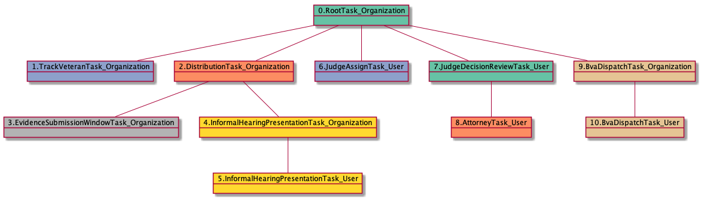

# InformalHearingPresentationTask_User

<details><summary>Links for InformalHearingPresentationTask_User</summary>

```
digraph G {
rankdir="LR";
"InformalHearingPresentationTask_User" -> "JudgeAssignTask_User" [label=6]
"InformalHearingPresentationTask_Organization" -> "InformalHearingPresentationTask_User" [label=8]
}
```
</details>


## Nextlinks

   * 6 [JudgeAssignTask_User](JudgeAssignTask_User.md)

## Backlinks

   * 8 [InformalHearingPresentationTask_Organization](InformalHearingPresentationTask_Organization.md)

## RTO.TVTO.DTO.IHPTO.IHPTU

5 occurrences (example appeals: [30234, 35142, 41843, 5529, 34472])

<details><summary>PlantUML for 30234</summary>

```
@startuml
object 0.RootTask_Organization #66c2a5
object 1.TrackVeteranTask_Organization #8da0cb
object 2.DistributionTask_Organization #fc8d62
object 3.InformalHearingPresentationTask_Organization #ffd92f
object 4.InformalHearingPresentationTask_User #ffd92f
object 5.JudgeAssignTask_User #8da0cb
object 6.JudgeDecisionReviewTask_User #66c2a5
object 7.AttorneyTask_User #fc8d62
object 8.BvaDispatchTask_Organization #e5c494
object 9.BvaDispatchTask_User #e5c494
0.RootTask_Organization -- 1.TrackVeteranTask_Organization
0.RootTask_Organization -- 2.DistributionTask_Organization
2.DistributionTask_Organization -- 3.InformalHearingPresentationTask_Organization
3.InformalHearingPresentationTask_Organization -- 4.InformalHearingPresentationTask_User
0.RootTask_Organization -- 5.JudgeAssignTask_User
0.RootTask_Organization -- 6.JudgeDecisionReviewTask_User
6.JudgeDecisionReviewTask_User -- 7.AttorneyTask_User
0.RootTask_Organization -- 8.BvaDispatchTask_Organization
8.BvaDispatchTask_Organization -- 9.BvaDispatchTask_User
@enduml
```
</details>


## RTO.TVTO.DTO.ESWTO.IHPTO.IHPTU

3 occurrences (example appeals: [15370, 41412, 42019])

<details><summary>PlantUML for 15370</summary>

```
@startuml
object 0.RootTask_Organization #66c2a5
object 1.TrackVeteranTask_Organization #8da0cb
object 2.DistributionTask_Organization #fc8d62
object 3.EvidenceSubmissionWindowTask_Organization #b3b3b3
object 4.InformalHearingPresentationTask_Organization #ffd92f
object 5.InformalHearingPresentationTask_User #ffd92f
object 6.JudgeAssignTask_User #8da0cb
object 7.JudgeDecisionReviewTask_User #66c2a5
object 8.AttorneyTask_User #fc8d62
object 9.BvaDispatchTask_Organization #e5c494
object 10.BvaDispatchTask_User #e5c494
0.RootTask_Organization -- 1.TrackVeteranTask_Organization
0.RootTask_Organization -- 2.DistributionTask_Organization
2.DistributionTask_Organization -- 3.EvidenceSubmissionWindowTask_Organization
2.DistributionTask_Organization -- 4.InformalHearingPresentationTask_Organization
4.InformalHearingPresentationTask_Organization -- 5.InformalHearingPresentationTask_User
0.RootTask_Organization -- 6.JudgeAssignTask_User
0.RootTask_Organization -- 7.JudgeDecisionReviewTask_User
7.JudgeDecisionReviewTask_User -- 8.AttorneyTask_User
0.RootTask_Organization -- 9.BvaDispatchTask_Organization
9.BvaDispatchTask_Organization -- 10.BvaDispatchTask_User
@enduml
```
</details>



