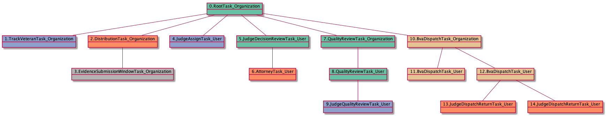

# JudgeDispatchReturnTask_User

<details><summary>Links for JudgeDispatchReturnTask_User</summary>

```
digraph G {
rankdir="LR";
"JudgeDispatchReturnTask_User" -> "JudgeDispatchReturnTask_User" [label=1]
"BvaDispatchTask_User" -> "JudgeDispatchReturnTask_User" [label=1]
"JudgeDispatchReturnTask_User" -> "JudgeDispatchReturnTask_User" [label=1]
}
```
</details>


## Nextlinks

   * 1 [JudgeDispatchReturnTask_User](JudgeDispatchReturnTask_User.md)

## Backlinks

   * 1 [BvaDispatchTask_User](BvaDispatchTask_User.md)
   * 1 [JudgeDispatchReturnTask_User](JudgeDispatchReturnTask_User.md)

## RTO.TVTO.DTO.ESWTO.JATU.JDRTU.ATU.QRTO.QRTU.JQRTU.BDTO.BDTU.JDRTU

1 occurrences (example appeals: [15411])

<details><summary>PlantUML for 15411</summary>

```
@startuml
object 0.RootTask_Organization #66c2a5
object 1.TrackVeteranTask_Organization #8da0cb
object 2.DistributionTask_Organization #fc8d62
object 3.EvidenceSubmissionWindowTask_Organization #b3b3b3
object 4.JudgeAssignTask_User #8da0cb
object 5.JudgeDecisionReviewTask_User #66c2a5
object 6.AttorneyTask_User #fc8d62
object 7.QualityReviewTask_Organization #66c2a5
object 8.QualityReviewTask_User #66c2a5
object 9.JudgeQualityReviewTask_User #8da0cb
object 10.BvaDispatchTask_Organization #e5c494
object 11.BvaDispatchTask_User #e5c494
object 12.BvaDispatchTask_User #e5c494
object 13.JudgeDispatchReturnTask_User #fc8d62
object 14.JudgeDispatchReturnTask_User #fc8d62
0.RootTask_Organization -- 1.TrackVeteranTask_Organization
0.RootTask_Organization -- 2.DistributionTask_Organization
2.DistributionTask_Organization -- 3.EvidenceSubmissionWindowTask_Organization
0.RootTask_Organization -- 4.JudgeAssignTask_User
0.RootTask_Organization -- 5.JudgeDecisionReviewTask_User
5.JudgeDecisionReviewTask_User -- 6.AttorneyTask_User
0.RootTask_Organization -- 7.QualityReviewTask_Organization
7.QualityReviewTask_Organization -- 8.QualityReviewTask_User
8.QualityReviewTask_User -- 9.JudgeQualityReviewTask_User
0.RootTask_Organization -- 10.BvaDispatchTask_Organization
10.BvaDispatchTask_Organization -- 11.BvaDispatchTask_User
10.BvaDispatchTask_Organization -- 12.BvaDispatchTask_User
12.BvaDispatchTask_User -- 13.JudgeDispatchReturnTask_User
12.BvaDispatchTask_User -- 14.JudgeDispatchReturnTask_User
@enduml
```
</details>



## RTO.TVTO.DTO.ESWTO.JATU.JDRTU.ATU.QRTO.QRTU.JQRTU.BDTO.BDTU.JDRTU.JDRTU

1 occurrences (example appeals: [15411])

<details><summary>PlantUML for 15411</summary>

```
@startuml
object 0.RootTask_Organization #66c2a5
object 1.TrackVeteranTask_Organization #8da0cb
object 2.DistributionTask_Organization #fc8d62
object 3.EvidenceSubmissionWindowTask_Organization #b3b3b3
object 4.JudgeAssignTask_User #8da0cb
object 5.JudgeDecisionReviewTask_User #66c2a5
object 6.AttorneyTask_User #fc8d62
object 7.QualityReviewTask_Organization #66c2a5
object 8.QualityReviewTask_User #66c2a5
object 9.JudgeQualityReviewTask_User #8da0cb
object 10.BvaDispatchTask_Organization #e5c494
object 11.BvaDispatchTask_User #e5c494
object 12.BvaDispatchTask_User #e5c494
object 13.JudgeDispatchReturnTask_User #fc8d62
object 14.JudgeDispatchReturnTask_User #fc8d62
0.RootTask_Organization -- 1.TrackVeteranTask_Organization
0.RootTask_Organization -- 2.DistributionTask_Organization
2.DistributionTask_Organization -- 3.EvidenceSubmissionWindowTask_Organization
0.RootTask_Organization -- 4.JudgeAssignTask_User
0.RootTask_Organization -- 5.JudgeDecisionReviewTask_User
5.JudgeDecisionReviewTask_User -- 6.AttorneyTask_User
0.RootTask_Organization -- 7.QualityReviewTask_Organization
7.QualityReviewTask_Organization -- 8.QualityReviewTask_User
8.QualityReviewTask_User -- 9.JudgeQualityReviewTask_User
0.RootTask_Organization -- 10.BvaDispatchTask_Organization
10.BvaDispatchTask_Organization -- 11.BvaDispatchTask_User
10.BvaDispatchTask_Organization -- 12.BvaDispatchTask_User
12.BvaDispatchTask_User -- 13.JudgeDispatchReturnTask_User
12.BvaDispatchTask_User -- 14.JudgeDispatchReturnTask_User
@enduml
```
</details>


