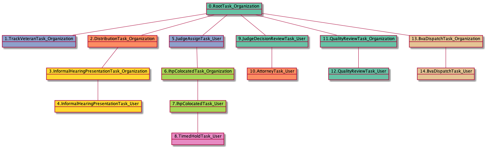
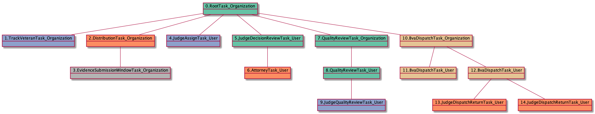

# QualityReviewTask_Organization

<details><summary>Links for QualityReviewTask_Organization</summary>

```
digraph G {
rankdir="LR";
"QualityReviewTask_Organization" -> "QualityReviewTask_User" [label=2]
"AttorneyTask_User" -> "QualityReviewTask_Organization" [label=2]
}
```
</details>


## Nextlinks

   * 2 [QualityReviewTask_User](QualityReviewTask_User.md)

## Backlinks

   * 2 [AttorneyTask_User](AttorneyTask_User.md)

## RTO.TVTO.DTO.IHPTO.JATU.ICTO.ICTU.THTU.JDRTU.ATU.QRTO

1 occurrences (example appeals: [7729])

<details><summary>PlantUML for 7729</summary>

```
@startuml
object 0.RootTask_Organization #66c2a5
object 1.TrackVeteranTask_Organization #8da0cb
object 2.DistributionTask_Organization #fc8d62
object 3.InformalHearingPresentationTask_Organization #ffd92f
object 4.InformalHearingPresentationTask_User #ffd92f
object 5.JudgeAssignTask_User #8da0cb
object 6.IhpColocatedTask_Organization #a6d854
object 7.IhpColocatedTask_User #a6d854
object 8.TimedHoldTask_User #e78ac3
object 9.JudgeDecisionReviewTask_User #66c2a5
object 10.AttorneyTask_User #fc8d62
object 11.QualityReviewTask_Organization #66c2a5
object 12.QualityReviewTask_User #66c2a5
object 13.BvaDispatchTask_Organization #e5c494
object 14.BvaDispatchTask_User #e5c494
0.RootTask_Organization -- 1.TrackVeteranTask_Organization
0.RootTask_Organization -- 2.DistributionTask_Organization
2.DistributionTask_Organization -- 3.InformalHearingPresentationTask_Organization
3.InformalHearingPresentationTask_Organization -- 4.InformalHearingPresentationTask_User
0.RootTask_Organization -- 5.JudgeAssignTask_User
5.JudgeAssignTask_User -- 6.IhpColocatedTask_Organization
6.IhpColocatedTask_Organization -- 7.IhpColocatedTask_User
7.IhpColocatedTask_User -- 8.TimedHoldTask_User
0.RootTask_Organization -- 9.JudgeDecisionReviewTask_User
9.JudgeDecisionReviewTask_User -- 10.AttorneyTask_User
0.RootTask_Organization -- 11.QualityReviewTask_Organization
11.QualityReviewTask_Organization -- 12.QualityReviewTask_User
0.RootTask_Organization -- 13.BvaDispatchTask_Organization
13.BvaDispatchTask_Organization -- 14.BvaDispatchTask_User
@enduml
```
</details>



## RTO.TVTO.DTO.ESWTO.JATU.JDRTU.ATU.QRTO

1 occurrences (example appeals: [15411])

<details><summary>PlantUML for 15411</summary>

```
@startuml
object 0.RootTask_Organization #66c2a5
object 1.TrackVeteranTask_Organization #8da0cb
object 2.DistributionTask_Organization #fc8d62
object 3.EvidenceSubmissionWindowTask_Organization #b3b3b3
object 4.JudgeAssignTask_User #8da0cb
object 5.JudgeDecisionReviewTask_User #66c2a5
object 6.AttorneyTask_User #fc8d62
object 7.QualityReviewTask_Organization #66c2a5
object 8.QualityReviewTask_User #66c2a5
object 9.JudgeQualityReviewTask_User #8da0cb
object 10.BvaDispatchTask_Organization #e5c494
object 11.BvaDispatchTask_User #e5c494
object 12.BvaDispatchTask_User #e5c494
object 13.JudgeDispatchReturnTask_User #fc8d62
object 14.JudgeDispatchReturnTask_User #fc8d62
0.RootTask_Organization -- 1.TrackVeteranTask_Organization
0.RootTask_Organization -- 2.DistributionTask_Organization
2.DistributionTask_Organization -- 3.EvidenceSubmissionWindowTask_Organization
0.RootTask_Organization -- 4.JudgeAssignTask_User
0.RootTask_Organization -- 5.JudgeDecisionReviewTask_User
5.JudgeDecisionReviewTask_User -- 6.AttorneyTask_User
0.RootTask_Organization -- 7.QualityReviewTask_Organization
7.QualityReviewTask_Organization -- 8.QualityReviewTask_User
8.QualityReviewTask_User -- 9.JudgeQualityReviewTask_User
0.RootTask_Organization -- 10.BvaDispatchTask_Organization
10.BvaDispatchTask_Organization -- 11.BvaDispatchTask_User
10.BvaDispatchTask_Organization -- 12.BvaDispatchTask_User
12.BvaDispatchTask_User -- 13.JudgeDispatchReturnTask_User
12.BvaDispatchTask_User -- 14.JudgeDispatchReturnTask_User
@enduml
```
</details>



