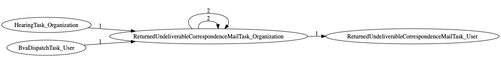
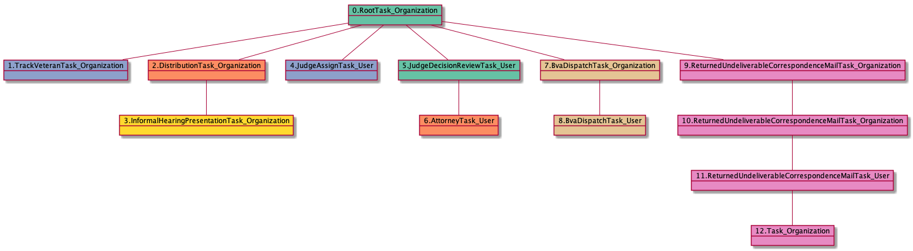
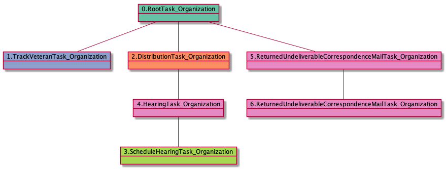

# ReturnedUndeliverableCorrespondenceMailTask_Organization

<details><summary>Links for ReturnedUndeliverableCorrespondenceMailTask_Organization</summary>

```
digraph G {
rankdir="LR";
"ReturnedUndeliverableCorrespondenceMailTask_Organization" -> "ReturnedUndeliverableCorrespondenceMailTask_Organization" [label=2]
"ReturnedUndeliverableCorrespondenceMailTask_Organization" -> "ReturnedUndeliverableCorrespondenceMailTask_User" [label=1]
"ReturnedUndeliverableCorrespondenceMailTask_Organization" -> "ReturnedUndeliverableCorrespondenceMailTask_Organization" [label=2]
"HearingTask_Organization" -> "ReturnedUndeliverableCorrespondenceMailTask_Organization" [label=1]
"BvaDispatchTask_User" -> "ReturnedUndeliverableCorrespondenceMailTask_Organization" [label=1]
}
```
</details>



## Nextlinks

   * 2 [ReturnedUndeliverableCorrespondenceMailTask_Organization](ReturnedUndeliverableCorrespondenceMailTask_Organization.md)
   * 1 [ReturnedUndeliverableCorrespondenceMailTask_User](ReturnedUndeliverableCorrespondenceMailTask_User.md)

## Backlinks

   * 2 [ReturnedUndeliverableCorrespondenceMailTask_Organization](ReturnedUndeliverableCorrespondenceMailTask_Organization.md)
   * 1 [HearingTask_Organization](HearingTask_Organization.md)
   * 1 [BvaDispatchTask_User](BvaDispatchTask_User.md)

## RTO.TVTO.DTO.IHPTO.JATU.JDRTU.ATU.BDTO.BDTU.RUCMTO

1 occurrences (example appeals: [29665])

<details><summary>PlantUML for 29665</summary>

```
@startuml
object 0.RootTask_Organization #66c2a5
object 1.TrackVeteranTask_Organization #8da0cb
object 2.DistributionTask_Organization #fc8d62
object 3.InformalHearingPresentationTask_Organization #ffd92f
object 4.JudgeAssignTask_User #8da0cb
object 5.JudgeDecisionReviewTask_User #66c2a5
object 6.AttorneyTask_User #fc8d62
object 7.BvaDispatchTask_Organization #e5c494
object 8.BvaDispatchTask_User #e5c494
object 9.ReturnedUndeliverableCorrespondenceMailTask_Organization #e78ac3
object 10.ReturnedUndeliverableCorrespondenceMailTask_Organization #e78ac3
object 11.ReturnedUndeliverableCorrespondenceMailTask_User #e78ac3
object 12.Task_Organization #e78ac3
0.RootTask_Organization -- 1.TrackVeteranTask_Organization
0.RootTask_Organization -- 2.DistributionTask_Organization
2.DistributionTask_Organization -- 3.InformalHearingPresentationTask_Organization
0.RootTask_Organization -- 4.JudgeAssignTask_User
0.RootTask_Organization -- 5.JudgeDecisionReviewTask_User
5.JudgeDecisionReviewTask_User -- 6.AttorneyTask_User
0.RootTask_Organization -- 7.BvaDispatchTask_Organization
7.BvaDispatchTask_Organization -- 8.BvaDispatchTask_User
0.RootTask_Organization -- 9.ReturnedUndeliverableCorrespondenceMailTask_Organization
9.ReturnedUndeliverableCorrespondenceMailTask_Organization -- 10.ReturnedUndeliverableCorrespondenceMailTask_Organization
10.ReturnedUndeliverableCorrespondenceMailTask_Organization -- 11.ReturnedUndeliverableCorrespondenceMailTask_User
11.ReturnedUndeliverableCorrespondenceMailTask_User -- 12.Task_Organization
@enduml
```
</details>



## RTO.TVTO.DTO.SHTO.HTO.RUCMTO.RUCMTO

1 occurrences (example appeals: [2056])

<details><summary>PlantUML for 2056</summary>

```
@startuml
object 0.RootTask_Organization #66c2a5
object 1.TrackVeteranTask_Organization #8da0cb
object 2.DistributionTask_Organization #fc8d62
object 3.ScheduleHearingTask_Organization #a6d854
object 4.HearingTask_Organization #e78ac3
object 5.ReturnedUndeliverableCorrespondenceMailTask_Organization #e78ac3
object 6.ReturnedUndeliverableCorrespondenceMailTask_Organization #e78ac3
0.RootTask_Organization -- 1.TrackVeteranTask_Organization
0.RootTask_Organization -- 2.DistributionTask_Organization
4.HearingTask_Organization -- 3.ScheduleHearingTask_Organization
2.DistributionTask_Organization -- 4.HearingTask_Organization
0.RootTask_Organization -- 5.ReturnedUndeliverableCorrespondenceMailTask_Organization
5.ReturnedUndeliverableCorrespondenceMailTask_Organization -- 6.ReturnedUndeliverableCorrespondenceMailTask_Organization
@enduml
```
</details>


## RTO.TVTO.DTO.IHPTO.JATU.JDRTU.ATU.BDTO.BDTU.RUCMTO.RUCMTO

1 occurrences (example appeals: [29665])

<details><summary>PlantUML for 29665</summary>

```
@startuml
object 0.RootTask_Organization #66c2a5
object 1.TrackVeteranTask_Organization #8da0cb
object 2.DistributionTask_Organization #fc8d62
object 3.InformalHearingPresentationTask_Organization #ffd92f
object 4.JudgeAssignTask_User #8da0cb
object 5.JudgeDecisionReviewTask_User #66c2a5
object 6.AttorneyTask_User #fc8d62
object 7.BvaDispatchTask_Organization #e5c494
object 8.BvaDispatchTask_User #e5c494
object 9.ReturnedUndeliverableCorrespondenceMailTask_Organization #e78ac3
object 10.ReturnedUndeliverableCorrespondenceMailTask_Organization #e78ac3
object 11.ReturnedUndeliverableCorrespondenceMailTask_User #e78ac3
object 12.Task_Organization #e78ac3
0.RootTask_Organization -- 1.TrackVeteranTask_Organization
0.RootTask_Organization -- 2.DistributionTask_Organization
2.DistributionTask_Organization -- 3.InformalHearingPresentationTask_Organization
0.RootTask_Organization -- 4.JudgeAssignTask_User
0.RootTask_Organization -- 5.JudgeDecisionReviewTask_User
5.JudgeDecisionReviewTask_User -- 6.AttorneyTask_User
0.RootTask_Organization -- 7.BvaDispatchTask_Organization
7.BvaDispatchTask_Organization -- 8.BvaDispatchTask_User
0.RootTask_Organization -- 9.ReturnedUndeliverableCorrespondenceMailTask_Organization
9.ReturnedUndeliverableCorrespondenceMailTask_Organization -- 10.ReturnedUndeliverableCorrespondenceMailTask_Organization
10.ReturnedUndeliverableCorrespondenceMailTask_Organization -- 11.ReturnedUndeliverableCorrespondenceMailTask_User
11.ReturnedUndeliverableCorrespondenceMailTask_User -- 12.Task_Organization
@enduml
```
</details>


## RTO.TVTO.DTO.SHTO.HTO.RUCMTO

1 occurrences (example appeals: [2056])

<details><summary>PlantUML for 2056</summary>

```
@startuml
object 0.RootTask_Organization #66c2a5
object 1.TrackVeteranTask_Organization #8da0cb
object 2.DistributionTask_Organization #fc8d62
object 3.ScheduleHearingTask_Organization #a6d854
object 4.HearingTask_Organization #e78ac3
object 5.ReturnedUndeliverableCorrespondenceMailTask_Organization #e78ac3
object 6.ReturnedUndeliverableCorrespondenceMailTask_Organization #e78ac3
0.RootTask_Organization -- 1.TrackVeteranTask_Organization
0.RootTask_Organization -- 2.DistributionTask_Organization
4.HearingTask_Organization -- 3.ScheduleHearingTask_Organization
2.DistributionTask_Organization -- 4.HearingTask_Organization
0.RootTask_Organization -- 5.ReturnedUndeliverableCorrespondenceMailTask_Organization
5.ReturnedUndeliverableCorrespondenceMailTask_Organization -- 6.ReturnedUndeliverableCorrespondenceMailTask_Organization
@enduml
```
</details>



