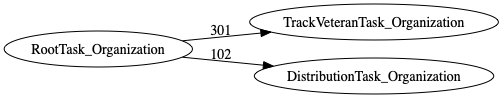

# RootTask_Organization

<details><summary>Links for RootTask_Organization</summary>

```
digraph G {
rankdir="LR";
"RootTask_Organization" -> "TrackVeteranTask_Organization" [label=301]
"RootTask_Organization" -> "DistributionTask_Organization" [label=102]
}
```
</details>



## Nextlinks

   * 301 [TrackVeteranTask_Organization](TrackVeteranTask_Organization.md)
   * 102 [DistributionTask_Organization](DistributionTask_Organization.md)

## Backlinks


## RTO

403 occurrences (example appeals: [42769, 34538, 39812, 41319, 15152])

<details><summary>PlantUML for 42769</summary>

```
@startuml
object 0.RootTask_Organization #66c2a5
object 1.TrackVeteranTask_Organization #8da0cb
object 2.DistributionTask_Organization #fc8d62
object 3.ScheduleHearingTask_Organization #a6d854
object 4.HearingTask_Organization #e78ac3
0.RootTask_Organization -- 1.TrackVeteranTask_Organization
0.RootTask_Organization -- 2.DistributionTask_Organization
4.HearingTask_Organization -- 3.ScheduleHearingTask_Organization
2.DistributionTask_Organization -- 4.HearingTask_Organization
@enduml
```
</details>


