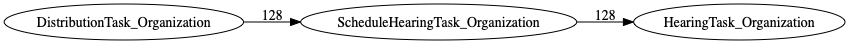
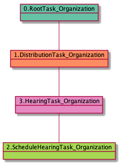

# ScheduleHearingTask_Organization

<details><summary>Links for ScheduleHearingTask_Organization</summary>

```
digraph G {
rankdir="LR";
"DistributionTask_Organization" -> "ScheduleHearingTask_Organization" [label=128]
"ScheduleHearingTask_Organization" -> "HearingTask_Organization" [label=128]
}
```
</details>



## Nextlinks

   * 128 [HearingTask_Organization](HearingTask_Organization.md)

## Backlinks

   * 128 [DistributionTask_Organization](DistributionTask_Organization.md)

## RTO.TVTO.DTO.SHTO

119 occurrences (example appeals: [42769, 42820, 42010, 42071, 39818])

<details><summary>PlantUML for 42769</summary>

```
@startuml
object 0.RootTask_Organization #66c2a5
object 1.TrackVeteranTask_Organization #8da0cb
object 2.DistributionTask_Organization #fc8d62
object 3.ScheduleHearingTask_Organization #a6d854
object 4.HearingTask_Organization #e78ac3
0.RootTask_Organization -- 1.TrackVeteranTask_Organization
0.RootTask_Organization -- 2.DistributionTask_Organization
4.HearingTask_Organization -- 3.ScheduleHearingTask_Organization
2.DistributionTask_Organization -- 4.HearingTask_Organization
@enduml
```
</details>


## RTO.DTO.SHTO

9 occurrences (example appeals: [41136, 42097, 4988, 42691, 40835])

<details><summary>PlantUML for 41136</summary>

```
@startuml
object 0.RootTask_Organization #66c2a5
object 1.DistributionTask_Organization #fc8d62
object 2.ScheduleHearingTask_Organization #a6d854
object 3.HearingTask_Organization #e78ac3
0.RootTask_Organization -- 1.DistributionTask_Organization
3.HearingTask_Organization -- 2.ScheduleHearingTask_Organization
1.DistributionTask_Organization -- 3.HearingTask_Organization
@enduml
```
</details>



