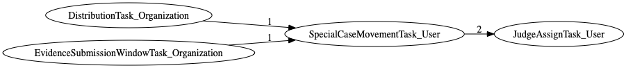
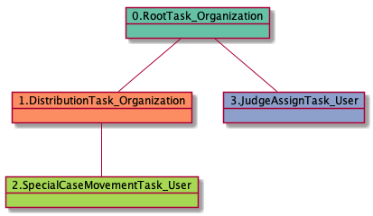

# SpecialCaseMovementTask_User

<details><summary>Links for SpecialCaseMovementTask_User</summary>

```
digraph G {
rankdir="LR";
"SpecialCaseMovementTask_User" -> "JudgeAssignTask_User" [label=2]
"DistributionTask_Organization" -> "SpecialCaseMovementTask_User" [label=1]
"EvidenceSubmissionWindowTask_Organization" -> "SpecialCaseMovementTask_User" [label=1]
}
```
</details>



## Nextlinks

   * 2 [JudgeAssignTask_User](JudgeAssignTask_User.md)

## Backlinks

   * 1 [DistributionTask_Organization](DistributionTask_Organization.md)
   * 1 [EvidenceSubmissionWindowTask_Organization](EvidenceSubmissionWindowTask_Organization.md)

## RTO.DTO.SCMTU

1 occurrences (example appeals: [41963])

<details><summary>PlantUML for 41963</summary>

```
@startuml
object 0.RootTask_Organization #66c2a5
object 1.DistributionTask_Organization #fc8d62
object 2.SpecialCaseMovementTask_User #a6d854
object 3.JudgeAssignTask_User #8da0cb
0.RootTask_Organization -- 1.DistributionTask_Organization
1.DistributionTask_Organization -- 2.SpecialCaseMovementTask_User
0.RootTask_Organization -- 3.JudgeAssignTask_User
@enduml
```
</details>



## RTO.DTO.ESWTO.SCMTU

1 occurrences (example appeals: [40605])

<details><summary>PlantUML for 40605</summary>

```
@startuml
object 0.RootTask_Organization #66c2a5
object 1.DistributionTask_Organization #fc8d62
object 2.EvidenceSubmissionWindowTask_Organization #b3b3b3
object 3.SpecialCaseMovementTask_User #a6d854
object 4.JudgeAssignTask_User #8da0cb
object 5.JudgeDecisionReviewTask_User #66c2a5
object 6.AttorneyTask_User #fc8d62
object 7.AttorneyRewriteTask_User #8da0cb
object 8.BvaDispatchTask_Organization #e5c494
object 9.BvaDispatchTask_User #e5c494
0.RootTask_Organization -- 1.DistributionTask_Organization
1.DistributionTask_Organization -- 2.EvidenceSubmissionWindowTask_Organization
1.DistributionTask_Organization -- 3.SpecialCaseMovementTask_User
0.RootTask_Organization -- 4.JudgeAssignTask_User
0.RootTask_Organization -- 5.JudgeDecisionReviewTask_User
5.JudgeDecisionReviewTask_User -- 6.AttorneyTask_User
5.JudgeDecisionReviewTask_User -- 7.AttorneyRewriteTask_User
0.RootTask_Organization -- 8.BvaDispatchTask_Organization
8.BvaDispatchTask_Organization -- 9.BvaDispatchTask_User
@enduml
```
</details>


