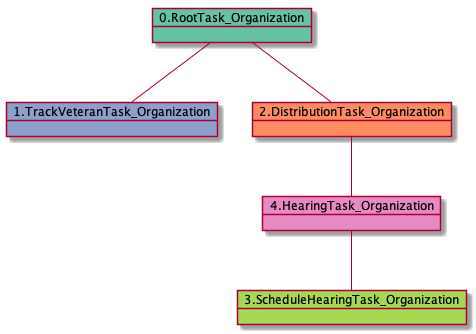

# TrackVeteranTask_Organization

<details><summary>Links for TrackVeteranTask_Organization</summary>

```
digraph G {
rankdir="LR";
"TrackVeteranTask_Organization" -> "DistributionTask_Organization" [label=301]
"TrackVeteranTask_Organization" -> "JudgeAssignTask_User" [label=3]
"TrackVeteranTask_Organization" -> "TrackVeteranTask_Organization" [label=3]
"TrackVeteranTask_Organization" -> "InformalHearingPresentationTask_Organization" [label=1]
"RootTask_Organization" -> "TrackVeteranTask_Organization" [label=301]
"TrackVeteranTask_Organization" -> "TrackVeteranTask_Organization" [label=3]
"EvidenceSubmissionWindowTask_Organization" -> "TrackVeteranTask_Organization" [label=2]
"AttorneyTask_User" -> "TrackVeteranTask_Organization" [label=1]
"HearingTask_Organization" -> "TrackVeteranTask_Organization" [label=1]
"DistributionTask_Organization" -> "TrackVeteranTask_Organization" [label=1]
}
```
</details>


## Nextlinks

   * 301 [DistributionTask_Organization](DistributionTask_Organization.md)
   * 3 [JudgeAssignTask_User](JudgeAssignTask_User.md)
   * 3 [TrackVeteranTask_Organization](TrackVeteranTask_Organization.md)
   * 1 [InformalHearingPresentationTask_Organization](InformalHearingPresentationTask_Organization.md)

## Backlinks

   * 301 [RootTask_Organization](RootTask_Organization.md)
   * 3 [TrackVeteranTask_Organization](TrackVeteranTask_Organization.md)
   * 2 [EvidenceSubmissionWindowTask_Organization](EvidenceSubmissionWindowTask_Organization.md)
   * 1 [AttorneyTask_User](AttorneyTask_User.md)
   * 1 [HearingTask_Organization](HearingTask_Organization.md)
   * 1 [DistributionTask_Organization](DistributionTask_Organization.md)

## RTO.TVTO

301 occurrences (example appeals: [42769, 34538, 39812, 41319, 40595])

<details><summary>PlantUML for 42769</summary>

```
@startuml
object 0.RootTask_Organization #66c2a5
object 1.TrackVeteranTask_Organization #8da0cb
object 2.DistributionTask_Organization #fc8d62
object 3.ScheduleHearingTask_Organization #a6d854
object 4.HearingTask_Organization #e78ac3
0.RootTask_Organization -- 1.TrackVeteranTask_Organization
0.RootTask_Organization -- 2.DistributionTask_Organization
4.HearingTask_Organization -- 3.ScheduleHearingTask_Organization
2.DistributionTask_Organization -- 4.HearingTask_Organization
@enduml
```
</details>



## RTO.TVTO.TVTO

3 occurrences (example appeals: [40894, 42805, 42609])

<details><summary>PlantUML for 40894</summary>

```
@startuml
object 0.RootTask_Organization #66c2a5
object 1.TrackVeteranTask_Organization #8da0cb
object 2.TrackVeteranTask_Organization #8da0cb
object 3.DistributionTask_Organization #fc8d62
object 4.EvidenceSubmissionWindowTask_Organization #b3b3b3
0.RootTask_Organization -- 1.TrackVeteranTask_Organization
0.RootTask_Organization -- 2.TrackVeteranTask_Organization
0.RootTask_Organization -- 3.DistributionTask_Organization
3.DistributionTask_Organization -- 4.EvidenceSubmissionWindowTask_Organization
@enduml
```
</details>


## RTO.DTO.ESWTO.TVTO

2 occurrences (example appeals: [15152, 17948])

<details><summary>PlantUML for 15152</summary>

```
@startuml
object 0.RootTask_Organization #66c2a5
object 1.DistributionTask_Organization #fc8d62
object 2.EvidenceSubmissionWindowTask_Organization #b3b3b3
object 3.TrackVeteranTask_Organization #8da0cb
object 4.JudgeAssignTask_User #8da0cb
object 5.JudgeDecisionReviewTask_User #66c2a5
object 6.AttorneyTask_User #fc8d62
object 7.JudgeDecisionReviewTask_User #66c2a5
object 8.BvaDispatchTask_Organization #e5c494
object 9.BvaDispatchTask_User #e5c494
0.RootTask_Organization -- 1.DistributionTask_Organization
1.DistributionTask_Organization -- 2.EvidenceSubmissionWindowTask_Organization
0.RootTask_Organization -- 3.TrackVeteranTask_Organization
0.RootTask_Organization -- 4.JudgeAssignTask_User
0.RootTask_Organization -- 5.JudgeDecisionReviewTask_User
5.JudgeDecisionReviewTask_User -- 6.AttorneyTask_User
0.RootTask_Organization -- 7.JudgeDecisionReviewTask_User
0.RootTask_Organization -- 8.BvaDispatchTask_Organization
8.BvaDispatchTask_Organization -- 9.BvaDispatchTask_User
@enduml
```
</details>


## RTO.DTO.JATU.JDRTU.ATU.TVTO

1 occurrences (example appeals: [3875])

<details><summary>PlantUML for 3875</summary>

```
@startuml
object 0.RootTask_Organization #66c2a5
object 1.DistributionTask_Organization #fc8d62
object 2.JudgeAssignTask_User #8da0cb
object 3.JudgeAssignTask_User #8da0cb
object 4.JudgeDecisionReviewTask_User #66c2a5
object 5.AttorneyTask_User #fc8d62
object 6.TrackVeteranTask_Organization #8da0cb
object 7.InformalHearingPresentationTask_Organization #ffd92f
object 8.BvaDispatchTask_Organization #e5c494
object 9.BvaDispatchTask_User #e5c494
object 10.BvaDispatchTask_User #e5c494
0.RootTask_Organization -- 1.DistributionTask_Organization
0.RootTask_Organization -- 2.JudgeAssignTask_User
0.RootTask_Organization -- 3.JudgeAssignTask_User
0.RootTask_Organization -- 4.JudgeDecisionReviewTask_User
4.JudgeDecisionReviewTask_User -- 5.AttorneyTask_User
0.RootTask_Organization -- 6.TrackVeteranTask_Organization
0.RootTask_Organization -- 7.InformalHearingPresentationTask_Organization
0.RootTask_Organization -- 8.BvaDispatchTask_Organization
8.BvaDispatchTask_Organization -- 9.BvaDispatchTask_User
8.BvaDispatchTask_Organization -- 10.BvaDispatchTask_User
@enduml
```
</details>


## RTO.DTO.TVTO

1 occurrences (example appeals: [11092])

<details><summary>PlantUML for 11092</summary>

```
@startuml
object 0.RootTask_Organization #66c2a5
object 1.DistributionTask_Organization #fc8d62
object 2.TrackVeteranTask_Organization #8da0cb
object 3.JudgeAssignTask_User #8da0cb
object 4.JudgeDecisionReviewTask_User #66c2a5
object 5.AttorneyTask_User #fc8d62
0.RootTask_Organization -- 1.DistributionTask_Organization
0.RootTask_Organization -- 2.TrackVeteranTask_Organization
0.RootTask_Organization -- 3.JudgeAssignTask_User
0.RootTask_Organization -- 4.JudgeDecisionReviewTask_User
4.JudgeDecisionReviewTask_User -- 5.AttorneyTask_User
@enduml
```
</details>


## RTO.DTO.SHTO.HTO.TVTO

1 occurrences (example appeals: [4988])

<details><summary>PlantUML for 4988</summary>

```
@startuml
object 0.RootTask_Organization #66c2a5
object 1.DistributionTask_Organization #fc8d62
object 2.ScheduleHearingTask_Organization #a6d854
object 3.HearingTask_Organization #e78ac3
object 4.TrackVeteranTask_Organization #8da0cb
0.RootTask_Organization -- 1.DistributionTask_Organization
3.HearingTask_Organization -- 2.ScheduleHearingTask_Organization
1.DistributionTask_Organization -- 3.HearingTask_Organization
0.RootTask_Organization -- 4.TrackVeteranTask_Organization
@enduml
```
</details>


