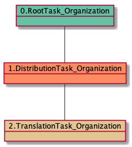
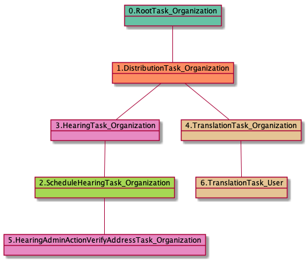

# TranslationTask_Organization

<details><summary>Links for TranslationTask_Organization</summary>

```
digraph G {
rankdir="LR";
"HearingTask_Organization" -> "TranslationTask_Organization" [label=1]
"TranslationTask_Organization" -> "TranslationTask_User" [label=1]
"DistributionTask_Organization" -> "TranslationTask_Organization" [label=1]
}
```
</details>


## Nextlinks

   * 1 [TranslationTask_User](TranslationTask_User.md)

## Backlinks

   * 1 [DistributionTask_Organization](DistributionTask_Organization.md)
   * 1 [HearingTask_Organization](HearingTask_Organization.md)

## RTO.DTO.TTO

1 occurrences (example appeals: [41094])

<details><summary>PlantUML for 41094</summary>

```
@startuml
object 0.RootTask_Organization #66c2a5
object 1.DistributionTask_Organization #fc8d62
object 2.TranslationTask_Organization #e5c494
0.RootTask_Organization -- 1.DistributionTask_Organization
1.DistributionTask_Organization -- 2.TranslationTask_Organization
@enduml
```
</details>



## RTO.DTO.SHTO.HTO.TTO

1 occurrences (example appeals: [24900])

<details><summary>PlantUML for 24900</summary>

```
@startuml
object 0.RootTask_Organization #66c2a5
object 1.DistributionTask_Organization #fc8d62
object 2.ScheduleHearingTask_Organization #a6d854
object 3.HearingTask_Organization #e78ac3
object 4.TranslationTask_Organization #e5c494
object 5.HearingAdminActionVerifyAddressTask_Organization #e78ac3
object 6.TranslationTask_User #e5c494
0.RootTask_Organization -- 1.DistributionTask_Organization
3.HearingTask_Organization -- 2.ScheduleHearingTask_Organization
1.DistributionTask_Organization -- 3.HearingTask_Organization
1.DistributionTask_Organization -- 4.TranslationTask_Organization
2.ScheduleHearingTask_Organization -- 5.HearingAdminActionVerifyAddressTask_Organization
4.TranslationTask_Organization -- 6.TranslationTask_User
@enduml
```
</details>



