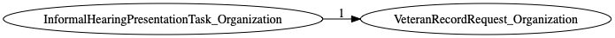
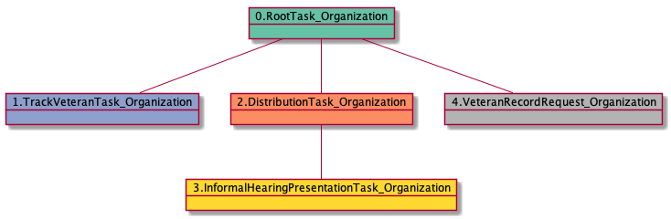

# VeteranRecordRequest_Organization

<details><summary>Links for VeteranRecordRequest_Organization</summary>

```
digraph G {
rankdir="LR";
"InformalHearingPresentationTask_Organization" -> "VeteranRecordRequest_Organization" [label=1]
}
```
</details>



## Nextlinks


## Backlinks

   * 1 [InformalHearingPresentationTask_Organization](InformalHearingPresentationTask_Organization.md)

## RTO.TVTO.DTO.IHPTO.VRRO

1 occurrences (example appeals: [42651])

<details><summary>PlantUML for 42651</summary>

```
@startuml
object 0.RootTask_Organization #66c2a5
object 1.TrackVeteranTask_Organization #8da0cb
object 2.DistributionTask_Organization #fc8d62
object 3.InformalHearingPresentationTask_Organization #ffd92f
object 4.VeteranRecordRequest_Organization #b3b3b3
0.RootTask_Organization -- 1.TrackVeteranTask_Organization
0.RootTask_Organization -- 2.DistributionTask_Organization
2.DistributionTask_Organization -- 3.InformalHearingPresentationTask_Organization
0.RootTask_Organization -- 4.VeteranRecordRequest_Organization
@enduml
```
</details>



